🇬🇧 English | 🇫🇷 [Français](ARCHITECTURE_FR.md) | 🇪🇸 [Español](ARCHITECTURE_ES.md)

# Architecture Overview (Raspberry Pi - Rust)

This document is the **deep, exhaustive** reference for the ArcadeMatrix architecture on Raspberry Pi (written in **Rust**). It covers the design philosophy, the full engine contract, the auto-discovery Registry, the "Lazy-Once" lifecycle, the self-healing configuration pipeline, the schema-driven dynamic UI (including **custom / dynamic option lists**), the display arbiter, the Fighter overlay compositor, and the multi-threaded runtime.

> If you want to **add** an engine or a config field, read [DEVELOPER.md](DEVELOPER.md). This document explains **why** and **how** the system behaves; the developer guide explains **what to type**.

---

## Table of Contents

1. [Design Philosophy: Performance & Jitter](#1-design-philosophy-performance--jitter)
2. [High-Level Component Map](#2-high-level-component-map)
3. [The Engine Contract (Class Model)](#3-the-engine-contract-class-model)
4. [Auto-Discovery: Registry, Descriptor & Factory](#4-auto-discovery-registry-descriptor--factory)
5. [The "Lazy-Once" Lifecycle](#5-the-lazy-once-lifecycle)
6. [Configuration Model: `config.json` → Instances](#6-configuration-model-configjson--instances)
7. [Self-Healing: the ConfigSanitizer](#7-self-healing-the-configsanitizer)
8. [Config Propagation & Hot Reload](#8-config-propagation--hot-reload)
9. [Schema-Driven Dynamic UI & Custom Lists](#9-schema-driven-dynamic-ui--custom-lists)
10. [The Display Arbiter](#10-the-display-arbiter)
11. [The Fighter Overlay Compositor](#11-the-fighter-overlay-compositor)
12. [Runtime Isolation & Threading Model](#12-runtime-isolation--threading-model)
13. [Rendering Cadence](#13-rendering-cadence)
14. [HTTP API Surface](#14-http-api-surface)
15. [Build Metadata](#15-build-metadata)

---

## 1. Design Philosophy: Performance & Jitter

Unlike the ESP32, the Raspberry Pi has abundant RAM (512 MB to 8 GB). However, its operating system is **not** real-time (no RTOS). The matrix driver (via DMA/GPIO, `rpi-rgb-led-matrix`) is extremely sensitive to micro-stutters ("jitter").

To hold a stable refresh rate without tearing, **the hot loop (`update()` + `render()`) must not perform unnecessary dynamic allocations**. Every heap allocation risks a `malloc`/resize that introduces a few milliseconds of unpredictable latency — enough to make the panel flicker.

Three rules follow from this and shape the whole architecture:

- **Allocate once, mutate in place.** Buffers (`String`, `Vec`) are reserved in `initialize()` and reused every frame (`clear()` + `write!()`).
- **Create engines lazily, keep them forever.** An engine is only instantiated the first time it is displayed, then cached for the process lifetime ("Lazy-Once").
- **Isolate the render thread.** HTTP, MQTT and network I/O never run on the thread that talks to the matrix.

---

## 2. High-Level Component Map

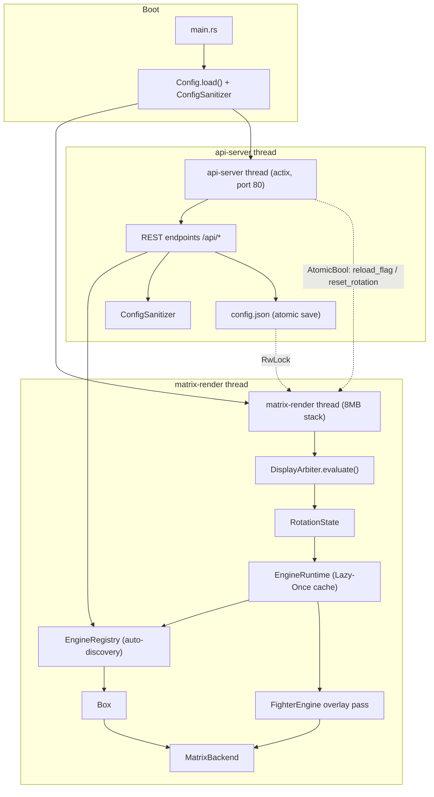

The two threads **never share mutable state directly**. They communicate only through:

- a shared `Config` guarded by `RwLock<ConfigSettings>` (for the settings snapshot), and
- lock-free atomics (`AtomicBool` / `AtomicU32`) used as one-shot signals.

---

## 3. The Engine Contract (Class Model)

Every visual feature (clock, weather, GIF player, crypto ticker, …) implements the single `Engine` trait. The Core only ever manipulates a `Box<dyn Engine>` — it has **no compile-time knowledge** of concrete engine types.

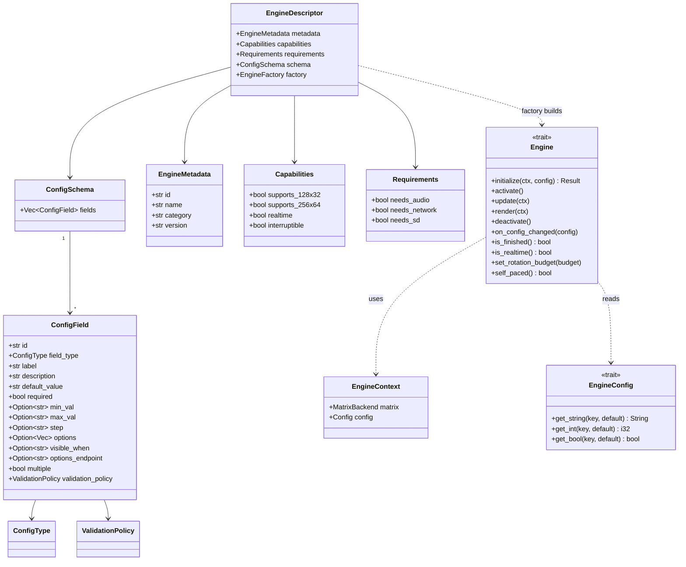

### Method responsibilities

| Method | Called | Purpose |
| :-- | :-- | :-- |
| `initialize` | once, on first display | Heavy allocation: load bitmaps/fonts, reserve buffers. |
| `activate` | each time it becomes visible | Cheap reset of transient state (no allocation). |
| `update` | hot loop | Business logic. **No unnecessary allocation.** |
| `render` | hot loop | Draw into `context.matrix`. **No unnecessary allocation.** |
| `deactivate` | when leaving screen | Stop background work / listeners. |
| `on_config_changed` | on live config edit | Re-read values **in place**, no recreation. |
| `is_finished` | each frame | Signal the runtime to advance early (e.g. crypto finished its token list). |
| `is_realtime` | each frame | Live cadence hint (≈25 FPS) evaluated per-frame, unlike the static `Capabilities.realtime`. |
| `set_rotation_budget` | on activate | For count-based engines (GIF), receives the rotation entry's numeric value as a playback budget. |
| `self_paced` | each frame | If `true`, the duration timer must **not** force-advance; the engine drives advance via `is_finished`. |

---

## 4. Auto-Discovery: Registry, Descriptor & Factory

### Why the Core has no list of concrete types

In pre-refactor versions, `app.rs` included every engine file and built a giant `match` with `Box::new(ClockEngine)`. Adding an engine meant editing the Core — a violation of the open/closed principle (SOLID).

Now each engine **registers itself at compile time** through the `linkme` crate's `#[distributed_slice]`. The linker collects every registration function into a single static slice `ENGINES`; the Core simply iterates it.

```rust
// core/registry.rs
#[distributed_slice]
pub static ENGINES: [fn() -> EngineDescriptor];
```

```rust
// any engine file
#[distributed_slice(crate::core::registry::ENGINES)]
fn register_clock() -> EngineDescriptor { /* metadata + schema + factory */ }
```

### Why the Registry stores descriptors, not instances

Instantiating every engine at boot (`Box::new(...)`) would waste RAM and slow startup. A **descriptor** is cheap: it carries metadata, capabilities, requirements, the config schema, and a **factory** — a function pointer `fn() -> Box<dyn Engine>` that builds the instance only when needed.

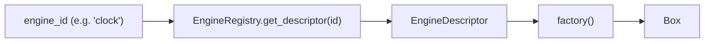

`EngineRegistry` exposes two calls:

- `get_all_descriptors()` — used by `GET /api/engines` and the sanitizer.
- `get_descriptor(id)` — used by the runtime to build one instance.

---

## 5. The "Lazy-Once" Lifecycle

The `EngineRuntime` owns two maps: the cached live instances and a snapshot of the config each was last configured with.

```rust
pub struct EngineRuntime {
    instances: HashMap<String, Box<dyn Engine>>,     // instance_id -> live engine
    configs:   HashMap<String, HashMap<String,String>>, // instance_id -> last applied config
}
```

`get_instance()` is the heart of Lazy-Once and hot-reload:

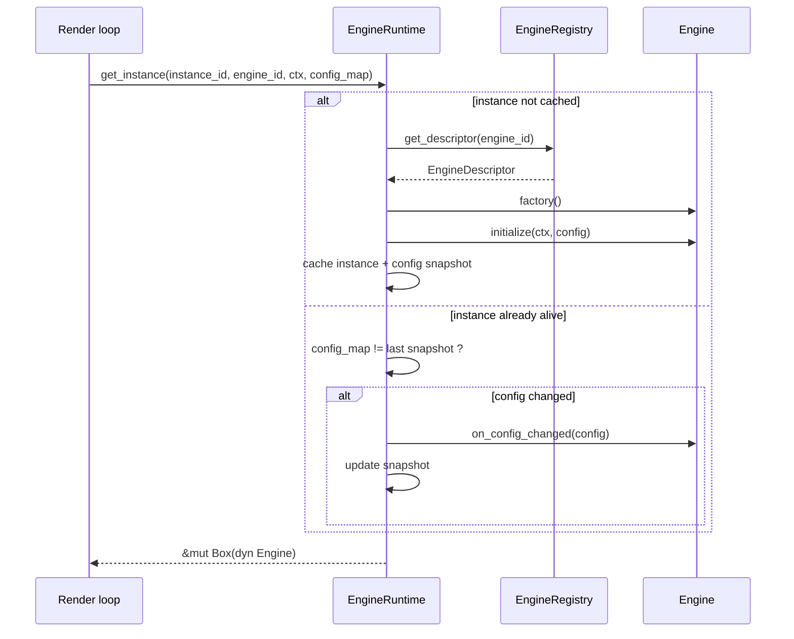

The lifecycle as a state machine:

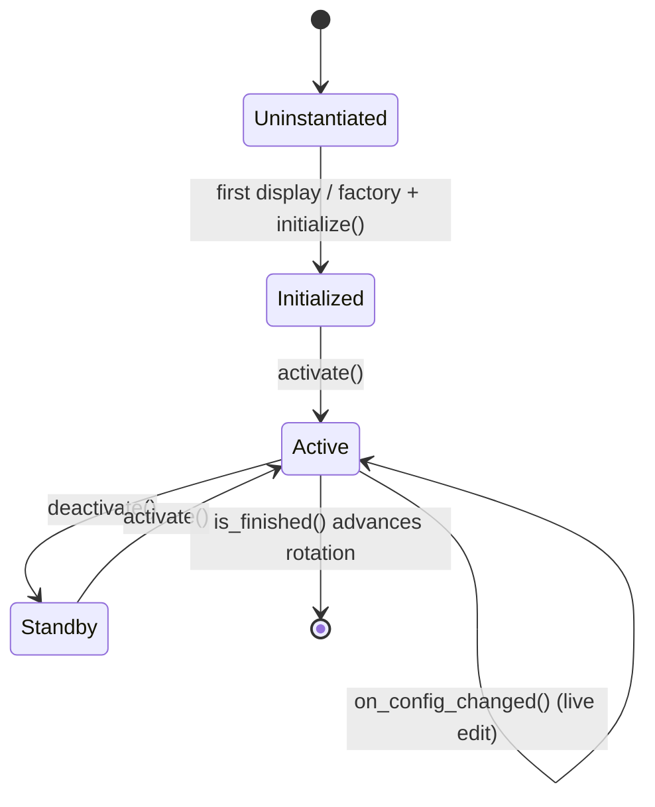

**Key property:** a configuration edit never destroys and rebuilds an instance. The instance keeps its buffers and simply re-reads values in `on_config_changed()`.

---

## 6. Configuration Model: `config.json` → Instances

The single root file `config.json` describes the entire device. Its structure:

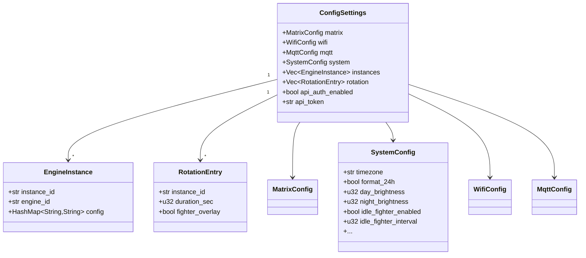

### Three distinct concepts

- **Engine** — a *type* (e.g. `clock`), declared once by the Registry.
- **Instance** — a *named configured occurrence* of an engine (e.g. `clock_main`, `clock_arcade`), stored in `instances`.
- **Configuration** — the `HashMap<String,String>` inside an instance, validated against the engine's `ConfigSchema`.

This is why you can run several clocks with different fonts/themes from the same `ClockEngine`.

### Why `config.json` and `EngineConfig` are separated

Engines must not see WiFi credentials or other engines' settings. The runtime wraps each instance's `HashMap` in a `HashConfig` and hands the engine only the `EngineConfig` trait (`get_string/get_int/get_bool`) — a restricted proxy exposing exactly the keys the engine declared in its schema.

### Runtime signals live on `Config`

`Config` also holds cross-thread runtime state, separate from the persisted `ConfigSettings`:

```rust
pub struct Config {
    pub reload_flag: AtomicBool,      // hardware/network change -> clean restart
    pub reset_rotation: AtomicBool,   // instance/rotation edit -> re-read next frame
    pub matrix_power: AtomicBool,     // live on/off
    pub matrix_brightness: AtomicU32, // live brightness (0..100)
    pub message_payload: Mutex<Option<Value>>,
    pub settings: RwLock<ConfigSettings>,
}
```

---

## 7. Self-Healing: the ConfigSanitizer

`ConfigSanitizer::sanitize_instances()` runs on boot and after every write. For each instance it looks up the engine's schema and repairs the stored config so the runtime always sees valid data — this is what makes OTA updates robust.

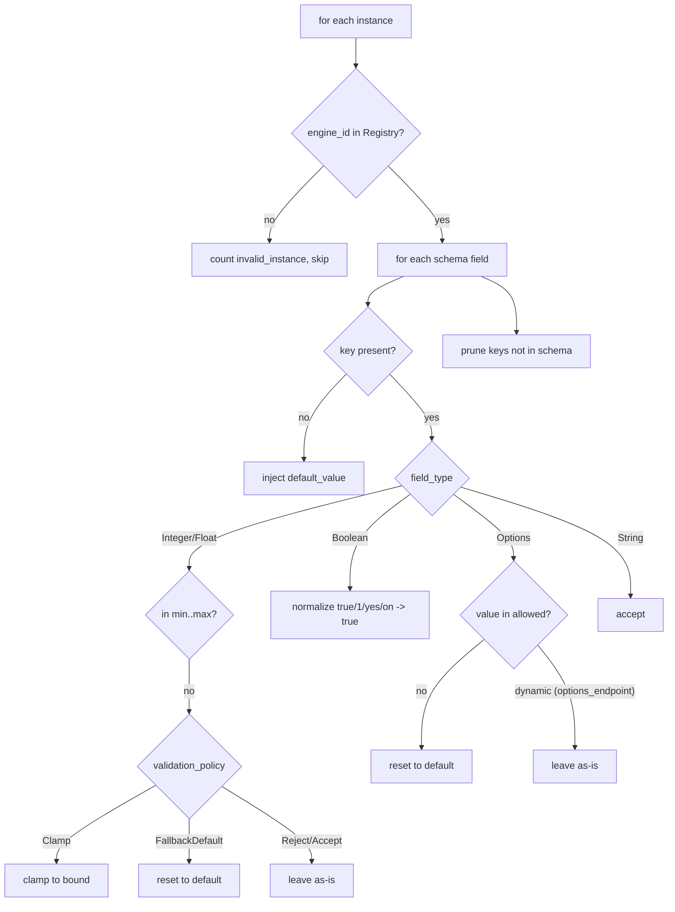

`SanitizeResult` reports how many values were `defaults_injected`, `values_clamped`, `values_fallback`, `keys_pruned`, and `invalid_instances`, and whether the file was `modified` (triggering a re-save).

Two subtleties that matter:

- **Dynamic options are trusted.** A field with `options_endpoint` (e.g. a font filename) has no static allow-list at compile time, so the sanitizer leaves its value untouched.
- **Multiselect is a CSV.** When `multiple = true`, the value is a comma-separated list; each token must be in the allowed set.

Concrete OTA example — firmware v2 adds `font_size` and removes `legacy_mode`:

```jsonc
// stored (v1)                 // after boot on v2
{ "font": "foo" }        -->   { "font": "foo", "font_size": "16" }
{ "legacy_mode": "x" }   -->   {}   // pruned: not in schema anymore
```

---

## 8. Config Propagation & Hot Reload

Because instances are cached, an edit must be **actively pushed** to the live engine rather than recreating it. The chain is wired end-to-end:

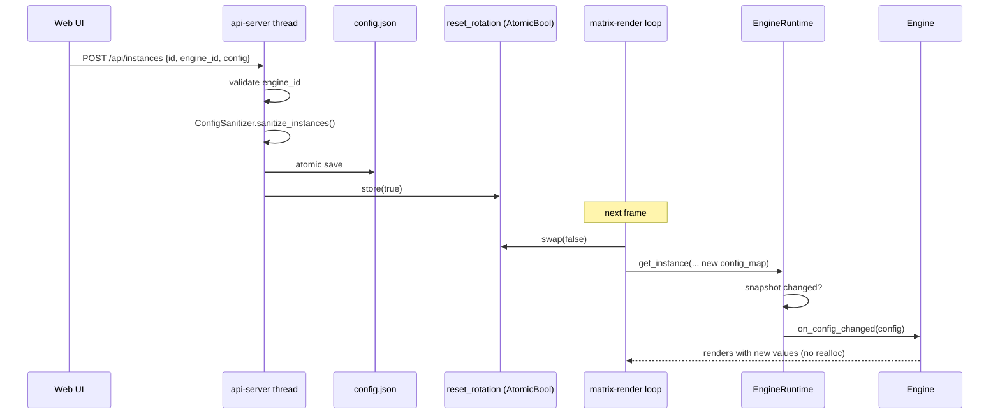

Two propagation classes:

- **Instance / rotation edits** → `reset_rotation` → applied **live** via `on_config_changed()`; no restart, no reallocation.
- **Hardware / network changes** (matrix geometry, `disable_internal`, …) → `reload_flag` → the render loop restarts the process cleanly so the driver re-initializes. Live brightness/power are the exception: they are pushed through `matrix_brightness` / `matrix_power` atomics with no restart.

---

## 9. Schema-Driven Dynamic UI & Custom Lists

The Web UI contains **no per-engine form**. `GET /api/engines` returns every descriptor (metadata + schema), and `dynamic_engines.js` interprets each `ConfigField` to build the correct widget. Adding an engine or a field changes the UI with zero frontend code.

### Field → widget resolution

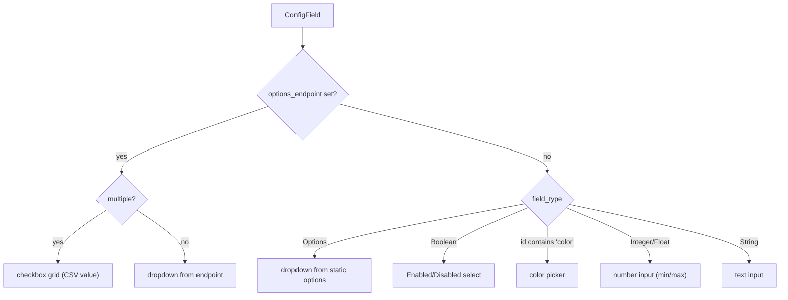

### Custom / dynamic option lists (the "resource discovery" endpoints)

This is the mechanism the old hardcoded UI used to lose. A field declares **where** its choices come from instead of hardcoding them; the backend serves the current, real resources:

| Endpoint | Backing source | Used by (field) |
| :-- | :-- | :-- |
| `GET /api/fonts` | files in `fonts/` (`.ttf`, `.bdf`) | clock `font`, any text engine |
| `GET /api/playlists` | sub-directories of `gifs/` | GIF `playlist` (**multiple**) |
| `GET /api/themes` | `core::theme::all_themes()` (single source of truth) | clock `theme` |

Each returns a JSON array of `{ "value": ..., "label": ... }`. Because the list is fetched **live**, dropping a new font into `fonts/` or a new GIF folder into `gifs/` immediately appears in the UI.

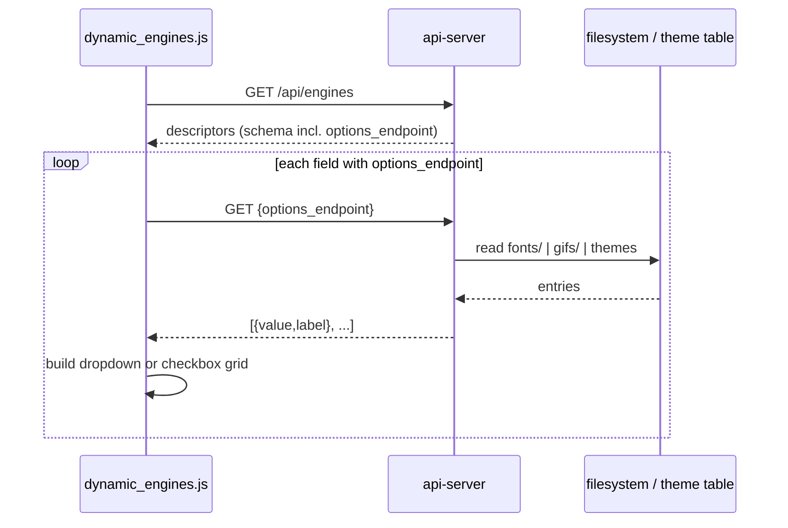

### Multiselect storage

For `multiple = true` (e.g. the GIF playlist), the UI renders a checkbox grid and stores the selection as a **comma-separated string** in the instance config (`"mario,zelda"`). The GIF engine and the sanitizer both split on `,`. This is how the user picks *which* GIF folders play — replacing the old "ignore this, include that" special-casing with an explicit, declarative choice.

### `visible_when`

A field may carry `visible_when` referencing another field, allowing the frontend to show/hide it conditionally (declarative dependent fields) without engine-specific JS.

---

## 10. The Display Arbiter

The rotation is not the only thing that can own the screen. Marquees (arcade frontends), MQTT banners, one-shot messages and the GIF player all compete for it. The `DisplayArbiter` resolves this by **priority**, so the Core never contains `if source == "mqtt"` business logic in the render loop.

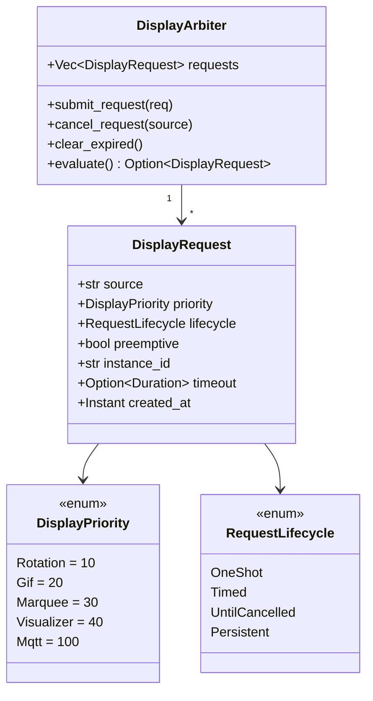

Each frame the render loop submits/cancels requests based on live state, then calls `evaluate()`, which drops expired requests and returns the **highest-priority** survivor. `ROTATION` is a `Persistent`, non-preemptive baseline (priority 10) that always exists; anything else (MQTT=100, Marquee=30, GIF=20, …) can temporarily take over.


---

## 11. The Fighter Overlay Compositor

The Fighter is **not** an `Engine` and is **not** arbitrated. It is an *additive overlay*: decorative fighter sprites drawn **on top of** the current rotation frame. Because the Arbiter is exclusive (one winner per frame), an overlay cannot be modeled as a competing source — so it is a separate compositing pass.

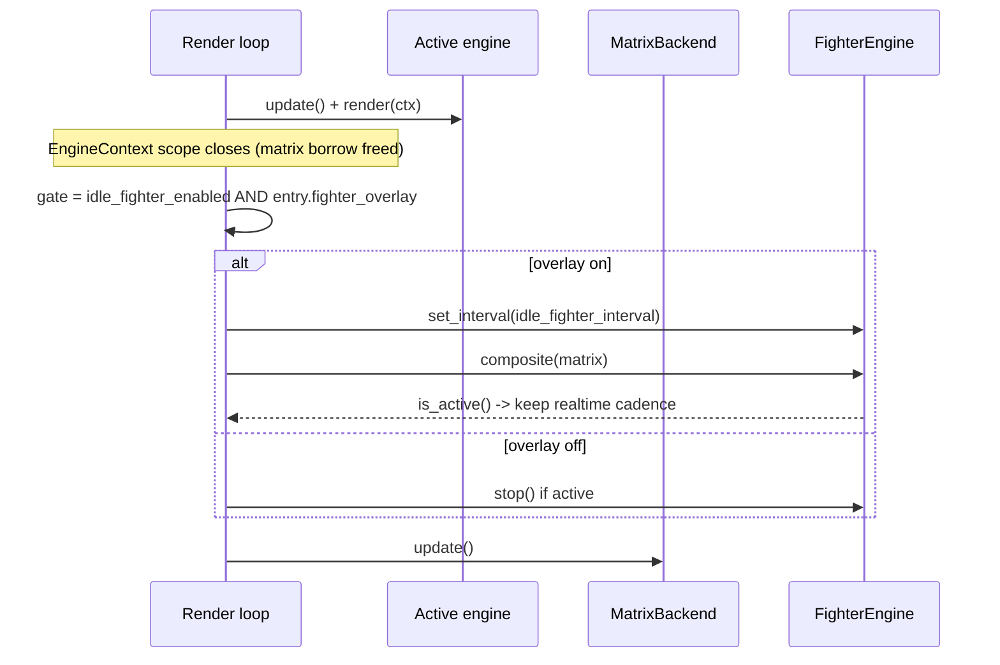

Design decisions (see [PLAN_FIGHTER_REINTEGRATION] history):

- **Per-entry opt-in.** Each `RotationEntry` has `fighter_overlay: bool`. The overlay shows only when the **master switch** (`system.idle_fighter_enabled`) *and* the current entry's flag are both true. There is deliberately **no** automatic "hide over GIF" capability — the user decides per screen.
- **Self-managed lifecycle.** `FighterEngine` loads sprites on a background thread, schedules fights on its own interval, and picks the asset set by panel height (`fighters_64` when height ≥ 64, otherwise `fighters_32`, with a last-resort fallback to the other set).
- **Cadence coupling.** While a fight is on screen, the loop keeps the high-FPS path so the animation stays smooth even over a static clock.

---

## 12. Runtime Isolation & Threading Model

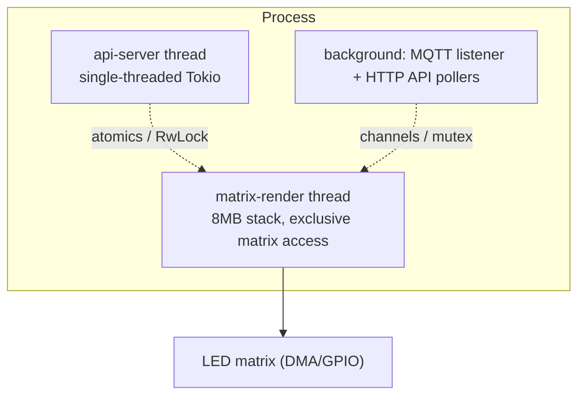

1. **Dedicated rendering thread (`matrix-render`)** — 8 MB stack, exclusive matrix ownership. If it shared the thread with HTTP, every request would skip a frame (tearing).
2. **Isolated Web API thread (`api-server`)** — a single-threaded Tokio runtime hosting actix on port 80. It touches the render thread only through atomics and short-lived `RwLock` reads.
3. **Background services** — MQTT listener and HTTP API pollers (crypto, weather, stock) run off the render path so a slow network call never stalls `update()`.

---

## 13. Rendering Cadence

The per-frame sleep is derived from capability/state, **never** from a hardcoded engine name:

- `Capabilities.realtime == true` **or** live `engine.is_realtime() == true` → ~25 FPS (40 ms), for animated content (GIF, scrolling message, Spotify, active Fighter overlay).
- otherwise → 1 Hz (1000 ms), for static content (clock, date, weather) — far lighter on CPU and Wi-Fi.

`is_realtime()` is re-checked every frame, so an engine can switch cadence based on live state (e.g. a clock that only animates on a specific theme).

---

## 14. HTTP API Surface

All endpoints are actix handlers in `src/api/server.rs`; static web assets are embedded via `rust-embed`. Full reference in [../openapi.yaml](../openapi.yaml).

| Method | Path | Purpose |
| :-- | :-- | :-- |
| GET | `/api/system` | Full settings snapshot |
| POST | `/api/system` | Patch top-level/system settings (partial-save safe) |
| GET | `/api/instances` | List configured instances |
| POST | `/api/instances` | Upsert an instance (sanitized + saved) |
| DELETE | `/api/instances/{id}` | Remove an instance |
| GET | `/api/rotation` | Rotation list (order, durations, overlay flags) |
| POST | `/api/rotation` | Replace rotation, sets `reset_rotation` |
| GET | `/api/engines` | All descriptors (drives the dynamic UI) |
| GET | `/api/fonts` | Font files in `fonts/` (options_endpoint) |
| GET | `/api/playlists` | GIF folders in `gifs/` (options_endpoint) |
| GET | `/api/themes` | Themes from `core::theme` (options_endpoint) |
| GET | `/api/stats` | Runtime stats (uptime, memory, version) |
| POST | `/api/wifi` | Update Wi-Fi credentials |
| POST | `/api/marquee` | Push a marquee image |
| POST | `/api/mqtt/install` | Install/enable the MQTT broker |
| POST | `/api/mqtt/logs` | Fetch MQTT logs |
| POST | `/api/system/restart` | Restart the service |
| GET | `/api/action/reboot` · POST `/api/system/reboot` | Reboot the Pi |
| POST | `/api/system/shutdown` | Shut down the Pi |
| POST | `/api/system/power` | Live matrix power on/off |

Every mutating handler runs behind `check_auth` when `api_auth_enabled` is set.

---

## 15. Build Metadata

`core/build_info.rs` centralizes `env!` values injected by `build.rs` (`VERSION`, `ARCH`, `BUILD_TIMESTAMP`, `GIT_COMMIT`). They are read **once** here because `env!` bakes values at each call site's compile time; reading them in a single module keeps `/api/version`, the startup banner, and OTA validation consistent across incremental builds.
