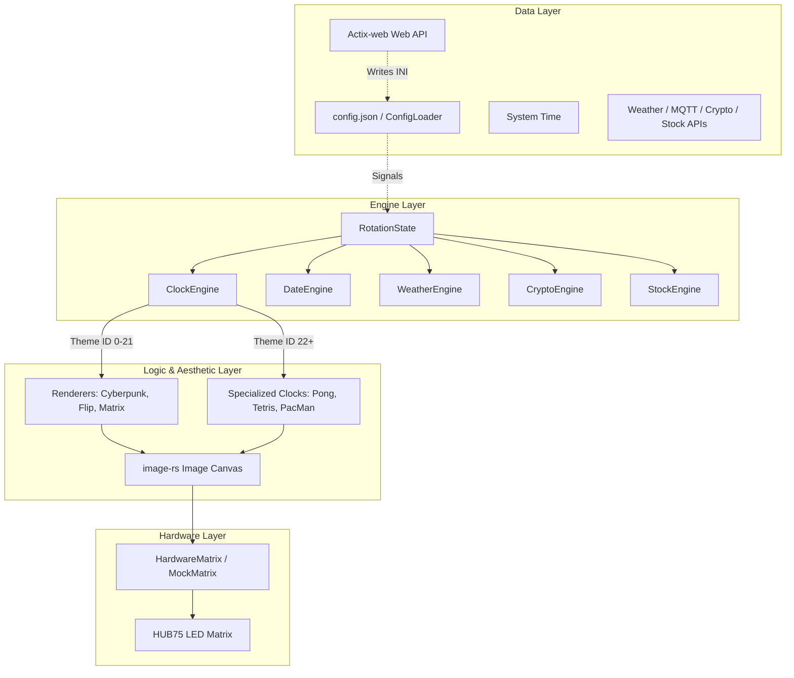

🇬🇧 English | 🇫🇷 [Français](ARCHITECTURE_FR.md) | 🇪🇸 [Español](ARCHITECTURE_ES.md)

# Architecture Overview (Raspberry Pi - Rust)

This document provides a comprehensive overview of the ArcadeMatrix architecture on the Raspberry Pi built with **Rust**. It explains the core design decisions, the rendering pipeline, threading models, dependency injection, and hardware rotation mechanics.

---

## 1. Core Philosophy

ArcadeMatrix driving a HUB75 LED Matrix using the `hzeller/rpi-rgb-led-matrix` C++ library via its Rust bindings (`rpi-led-matrix-sys`). The primary goals are:
- **Pixel-Perfect Rendering:** Support for sharp `.bdf` bitmap fonts and crisp RGB sprites.
- **Modularity:** Easy addition of new visual themes, clocks, and data sources via traits.
- **Responsiveness:** A single-threaded isolated Web API (`actix-web`) that can interrupt and change the display instantly without choking network IRQs or crashing the hardware matrix driver.

---

## 2. The Rendering Pipeline

To keep the codebase maintainable, we strictly separate the logic of *what* to display from *how* to draw it. 

### High-Level Diagram

---

## 3. Threading & Runtime Isolation Model

ArcadeMatrix RPi uses a multi-thread architecture designed to isolate hardware rendering from async I/O network operations:

1. **Dedicated Render Thread (`matrix-render`):**
   - Runs in a dedicated OS thread with an 8MB stack.
   - Executes the main matrix render loop, updating the hardware matrix at high frame rates.
   - Retries hardware init if GPIO/DMA is locked by a previous process restart.

2. **Isolated Web API Thread (`api-server`):**
   - Runs `actix-web` on a single-threaded Tokio runtime (`Builder::new_current_thread()`).
   - Prevents async network tasks from spawning threads across all CPU cores and choking Wi-Fi interrupts.
   - Communicates with the render thread strictly via atomic flags (`reload_flag`, `reset_rotation`, `matrix_power`) and `RwLock<ConfigSettings>`.

3. **Background Services:**
   - **MQTT Listener (`rumqttc`):** Receives game status events asynchronously from Batocera / Recalbox.
   - **Multi-Provider Data Engines:** Async data fetchers updating internal caches for Crypto (CoinGecko, Binance), Stock (Yahoo Finance), and Weather (OpenWeatherMap).

---

## 4. Symbol Counting & Rotation Auto-Skipping

The rotation engine handles asset listings (`crypto`, `stocks`) intelligently:
- **Symbol Parsing:** Comma-separated symbol strings (`CRYPTO SYMBOLS`, `STOCK SYMBOLS`) are parsed into trimmed, non-empty tokens (ignoring whitespace and empty comma sequences).
- **Auto-Skipping:** If `crypto_symbols` or `stock_symbols` count evaluates to `0` (or if the module is disabled), `RotationState` automatically advances to the next configured module in the playlist without stalling or waiting.
- **Dynamic Module Duration:** Displays each active symbol for a configurable per-token duration (e.g. `symbol_count * 5s`).

---

## 5. RPi (Rust) vs ESP32 (C++) Architecture Differences

- **RPi (Rust):** Uses a decoupled Rendering Pipeline (Engines -> Renderers -> `image-rs` Canvas -> Hardware Matrix). Abundant RAM (512MB+) enables full-color frame manipulation before transferring pixel data to `rpi-rgb-led-matrix`.
- **ESP32 (C++):** Uses a Direct DMA Rendering structure. RAM is limited to 320KB internal memory. Primitives draw directly to DMA buffers with minimal RAM overhead.

*This architectural divergence is intentional and optimizes for the specific constraints of each hardware platform.*

---

## 6. Dependency Injection & Traits

Engine data providers use Rust `trait` abstractions (`IProvider`):
- `CryptoEngine` supports multiple `CryptoProvider` implementations (`CoinGeckoProvider`, `BinanceProvider`).
- `StockEngine` supports `StockProvider` (`YahooFinanceProvider`).
- `WeatherEngine` supports `WeatherProvider` (`OpenWeatherMapProvider`).

This allows automatic fallback on API failures and comprehensive unit testing via mock providers.
