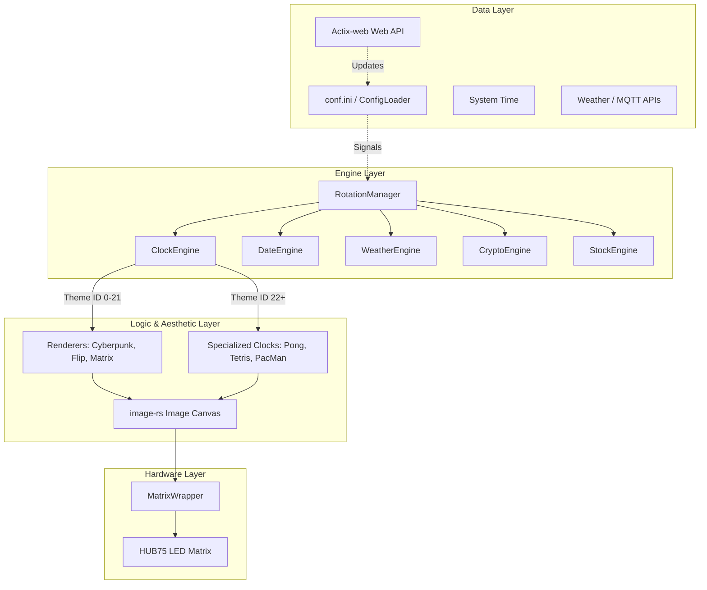
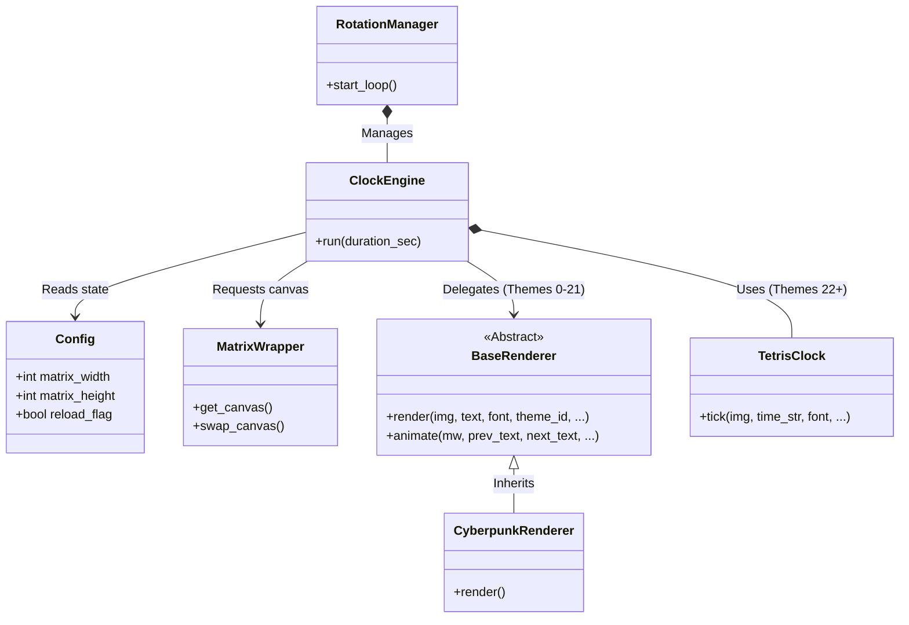

🇬🇧 English | 🇫🇷 [Français](ARCHITECTURE_FR.md) | 🇪🇸 [Español](ARCHITECTURE_ES.md)

# Architecture Overview

This document provides a comprehensive overview of the ArcadeMatrix architecture on the Raspberry Pi. It explains the core design decisions, the rendering pipeline, threading models, and the project's overall philosophy.

---

## 1. Core Philosophy

ArcadeMatrix is designed to drive a HUB75 LED Matrix using the `hzeller/rpi-rgb-led-matrix` C++ library via its Rust bindings. The primary goals are:
- **Pixel-Perfect Rendering:** Support for sharp `.bdf` bitmap fonts and crisp sprites.
- **Modularity:** Easy addition of new visual themes, clocks, and data sources.
- **Responsiveness:** A snappy Web API that can interrupt and change the display instantly without crashing the hardware driver.

---

## 2. The Rendering Pipeline

To keep the codebase maintainable, we strictly separate the logic of *what* to display from *how* to draw it. 

### High-Level Diagram

### Class Relationship Diagram

### Components of the Pipeline

1. **Engines (`engines/`)**: The controllers. They manage the `while` loops, fetch data (time, weather), and determine how long a feature stays on screen.
2. **Renderers (`engines/renderers/`)**: The aesthetics. They take generic text (e.g., "12:30") and draw it onto a PIL image with a specific background (e.g., Cyberpunk, Flip animation, Matrix rain). They are reusable across different engines.
3. **Specialized Clocks (`engines/clocks/`)**: The mini-games. Unlike renderers, these are complex state machines (e.g., a Pong game bouncing a ball, Tetris blocks falling) that dynamically construct the time display.
4. **Fighter Engine (`engines/fighter.py`)**: An overlay engine that runs on top of the final rendered canvas to inject MUGEN sprites dynamically.

---

## 3. Threading Model

ArcadeMatrix uses a dual-thread architecture.

### The Main Thread (Hardware & Rendering)
The `rgbmatrix` library relies on highly precise hardware PWM to prevent flickering on the LED matrix. While Rust is incredibly fast and has no garbage collector, context switching can still disrupt hardware timing. Therefore, **all rendering and hardware communication must occur strictly on the main thread.**
- `tokio::spawn` is used for background tasks, but the matrix update loop is strictly bound to the main thread.
- `std::thread::sleep()` or `tokio::time::sleep()` is used to yield execution cleanly.

### The Background Thread (Web API)
A lightweight Actix-web server runs on a secondary daemon thread (`src/api/server.rs`). 
- It serves the static frontend dashboard (built with Vite, vanilla JS/HTML/CSS - despite an
  earlier version of this doc, it is **not** Vue.js: verified against the actual bundle in
  `api/www/assets/`, no Vue runtime signatures present) and exposes REST endpoints.
- **Communication:** The API thread never draws to the matrix directly. Instead, it writes to the shared `Config` object in memory and sets thread-safe flags (e.g., `config.reload_flag = True` or `config.force_engine = "weather"`). The Main Thread detects these flags during its next loop iteration and gracefully aborts/restarts the engine to reflect the new settings.

### The MQTT Thread (Pixelcade Integration)
A `rumqttc` task runs in the background to receive live game events from Recalbox or Batocera.
- **Asynchronous Fetching:** When a game is selected, the thread instantly sets `force_engine = 'message'` to show fallback text, while simultaneously spawning a transient background task via `tokio` to download the official Pixelcade marquee image from GitHub.
- **Atomic Caching:** To prevent SD card corruption if multiple downloads race for the same file, the background task writes to a temporary file (`.tmp.[task_id]`) and uses `fs::rename()` for atomic replacement.
- **Deadlock Prevention:** The Rust version uses `RwLock` and atomic variables instead of Python locks, completely avoiding GIL-related deadlocks when updating the Main Thread state.

---

## 4. BDF Font Scaling Engine

Because HUB75 matrices have extremely low resolutions (e.g., 64x32), standard TrueType (`.ttf`) fonts often look blurry due to anti-aliasing. To solve this, we use `.bdf` bitmap fonts.

However, PIL (image-rs) does not natively support scaling `.bdf` fonts. Our architecture intercepts `.bdf` rendering:
1. It draws the `.bdf` text to a 1-bit binary mask at its original 1x scale.
2. It scales the mask using the `NEAREST` neighbor algorithm to multiply its size perfectly (2x, 3x, etc.) without blurring.
3. It recolors the scaled mask and pastes it onto the final RGB canvas.

---

## 5. Power & Standby Management

To extend the lifespan of the LED matrix and reduce energy consumption, ArcadeMatrix includes both manual and scheduled power management features:
- **Matrix Power Toggle:** Accessible via the UI, toggling the matrix power sets `config.matrix_power = False`. The engines instantly detect this flag, skip rendering frames, and issue a `wrapper.clear()` command to shut off all LEDs while the background processes (API, MQTT) remain active.
- **Night Mode:** A scheduled cron-like feature that automatically dims the matrix or turns it off entirely (by dropping brightness to 0) between specified `turn_off_at` and `wake_up_at` times.

---

## 6. RPi vs ESP32 Architecture Differences

If you explore the `RetroPixelLED/ArcadeMatrix` repository, you will notice the ESP32 version is written in C++ and has a different architecture.

- **RPi (Rust):** Uses a decoupled Rendering Pipeline (Engines -> Renderers -> PIL Canvas -> Matrix). RAM is abundant (512MB+), allowing us to manipulate full RGB canvases in memory using image-rs before sending them to the hardware.
- **ESP32 (C++):** Uses a Monolithic Engine structure. RAM is extremely limited (320KB). Instead of drawing to an off-screen canvas, the ESP32 code often writes pixels directly to the DMA buffer or uses minimal 1D arrays. It does not use a separated "Renderer" pipeline to avoid dynamic memory allocation and pointer overhead. 

*This architectural divergence is intentional and optimizes for the specific constraints of each hardware platform.*

## Dependency Injection & Providers
The project uses a Dependency Injection (DI) architecture for its API-driven engines (Crypto, Stock, Weather). Engines are decoupled from HTTP logic via interfaces (`IProvider` in C++, `traits` in Rust). This allows fallback mechanisms across multiple providers and enables comprehensive unit testing via Mocks.
