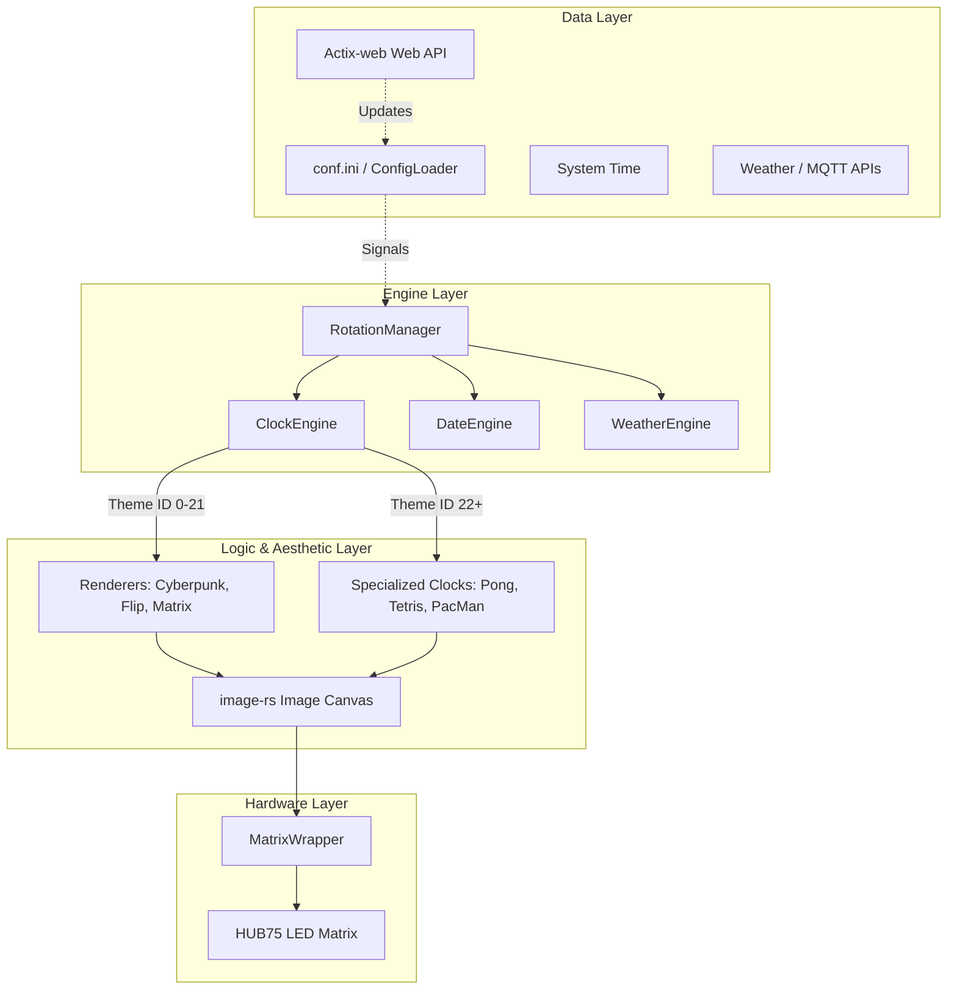
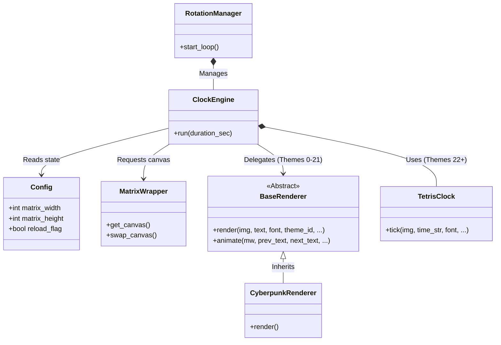

🇬🇧 [English](ARCHITECTURE.md) | 🇫🇷 [Français](ARCHITECTURE_FR.md) | 🇪🇸 Español

# Visión general de la arquitectura

Este documento ofrece una visión general completa de la arquitectura de ArcadeMatrix en Raspberry Pi. Explica las decisiones clave de diseño, el pipeline de renderizado, los modelos de threading y la filosofía general del proyecto.

---

## 1. Filosofía principal

ArcadeMatrix está diseñado para controlar una matriz LED HUB75 usando la biblioteca C++ `hzeller/rpi-rgb-led-matrix` a través de sus bindings de Rust. Los objetivos principales son:
- **Renderizado pixel-perfect:** soporte para fuentes bitmap `.bdf` nítidas y sprites precisos.
- **Modularidad:** añadir fácilmente nuevos temas visuales, relojes y fuentes de datos.
- **Capacidad de respuesta:** una API Web ágil capaz de interrumpir y cambiar la pantalla al instante sin hacer caer el driver de hardware.

---

## 2. El Rendering Pipeline

Para mantener el código base mantenible, separamos estrictamente la lógica de *qué* mostrar de la de *cómo* dibujarlo. 

### Diagrama de alto nivel

### Diagrama de relaciones entre clases

### Componentes del pipeline

1. **Engines (`engines/`)**: los controladores. Gestionan los bucles `while`, obtienen los datos (hora, weather) y determinan cuánto tiempo permanece una función en pantalla.
2. **Renderers (`engines/renderers/`)**: la estética. Toman texto genérico (p. ej. `"12:30"`) y lo dibujan sobre una imagen PIL con un fondo específico (p. ej. Cyberpunk, animación Flip, lluvia Matrix). Son reutilizables entre distintos engines.
3. **Specialized Clocks (`engines/clocks/`)**: los minijuegos. A diferencia de los renderers, son máquinas de estado complejas (p. ej. un juego de Pong con una pelota rebotando, bloques de Tetris cayendo) que construyen dinámicamente la visualización de la hora.
4. **Fighter Engine (`engines/fighter.py`)**: un engine de overlay que se ejecuta sobre el canvas final renderizado para inyectar sprites MUGEN dinámicamente.

---

## 3. Modelo de threading

ArcadeMatrix utiliza una arquitectura de doble thread.

### El thread principal (hardware y renderizado)
La biblioteca `rgbmatrix` depende de un PWM de hardware extremadamente preciso para evitar parpadeos en la matriz LED. Debido a que el Garbage Collector overhead de Rust y los cambios de contexto pueden alterar esa temporización, **todo el renderizado y toda la comunicación con el hardware deben ocurrir estrictamente en el thread principal.**
- NO uses `asyncio` ni lances nuevos threads para dibujar.
- `time.sleep()` se utiliza mucho en los bucles de los engines para ceder la ejecución limpiamente sin dejar sin servicio el buffer DMA.

### El thread en segundo plano (API Web)
Un servidor Actix-web ligero se ejecuta en un thread daemon secundario (`src/api/server.rs`). 
- Sirve el dashboard frontend estático (compilado con Vite, vanilla JS/HTML/CSS; pese a una versión anterior de este documento, **no** es Vue.js: verificado contra el bundle real en `api/www/assets/`, sin firmas del runtime de Vue presentes) y expone endpoints REST.
- **Comunicación:** el thread de la API nunca dibuja directamente en la matriz. En su lugar, escribe en el objeto `Config` compartido en memoria y establece flags thread-safe (p. ej. `config.reload_flag = True` o `config.force_engine = "weather"`). El thread principal detecta estos flags durante la siguiente iteración de su bucle y aborta/reinicia el engine de forma ordenada para reflejar la nueva configuración.

### El thread MQTT (integración Pixelcade)
Un bucle `paho-mqtt` se ejecuta en su propio thread para recibir eventos de juego en vivo desde Recalbox o Batocera.
- **Fetching asíncrono:** cuando se selecciona un juego, el thread establece inmediatamente `force_engine = 'message'` para mostrar texto de respaldo, mientras lanza simultáneamente un thread transitorio en segundo plano mediante `DMDCache` para descargar desde GitHub la imagen oficial Pixelcade marquee.
- **Caché atómica:** para evitar corrupción en la tarjeta SD si varias descargas compiten por el mismo archivo, el thread en segundo plano escribe en un archivo temporal (`.tmp.[thread_id]`) y usa `os.rename()` para el reemplazo atómico.
- **Prevención de deadlocks:** `DMDCache` usa un modelo estricto de adquisición única de lock para `self._lock` al asignar IDs de petición. Los threads en segundo plano nunca ejecutan callbacks mientras mantienen el lock, lo que evita los deadlocks clásicos de locks reentrantes cuando el callback actualiza el estado del thread principal.

---

## 4. Motor de escalado de fuentes BDF

Como las matrices HUB75 tienen resoluciones extremadamente bajas (p. ej. 64x32), las fuentes TrueType (`.ttf`) estándar suelen verse borrosas debido al anti-aliasing. Para resolverlo, usamos fuentes bitmap `.bdf`.

Sin embargo, PIL (image-rs) no admite de forma nativa el escalado de fuentes `.bdf`. Nuestra arquitectura intercepta el renderizado `.bdf`:
1. Dibuja el texto `.bdf` en una máscara binaria de 1 bit en su escala original 1x.
2. Escala la máscara usando el algoritmo `NEAREST` neighbor para multiplicar perfectamente su tamaño (2x, 3x, etc.) sin desenfoque.
3. Recolorea la máscara escalada y la pega sobre el canvas RGB final.

---

## 5. Gestión de energía y standby

Para prolongar la vida útil de la matriz LED y reducir el consumo energético, ArcadeMatrix incluye funciones de gestión de energía tanto manuales como programadas:
- **Matrix Power Toggle:** accesible desde la UI; al alternar la energía de la matriz se establece `config.matrix_power = False`. Los engines detectan este flag al instante, omiten el renderizado de frames y emiten un comando `wrapper.clear()` para apagar todos los LEDs mientras los procesos en segundo plano (API, MQTT) siguen activos.
- **Night Mode:** una función programada tipo cron que atenúa automáticamente la matriz o la apaga por completo (bajando el brillo a 0) entre las horas `turn_off_at` y `wake_up_at` especificadas.

---

## 6. Diferencias de arquitectura entre RPi (Rust) y ESP32 (C++)

El proyecto ArcadeMatrix consta de dos implementaciones originales desarrolladas en paralelo para adaptarse a las limitaciones específicas de cada plataforma de hardware:

- **RPi (Rust):** utiliza un Rendering Pipeline desacoplado (Engines -> Renderers -> PIL Canvas -> Matrix). La RAM es abundante (512MB+), lo que permite manipular canvas RGB completos en memoria con image-rs antes de enviarlos al hardware.
- **ESP32 (C++):** utiliza una estructura Monolithic Engine. La RAM es extremadamente limitada (320KB). En lugar de dibujar en un canvas fuera de pantalla, el código de ESP32 a menudo escribe los píxeles directamente en el buffer DMA o usa arreglos 1D mínimos. No utiliza un pipeline de `Renderer` separado para evitar la asignación dinámica de memoria y la sobrecarga de punteros. 

*Esta divergencia arquitectónica es intencional y optimiza las limitaciones específicas de cada plataforma de hardware.*

## Inyección de Dependencias y Proveedores
El proyecto utiliza una arquitectura de Inyección de Dependencias (DI) para los motores basados en API (Crypto, Stock, Clima). Los motores están desacoplados de la lógica HTTP a través de interfaces (`IProvider` en C++, `traits` en Rust). Esto permite mecanismos de respaldo entre múltiples proveedores y habilita pruebas unitarias exhaustivas mediante Mocks.
