🇪🇸 Español | 🇬🇧 [English](ARCHITECTURE.md) | 🇫🇷 [Français](ARCHITECTURE_FR.md)

# Visión general de la arquitectura (Raspberry Pi - Rust)

Este documento es la referencia **profunda y exhaustiva** de la arquitectura ArcadeMatrix en Raspberry Pi (escrita en **Rust**). Cubre la filosofía de diseño, el contrato completo de los motores, el Registry de auto-descubrimiento, el ciclo de vida «Lazy-Once», la configuración auto-reparable, la UI dinámica dirigida por esquema (incluidas las **listas de opciones personalizadas / dinámicas**), el árbitro de visualización, el compositor de overlay Fighter y el runtime multihilo.

> Para **añadir** un motor o un campo de configuración, lee [DEVELOPER_ES.md](DEVELOPER_ES.md). Este documento explica **por qué** y **cómo** se comporta el sistema; la guía del desarrollador explica **qué escribir**.

---

## Tabla de contenidos

1. [Filosofía: rendimiento y «jitter»](#1-filosofía-rendimiento-y-jitter)
2. [Mapa de componentes](#2-mapa-de-componentes)
3. [El contrato de los motores (modelo de clases)](#3-el-contrato-de-los-motores-modelo-de-clases)
4. [Auto-descubrimiento: Registry, Descriptor y Factory](#4-auto-descubrimiento-registry-descriptor-y-factory)
5. [El ciclo de vida «Lazy-Once»](#5-el-ciclo-de-vida-lazy-once)
6. [Modelo de configuración: `config.json` → instancias](#6-modelo-de-configuración-configjson--instancias)
7. [Auto-reparación: el ConfigSanitizer](#7-auto-reparación-el-configsanitizer)
8. [Propagación de config y hot reload](#8-propagación-de-config-y-hot-reload)
9. [UI dinámica por esquema y listas personalizadas](#9-ui-dinámica-por-esquema-y-listas-personalizadas)
10. [El árbitro de visualización](#10-el-árbitro-de-visualización)
11. [El compositor de overlay Fighter](#11-el-compositor-de-overlay-fighter)
12. [Aislamiento del runtime y modelo de hilos](#12-aislamiento-del-runtime-y-modelo-de-hilos)
13. [Cadencia de renderizado](#13-cadencia-de-renderizado)
14. [Superficie de la API HTTP](#14-superficie-de-la-api-http)
15. [Metadatos de compilación](#15-metadatos-de-compilación)

---

## 1. Filosofía: rendimiento y «jitter»

A diferencia del ESP32, la Raspberry Pi tiene RAM abundante (512 MB a 8 GB). Sin embargo, su sistema operativo **no** es de tiempo real (sin RTOS). El controlador de la matriz (vía DMA/GPIO, `rpi-rgb-led-matrix`) es extremadamente sensible a los micro-tirones («jitter»).

Para mantener un refresco estable sin desgarros, **el bucle caliente (`update()` + `render()`) no debe realizar asignaciones dinámicas innecesarias**. Cada asignación en el heap arriesga un `malloc`/redimensionamiento que introduce unos milisegundos de latencia impredecible — suficiente para hacer parpadear el panel.

De aquí surgen tres reglas que dan forma a toda la arquitectura:

- **Asignar una vez, mutar in situ.** Los búferes (`String`, `Vec`) se reservan en `initialize()` y se reutilizan en cada frame (`clear()` + `write!()`).
- **Crear motores de forma perezosa y conservarlos para siempre.** Un motor solo se instancia la primera vez que se muestra, y luego se cachea durante toda la vida del proceso («Lazy-Once»).
- **Aislar el hilo de renderizado.** HTTP, MQTT y la E/S de red nunca corren en el hilo que habla con la matriz.

---

## 2. Mapa de componentes

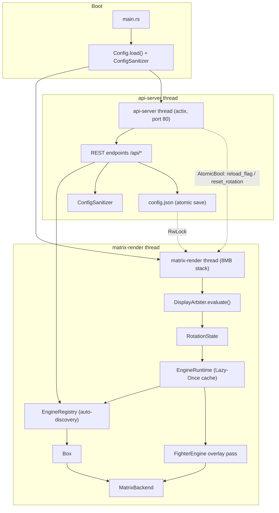

Los dos hilos **nunca comparten estado mutable directamente**. Se comunican solo mediante:

- un `Config` compartido protegido por `RwLock<ConfigSettings>` (para el snapshot de ajustes), y
- atómicos sin bloqueo (`AtomicBool` / `AtomicU32`) usados como señales de un solo disparo.

---

## 3. El contrato de los motores (modelo de clases)

Cada función visual (reloj, clima, reproductor GIF, ticker cripto…) implementa el único trait `Engine`. El Core solo manipula un `Box<dyn Engine>` — **no tiene conocimiento en tiempo de compilación** de los tipos concretos.

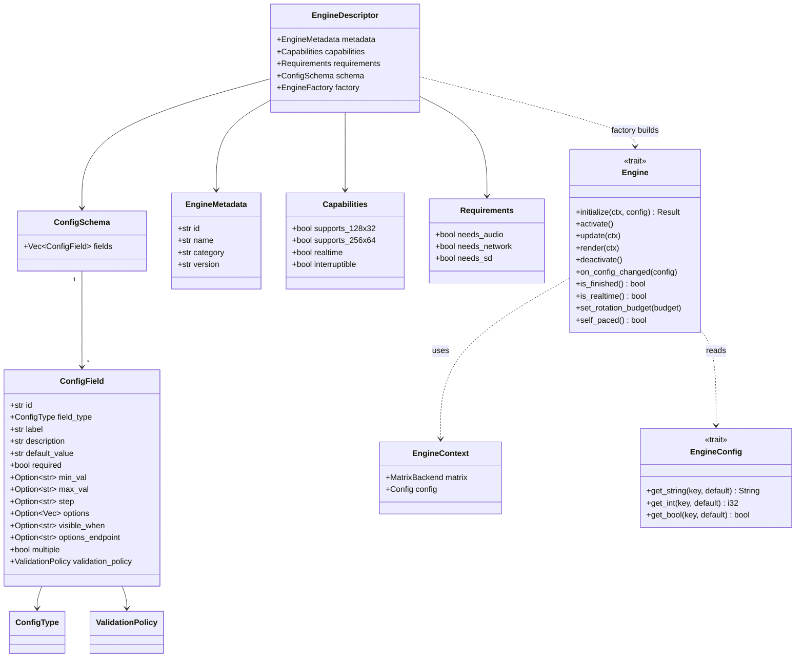

### Responsabilidades de los métodos

| Método | Llamado | Propósito |
| :-- | :-- | :-- |
| `initialize` | una vez, al primer mostrado | Asignación pesada: cargar bitmaps/fuentes, reservar búferes. |
| `activate` | cada vez que se vuelve visible | Reinicio barato del estado transitorio (sin asignación). |
| `update` | bucle caliente | Lógica de negocio. **Sin asignación innecesaria.** |
| `render` | bucle caliente | Dibujar en `context.matrix`. **Sin asignación innecesaria.** |
| `deactivate` | al salir de pantalla | Detener tareas/escuchas de fondo. |
| `on_config_changed` | en edición en vivo | Releer valores **in situ**, sin recreación. |
| `is_finished` | cada frame | Señalar al runtime que avance antes (p. ej. cripto terminó su lista de tokens). |
| `is_realtime` | cada frame | Pista de cadencia en vivo (≈25 FPS) evaluada por frame, a diferencia del `Capabilities.realtime` estático. |
| `set_rotation_budget` | al activar | Para motores basados en contador (GIF), recibe el valor numérico de la entrada de rotación como presupuesto de reproducción. |
| `self_paced` | cada frame | Si es `true`, el temporizador de duración **no** debe forzar el avance; el motor lo dirige vía `is_finished`. |

---

## 4. Auto-descubrimiento: Registry, Descriptor y Factory

### Por qué el Core no tiene lista de tipos concretos

En versiones previas a la refactorización, `app.rs` incluía cada archivo de motor y construía un enorme `match` con `Box::new(ClockEngine)`. Añadir un motor obligaba a modificar el Core — una violación del principio abierto/cerrado (SOLID).

Ahora cada motor **se registra en tiempo de compilación** mediante el `#[distributed_slice]` de la crate `linkme`. El linker recoge cada función de registro en una única slice estática `ENGINES`; el Core simplemente la itera.

```rust
// core/registry.rs
#[distributed_slice]
pub static ENGINES: [fn() -> EngineDescriptor];
```

```rust
// cualquier archivo de motor
#[distributed_slice(crate::core::registry::ENGINES)]
fn register_clock() -> EngineDescriptor { /* metadata + schema + factory */ }
```

### Por qué el Registry guarda descriptores, no instancias

Instanciar cada motor en el arranque (`Box::new(...)`) desperdiciaría RAM y ralentizaría el inicio. Un **descriptor** es barato: lleva metadatos, capacidades, requisitos, el esquema de configuración y una **factory** — un puntero a función `fn() -> Box<dyn Engine>` que construye la instancia solo cuando se necesita.

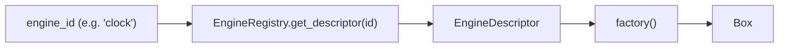

`EngineRegistry` expone dos llamadas:

- `get_all_descriptors()` — usada por `GET /api/engines` y el sanitizer.
- `get_descriptor(id)` — usada por el runtime para construir una instancia.

---

## 5. El ciclo de vida «Lazy-Once»

El `EngineRuntime` posee dos mapas: las instancias vivas en caché y un snapshot de la config con la que cada una se configuró por última vez.

```rust
pub struct EngineRuntime {
    instances: HashMap<String, Box<dyn Engine>>,     // instance_id -> motor vivo
    configs:   HashMap<String, HashMap<String,String>>, // instance_id -> última config aplicada
}
```

`get_instance()` es el corazón del Lazy-Once y del hot-reload:

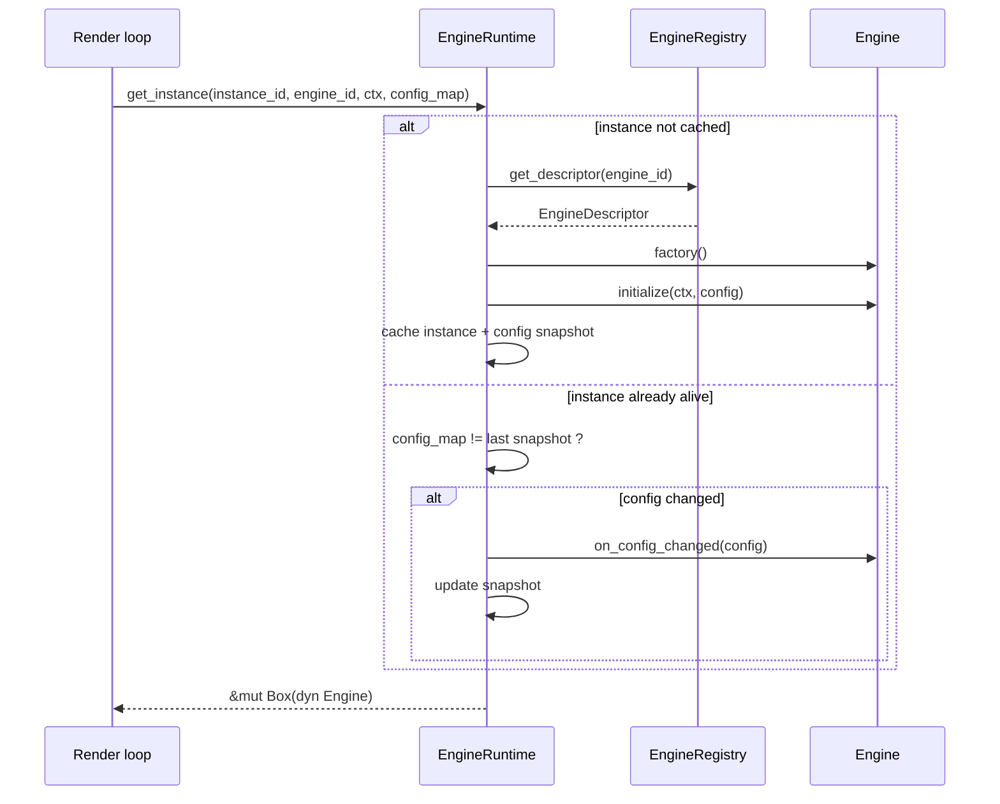

El ciclo de vida como máquina de estados:

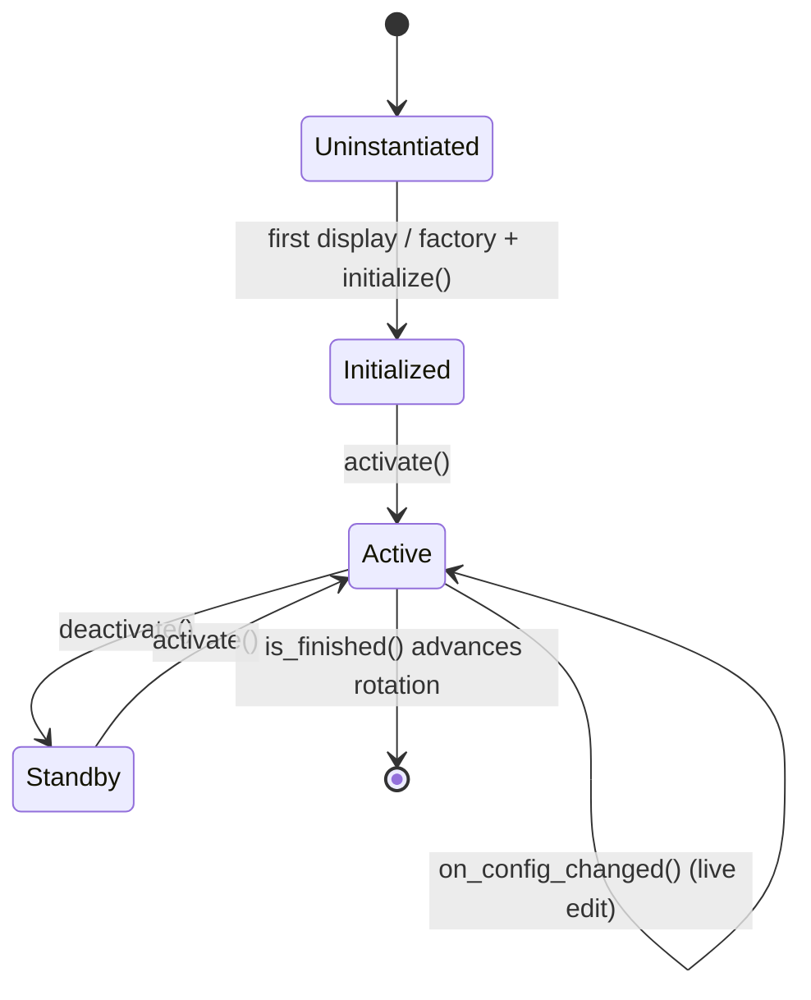

**Propiedad clave:** una edición de configuración nunca destruye ni reconstruye una instancia. La instancia conserva sus búferes y simplemente relee los valores en `on_config_changed()`.

---

## 6. Modelo de configuración: `config.json` → instancias

El único archivo raíz `config.json` describe todo el dispositivo. Su estructura:

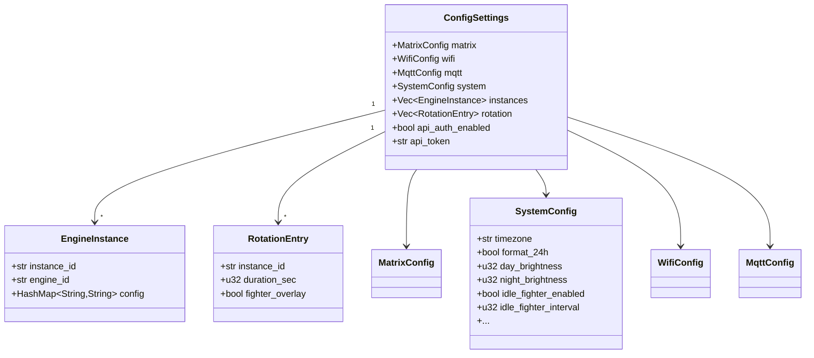

### Tres conceptos distintos

- **Motor (Engine)** — un *tipo* (p. ej. `clock`), declarado una vez por el Registry.
- **Instancia** — una *ocurrencia nombrada y configurada* de un motor (p. ej. `clock_main`, `clock_arcade`), almacenada en `instances`.
- **Configuración** — el `HashMap<String,String>` dentro de una instancia, validado contra el `ConfigSchema` del motor.

Por eso puedes ejecutar varios relojes con fuentes/temas distintos a partir del mismo `ClockEngine`.

### Por qué se separan `config.json` y `EngineConfig`

Los motores no deben ver las credenciales WiFi ni los ajustes de otros motores. El runtime envuelve el `HashMap` de cada instancia en un `HashConfig` y solo entrega al motor el trait `EngineConfig` (`get_string/get_int/get_bool`) — un proxy restringido que expone exactamente las claves que el motor declaró en su esquema.

### Las señales del runtime viven en `Config`

`Config` también contiene el estado runtime entre hilos, separado del `ConfigSettings` persistente:

```rust
pub struct Config {
    pub reload_flag: AtomicBool,      // cambio de hardware/red -> reinicio limpio
    pub reset_rotation: AtomicBool,   // edición de instancia/rotación -> relectura en el siguiente frame
    pub matrix_power: AtomicBool,     // encendido/apagado en vivo
    pub matrix_brightness: AtomicU32, // brillo en vivo (0..100)
    pub message_payload: Mutex<Option<Value>>,
    pub settings: RwLock<ConfigSettings>,
}
```

---

## 7. Auto-reparación: el ConfigSanitizer

`ConfigSanitizer::sanitize_instances()` se ejecuta en el arranque y tras cada escritura. Para cada instancia busca el esquema del motor y repara la config almacenada para que el runtime siempre vea datos válidos — esto es lo que hace robustas las actualizaciones OTA.

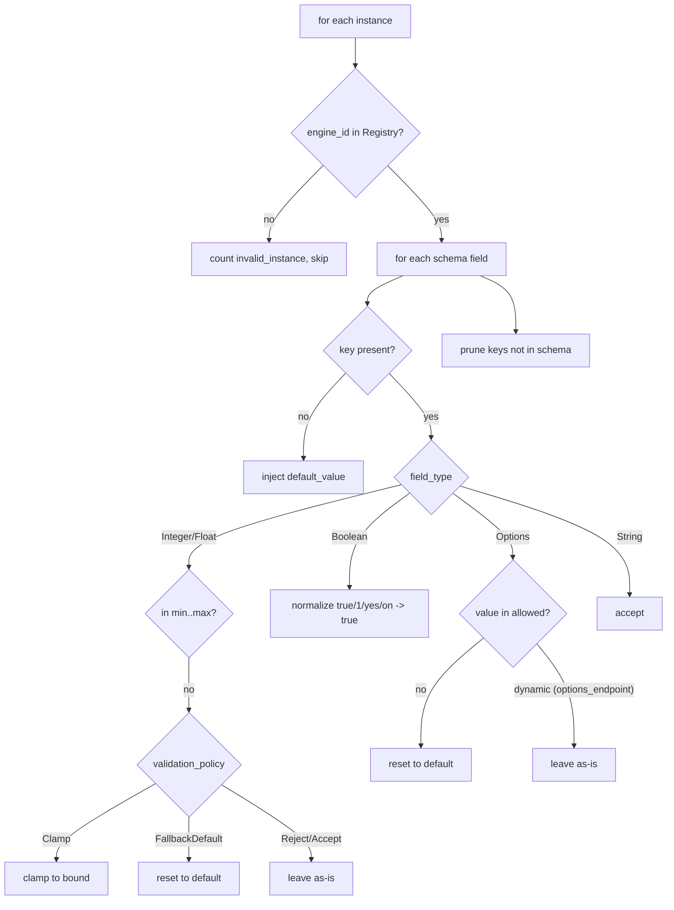

`SanitizeResult` informa cuántos valores fueron `defaults_injected`, `values_clamped`, `values_fallback`, `keys_pruned` e `invalid_instances`, y si el archivo fue `modified` (lo que dispara un reguardado).

Dos sutilezas importantes:

- **Las opciones dinámicas son de confianza.** Un campo con `options_endpoint` (p. ej. un nombre de archivo de fuente) no tiene lista blanca estática en compilación, así que el sanitizer deja su valor intacto.
- **El multiselección es un CSV.** Cuando `multiple = true`, el valor es una lista separada por comas; cada token debe pertenecer al conjunto permitido.

Ejemplo OTA concreto — el firmware v2 añade `font_size` y elimina `legacy_mode`:

```jsonc
// almacenado (v1)             // tras arrancar en v2
{ "font": "foo" }        -->   { "font": "foo", "font_size": "16" }
{ "legacy_mode": "x" }   -->   {}   // podado: ya no está en el esquema
```

---

## 8. Propagación de config y hot reload

Como las instancias están en caché, una edición debe **empujarse activamente** al motor vivo en vez de recrearlo. La cadena está cableada de extremo a extremo:

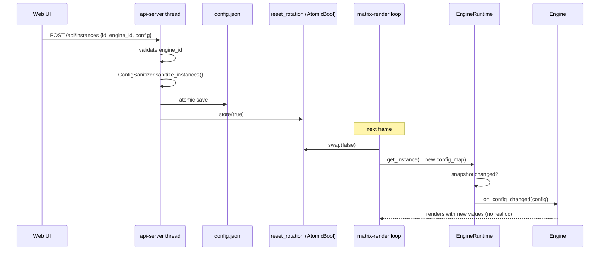

Dos clases de propagación:

- **Ediciones de instancia / rotación** → `reset_rotation` → aplicadas **en vivo** vía `on_config_changed()`; sin reinicio ni reasignación.
- **Cambios de hardware / red** (geometría de la matriz, `disable_internal`…) → `reload_flag` → el bucle de render reinicia el proceso limpiamente para reinicializar el controlador. El brillo/encendido en vivo son la excepción: pasan por los atómicos `matrix_brightness` / `matrix_power` sin reinicio.

---

## 9. UI dinámica por esquema y listas personalizadas

La UI web no contiene **ningún formulario por motor**. `GET /api/engines` devuelve cada descriptor (metadatos + esquema), y `dynamic_engines.js` interpreta cada `ConfigField` para construir el widget correcto. Añadir un motor o un campo cambia la UI sin ninguna línea de frontend.

### Resolución campo → widget

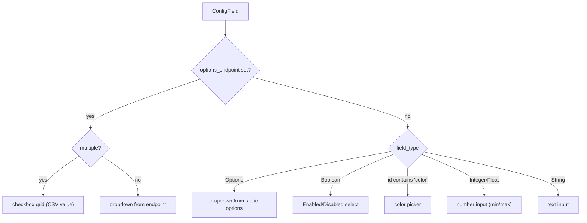

### Listas de opciones personalizadas / dinámicas (los endpoints de «descubrimiento de recursos»)

Es el mecanismo que la antigua UI codificada perdía. Un campo declara **de dónde** vienen sus opciones en vez de codificarlas; el backend sirve los recursos reales y actualizados:

| Endpoint | Fuente | Usado por (campo) |
| :-- | :-- | :-- |
| `GET /api/fonts` | archivos en `fonts/` (`.ttf`, `.bdf`) | `font` del reloj, cualquier motor de texto |
| `GET /api/playlists` | subdirectorios de `gifs/` | `playlist` del GIF (**multiple**) |
| `GET /api/themes` | `core::theme::all_themes()` (fuente única de verdad) | `theme` del reloj |

Cada uno devuelve un array JSON de `{ "value": ..., "label": ... }`. Como la lista se obtiene **en vivo**, soltar una nueva fuente en `fonts/` o una nueva carpeta GIF en `gifs/` aparece inmediatamente en la UI.

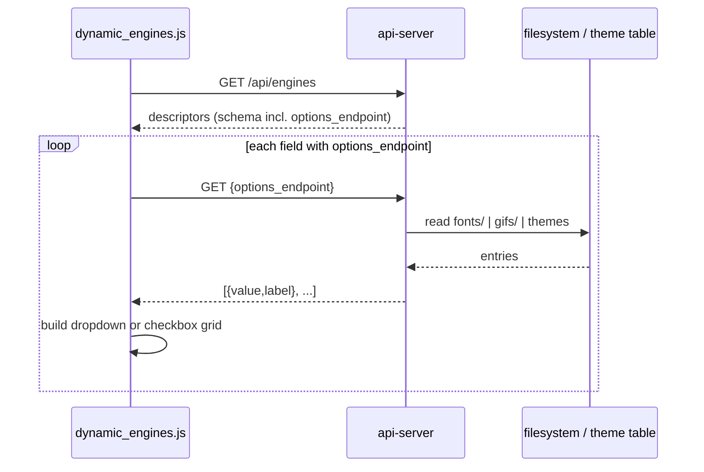

### Almacenamiento del multiselección

Para `multiple = true` (p. ej. la playlist GIF), la UI muestra una cuadrícula de casillas y almacena la selección como una **cadena separada por comas** en la config de la instancia (`"mario,zelda"`). El motor GIF y el sanitizer dividen ambos por `,`. Así el usuario elige *qué* carpetas GIF se reproducen — reemplazando el antiguo caso especial «ignorar esto, incluir aquello» por una elección explícita y declarativa.

### `visible_when`

Un campo puede llevar `visible_when` referenciando otro campo, permitiendo al frontend mostrarlo/ocultarlo condicionalmente (campos dependientes declarativos) sin JS específico del motor.

---

## 10. El árbitro de visualización

La rotación no es lo único que puede poseer la pantalla. Los marquees (frontends de arcade), banners MQTT, mensajes de un disparo y el reproductor GIF compiten por ella. El `DisplayArbiter` lo resuelve por **prioridad**, de modo que el Core nunca contiene lógica de negocio `if source == "mqtt"` en el bucle de render.

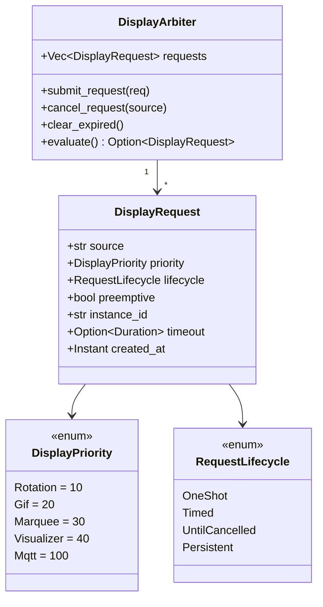

En cada frame, el bucle de render envía/cancela solicitudes según el estado en vivo, luego llama a `evaluate()`, que descarta las solicitudes expiradas y devuelve la superviviente de **mayor prioridad**. `ROTATION` es una base `Persistent`, no preventiva (prioridad 10) siempre presente; cualquier otra cosa (MQTT=100, Marquee=30, GIF=20…) puede tomar el control temporalmente.

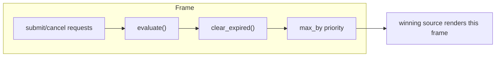

---

## 11. El compositor de overlay Fighter

El Fighter **no** es un `Engine` y **no** es arbitrado. Es un *overlay aditivo*: sprites decorativos de luchadores dibujados **encima** del frame de rotación actual. Como el árbitro es exclusivo (un ganador por frame), un overlay no puede modelarse como una fuente competidora — por eso es una pasada de composición separada.

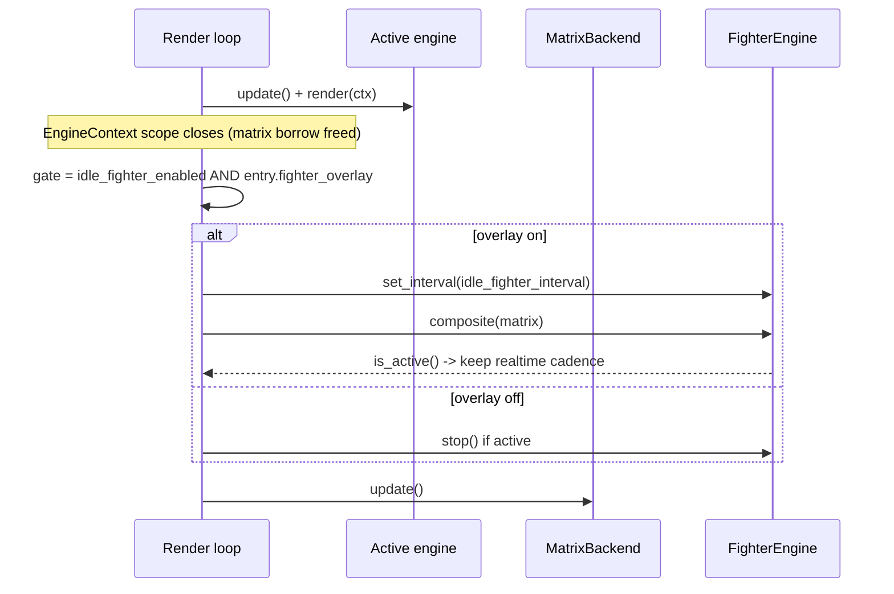

Decisiones de diseño:

- **Opt-in por entrada.** Cada `RotationEntry` tiene `fighter_overlay: bool`. El overlay se muestra solo cuando el **interruptor maestro** (`system.idle_fighter_enabled`) *y* el flag de la entrada actual son ambos verdaderos. Deliberadamente **no** existe una capacidad «ocultar sobre GIF» automática — el usuario decide por pantalla.
- **Ciclo de vida autogestionado.** `FighterEngine` carga los sprites en un hilo de fondo, programa peleas en su propio intervalo y elige el conjunto de assets por la altura del panel (`fighters_64` si altura ≥ 64, si no `fighters_32`, con recurso final al otro conjunto).
- **Acoplamiento de cadencia.** Mientras hay una pelea en pantalla, el bucle mantiene la vía de alto FPS para que la animación siga fluida, incluso sobre un reloj estático.

---

## 12. Aislamiento del runtime y modelo de hilos

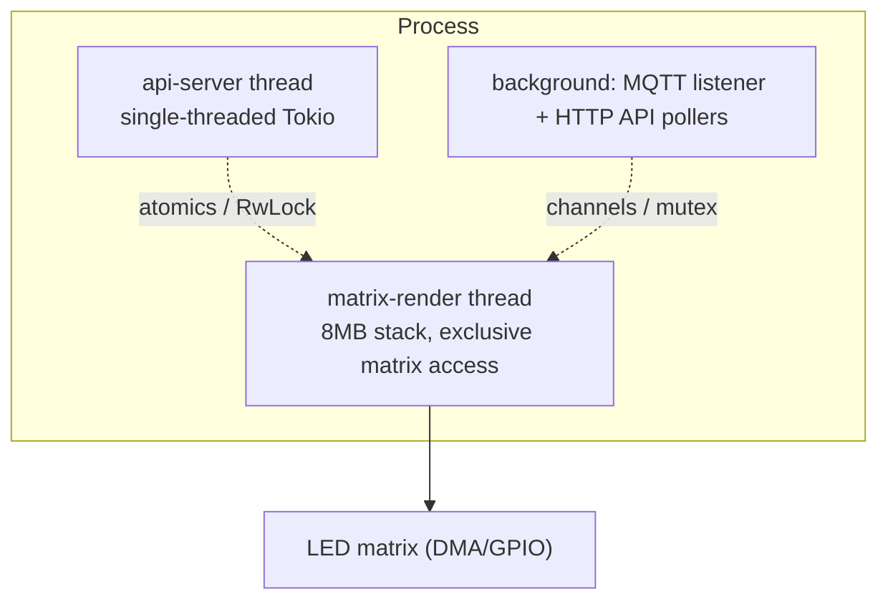

1. **Hilo de renderizado dedicado (`matrix-render`)** — pila de 8 MB, propiedad exclusiva de la matriz. Si compartiera el hilo con HTTP, cada solicitud saltaría un frame (desgarro).
2. **Hilo Web API aislado (`api-server`)** — un runtime Tokio de un solo hilo que aloja actix en el puerto 80. Solo toca el hilo de render mediante atómicos y lecturas cortas de `RwLock`.
3. **Servicios de fondo** — el escucha MQTT y los sondeadores HTTP (cripto, clima, bolsa) corren fuera de la vía de render, para que una llamada de red lenta nunca detenga `update()`.

---

## 13. Cadencia de renderizado

La pausa por frame se deriva de la capacidad/estado, **nunca** de un nombre de motor codificado:

- `Capabilities.realtime == true` **o** `engine.is_realtime() == true` en vivo → ~25 FPS (40 ms), para contenido animado (GIF, mensaje desplazante, Spotify, overlay Fighter activo).
- de lo contrario → 1 Hz (1000 ms), para contenido estático (reloj, fecha, clima) — mucho más ligero para CPU y Wi-Fi.

`is_realtime()` se reevalúa en cada frame, así que un motor puede cambiar de cadencia según su estado en vivo (p. ej. un reloj que solo anima en un tema concreto).

---

## 14. Superficie de la API HTTP

Todos los endpoints son handlers actix en `src/api/server.rs`; los assets web estáticos se incrustan vía `rust-embed`. Referencia completa en [../openapi.yaml](../openapi.yaml).

| Método | Ruta | Propósito |
| :-- | :-- | :-- |
| GET | `/api/system` | Snapshot completo de ajustes |
| POST | `/api/system` | Patch de ajustes top-level/sistema (guardado parcial seguro) |
| GET | `/api/instances` | Listar instancias configuradas |
| POST | `/api/instances` | Upsert de una instancia (saneada + guardada) |
| DELETE | `/api/instances/{id}` | Eliminar una instancia |
| GET | `/api/rotation` | Lista de rotación (orden, duraciones, flags de overlay) |
| POST | `/api/rotation` | Reemplazar la rotación, pone `reset_rotation` |
| GET | `/api/engines` | Todos los descriptores (dirige la UI dinámica) |
| GET | `/api/fonts` | Archivos de fuentes en `fonts/` (options_endpoint) |
| GET | `/api/playlists` | Carpetas GIF en `gifs/` (options_endpoint) |
| GET | `/api/themes` | Temas de `core::theme` (options_endpoint) |
| GET | `/api/stats` | Stats del runtime (uptime, memoria, versión) |
| POST | `/api/wifi` | Actualizar credenciales Wi-Fi |
| POST | `/api/marquee` | Enviar una imagen de marquee |
| POST | `/api/mqtt/install` | Instalar/activar el broker MQTT |
| POST | `/api/mqtt/logs` | Obtener logs MQTT |
| POST | `/api/system/restart` | Reiniciar el servicio |
| GET | `/api/action/reboot` · POST `/api/system/reboot` | Reiniciar la Pi |
| POST | `/api/system/shutdown` | Apagar la Pi |
| POST | `/api/system/power` | Encendido/apagado en vivo de la matriz |

Cada handler mutador pasa por `check_auth` cuando `api_auth_enabled` está activo.

---

## 15. Metadatos de compilación

`core/build_info.rs` centraliza los valores `env!` inyectados por `build.rs` (`VERSION`, `ARCH`, `BUILD_TIMESTAMP`, `GIT_COMMIT`). Se leen **una sola vez** aquí porque `env!` fija los valores en la compilación de cada sitio de llamada; leerlos en un módulo único mantiene coherentes `/api/version`, el banner de arranque y la validación OTA entre compilaciones incrementales.
