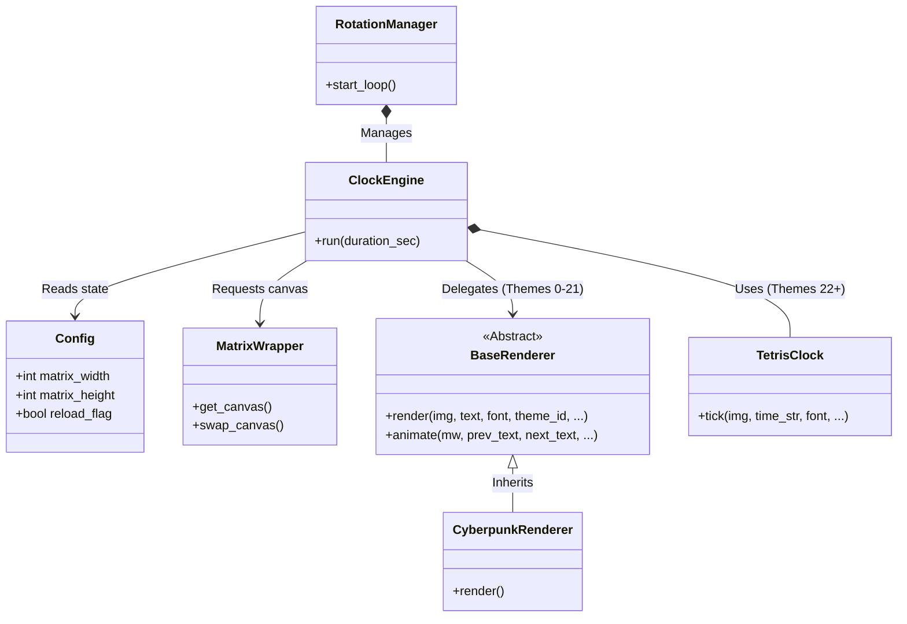

🇬🇧 [English](ARCHITECTURE.md) | 🇫🇷 Français | 🇪🇸 [Español](ARCHITECTURE_ES.md)

# Vue d'ensemble de l'architecture (Rust Engine & OTA)

Ce document fournit une vue d'ensemble complète de l'architecture d'ArcadeMatrix sur Raspberry Pi réécrit en **Rust natif**. Il explique les décisions de conception principales, le pipeline de rendu multi-threadé, le système de mises à jour OTA et la philosophie générale du projet.

---

## 1. Philosophie de base

ArcadeMatrix est un exécutable Rust binaire natif conçu pour piloter une matrice LED HUB75 à l'aide du trait `MatrixBackend` et des bindings `rpi-led-matrix`. Les objectifs principaux sont :
- **Rendu pixel-perfect :** prise en charge des polices bitmap `.bdf` nettes, polices `.ttf` et des sprites `.fgt` BGR565.
- **Sécurisation & Performance :** 0% d'utilisation CPU au repos, zéro garbage collection, et un binaire statique unique d'environ 5 Mo.
- **Mises à jour OTA sans re-flash :** endpoint `POST /api/update` permettant l'upload et le remplacement atomique du binaire à chaud depuis la Web UI.

---

## 2. Le Rendering Pipeline (Rust & Actix-web)

### Diagramme de haut niveau

```mermaid
graph TD
    subgraph Data & API Layer
        API[Actix-web REST API]
        OTA[OTA Handler /api/update]
        Config[conf.ini / Config Mutex]
        Time[Chrono System Time]
        Network[OpenWeather / MQTT Client]
    end

    subgraph Engine Layer (Rust)
        App[ArcadeMatrixApp]
        Rot[RotationState]
        ClockE[ClockEngine]
        DateE[DateEngine]
        WeathE[WeatherEngine]
        App --> ClockE & DateE & WeathE & OTA
    end

    subgraph Renderers & Matrix Abstraction
        ClockE -->|Theme ID 0-21| Renderers[Base, Cyberpunk, Flip, TrueMatrix]
        ClockE -->|Theme ID 22+| SpClocks[Pong, Tetris, Pacman, Versus, SlotMachine]
        Renderers --> Trait[Trait MatrixBackend]
        SpClocks --> Trait
    end

    subgraph Hardware & Mock Layer
        Trait -->|Linux ARM| Hardware[rpi-led-matrix C++ Binding]
        Trait -->|Development| Mock[MockMatrix Canvas]
    end
```
    end

    API -.->|Updates| Config
    Config -.->|Signals| Rot
```

### Diagramme des relations entre classes



### Composants du pipeline

1. **Engines (`engines/`)** : les contrôleurs. Ils gèrent les boucles `while`, récupèrent les données (heure, weather) et déterminent combien de temps une fonctionnalité reste à l'écran.
2. **Renderers (`engines/renderers/`)** : l'esthétique. Ils prennent un texte générique (p. ex. `"12:30"`) et le dessinent sur une image PIL avec un arrière-plan spécifique (p. ex. Cyberpunk, animation Flip, pluie Matrix). Ils sont réutilisables entre différents engines.
3. **Specialized Clocks (`engines/clocks/`)** : les mini-jeux. Contrairement aux renderers, ce sont des machines à états complexes (p. ex. une partie de Pong avec une balle qui rebondit, des blocs Tetris qui tombent) qui construisent dynamiquement l'affichage de l'heure.
4. **Fighter Engine (`engines/fighter.py`)** : un engine d'overlay qui s'exécute au-dessus du canvas final rendu pour injecter dynamiquement des sprites MUGEN.

---

## 3. Modèle de threading

ArcadeMatrix utilise une architecture à deux threads.

### Le thread principal (matériel & rendu)
La bibliothèque `rpi-led-matrix` s'appuie sur un PWM matériel extrêmement précis pour éviter le scintillement sur la matrice LED. Comme les changements de contexte peuvent perturber ce timing, **tout le rendu et toute la communication matérielle doivent impérativement se produire sur le thread principal dédié.**
- Le thread DMA en C++ étant extrêmement gourmand (tournant en temps réel `SCHED_FIFO`), l'application Rust isole l'affichage sur certains cœurs CPU (ex: cœurs 2 et 3), et le moniteur Wi-Fi s'assure que les interruptions noyau (IRQs Wi-Fi) restent protégées sur le cœur 0. Cette séparation stricte empêche les chutes de FPS et les déconnexions intempestives.

### Le thread d'arrière-plan (API Web)
Un serveur Actix-web léger tourne sur un thread secondaire (`src/api/server.rs`). 
- Il sert le dashboard frontend statique (compilé avec Vite, vanilla JS/HTML/CSS ; malgré une version antérieure de ce document, ce n'est **pas** du Vue.js : vérifié sur le bundle réel dans `api/www/js/`, aucune signature de runtime Vue présente) et expose des endpoints REST.
- **Communication :** le thread API ne dessine jamais directement sur la matrice. À la place, il écrit dans l'objet `Config` partagé en mémoire (`RwLock`) et positionne des flags thread-safe (p. ex. `config.reload_flag = true` ou `config.force_engine = "weather"`). Le thread principal détecte ces flags lors de sa prochaine itération de boucle et interrompt/redémarre proprement l'engine pour refléter les nouveaux réglages.

## 4. Configuration de la Matrice (Stabilité)

Afin d'assurer une compatibilité maximale avec tous les types de panneaux LED et de résoudre les problèmes matériels, de nouveaux paramètres ont été intégrés dans `conf.ini` :

* **`MATRIX_RGB_SEQUENCE`** (ex: `RGB` ou `BGR`) : Permet de corriger l'inversion des couleurs si votre matrice affiche de fausses couleurs.
* **`MATRIX_PWM_BITS`** (défaut: `8`) : La réduction des bits PWM (au lieu de 11) diminue considérablement la charge CPU générée par le thread DMA de la matrice, ce qui est crucial sur les RPi avec des ressources limitées.
* **`MATRIX_SLOWDOWN_GPIO`** (défaut: `4`) : Permet de stabiliser le signal d'affichage sur les matrices plus anciennes ou récalcitrantes, en ralentissant les impulsions GPIO.
* **`MATRIX_LIMIT_REFRESH_RATE_HZ`** (défaut: `0` = sans limite) : Permet de forcer le rafraîchissement à une certaine fréquence (ex: 120Hz).
* **`MATRIX_DISABLE_HARDWARE_PULSING`** (défaut: `false`) : À activer si vous utilisez le RPi sans la soudure matérielle (audio PWM) sur les pins, pour désactiver la génération d'impulsions matérielles strictes.

## 5. Utilitaires et Scripts de Débogage

Pendant la phase de migration et d'optimisation, plusieurs scripts ont été créés pour faciliter le développement et le diagnostic direct sur le Raspberry Pi :

* **`scripts/run_ab_test.sh`** :  
  Permet de comparer rapidement (A/B testing) l'ancienne version et la nouvelle version. Ce script stoppe proprement le service actuel, lance la version demandée, et permet de vérifier visuellement ou au niveau des performances les différences entre les deux implémentations.
* **`scripts/wifi_diag.sh`** :  
  Un outil de diagnostic essentiel. Il permet de monitorer en temps réel l'état de l'interface `wlan0`, de vérifier sur quel cœur CPU les interruptions réseau (IRQs) sont exécutées, et de faire des pings pour détecter immédiatement les pertes de paquets ou le "flapping" du Wi-Fi causés par une éventuelle famine CPU.
* **`scripts/deploy.sh` / `deploy.ps1`** :  
  Scripts de cross-compilation et de déploiement (Mac/Linux ou Windows). Ils compilent le code Rust pour l'architecture `aarch64` et envoient automatiquement le binaire mis à jour sur le Pi via SSH, tout en relançant le service `arcadematrix`.

### Le thread MQTT (intégration Pixelcade)
Une boucle `paho-mqtt` tourne sur son propre thread afin de recevoir les événements de jeu en direct depuis Recalbox ou Batocera.
- **Fetching asynchrone :** lorsqu'un jeu est sélectionné, le thread définit immédiatement `force_engine = 'message'` pour afficher un texte de secours, tout en lançant simultanément un thread d'arrière-plan transitoire via `DMDCache` pour télécharger depuis GitHub l'image officielle Pixelcade marquee.
- **Cache atomique :** pour éviter la corruption de la carte SD si plusieurs téléchargements entrent en concurrence pour le même fichier, le thread d'arrière-plan écrit dans un fichier temporaire (`.tmp.[thread_id]`) puis utilise `os.rename()` pour le remplacement atomique.
- **Prévention des deadlocks :** `DMDCache` utilise un modèle strict d'acquisition unique du verrou pour `self._lock` afin d'assigner des IDs de requête. Les threads d'arrière-plan n'exécutent jamais de callbacks en conservant le verrou, ce qui évite les deadlocks classiques de verrous réentrants lorsque le callback met à jour l'état du thread principal.

---

## 6. Moteur de mise à l'échelle des polices BDF

Parce que les matrices HUB75 ont des résolutions extrêmement basses (p. ex. 64x32), les polices TrueType standard (`.ttf`) paraissent souvent floues à cause de l'anti-aliasing. Pour résoudre cela, nous utilisons des polices bitmap `.bdf`.

Cependant, PIL (image-rs) ne prend pas en charge nativement le changement d'échelle des polices `.bdf`. Notre architecture intercepte le rendu `.bdf` :
1. Elle dessine le texte `.bdf` dans un masque binaire 1 bit à son échelle d'origine 1x.
2. Elle met à l'échelle le masque avec l'algorithme `NEAREST` neighbor pour multiplier parfaitement sa taille (2x, 3x, etc.) sans flou.
3. Elle recolore le masque mis à l'échelle et le colle sur le canvas RGB final.

---

## 7. Gestion de l'alimentation & de la veille

Pour prolonger la durée de vie de la matrice LED et réduire la consommation d'énergie, ArcadeMatrix inclut des fonctions de gestion de l'alimentation à la fois manuelles et planifiées :
- **Matrix Power Toggle :** accessible depuis l'UI, l'activation/désactivation de l'alimentation de la matrice positionne `config.matrix_power = False`. Les engines détectent instantanément ce flag, sautent le rendu des frames et émettent une commande `wrapper.clear()` pour éteindre toutes les LEDs pendant que les processus d'arrière-plan (API, MQTT) restent actifs.
- **Night Mode :** une fonctionnalité planifiée de type cron qui réduit automatiquement la luminosité de la matrice ou l'éteint complètement (en passant la luminosité à 0) entre les heures `turn_off_at` et `wake_up_at` spécifiées.

---

## 8. Différences d'architecture RPi vs ESP32

Si vous explorez le dépôt `RetroPixelLED/ArcadeMatrix`, vous remarquerez que la version ESP32 est écrite en C++ et possède une architecture différente.

- **RPi (Rust) :** utilise un Rendering Pipeline découplé (Engines -> Renderers -> PIL Canvas -> Matrix). La RAM est abondante (512MB+), ce qui nous permet de manipuler en mémoire des canvas RGB complets avec image-rs avant de les envoyer au matériel.
- **ESP32 (C++) :** utilise une structure Monolithic Engine. La RAM est extrêmement limitée (320KB). Au lieu de dessiner sur un canvas hors écran, le code ESP32 écrit souvent les pixels directement dans le buffer DMA ou utilise de petits tableaux 1D. Il n'utilise pas de pipeline de `Renderer` séparé afin d'éviter l'allocation dynamique de mémoire et le surcoût des pointeurs. 

*Cette divergence architecturale est intentionnelle et optimise les contraintes spécifiques de chaque plateforme matérielle.*

## Injection de Dépendances & Fournisseurs (Providers)
Le projet utilise une architecture d'Injection de Dépendances (DI) pour ses moteurs basés sur des API (Crypto, Stock, Météo). Les moteurs sont découplés de la logique HTTP via des interfaces (`IProvider` en C++, `traits` en Rust). Cela permet des mécanismes de secours sur plusieurs fournisseurs et rend possible l'utilisation de tests unitaires complets via des Mocks.
