🇫🇷 Français | 🇬🇧 [English](ARCHITECTURE.md) | 🇪🇸 [Español](ARCHITECTURE_ES.md)

# Vue d'ensemble de l'architecture (Raspberry Pi - Rust)

Ce document est la référence **approfondie et exhaustive** de l'architecture ArcadeMatrix sur Raspberry Pi (écrite en **Rust**). Il couvre la philosophie de conception, le contrat complet des moteurs, le Registry d'auto-découverte, le cycle de vie « Lazy-Once », le pipeline de configuration auto-réparante, l'UI dynamique pilotée par schéma (y compris les **listes d'options personnalisées / dynamiques**), l'arbitre d'affichage, le compositeur d'overlay Fighter et le runtime multi-thread.

> Pour **ajouter** un moteur ou un champ de configuration, lisez [DEVELOPER_FR.md](DEVELOPER_FR.md). Ce document explique **pourquoi** et **comment** le système se comporte ; le guide développeur explique **quoi écrire**.

---

## Table des matières

1. [Philosophie : performance et « jitter »](#1-philosophie--performance-et--jitter)
2. [Carte des composants](#2-carte-des-composants)
3. [Le contrat des moteurs (modèle de classes)](#3-le-contrat-des-moteurs-modèle-de-classes)
4. [Auto-découverte : Registry, Descriptor et Factory](#4-auto-découverte--registry-descriptor-et-factory)
5. [Le cycle de vie « Lazy-Once »](#5-le-cycle-de-vie--lazy-once-)
6. [Modèle de configuration : `config.json` → instances](#6-modèle-de-configuration--configjson--instances)
7. [Auto-réparation : le ConfigSanitizer](#7-auto-réparation--le-configsanitizer)
8. [Propagation de config et hot reload](#8-propagation-de-config-et-hot-reload)
9. [UI dynamique pilotée par schéma et listes personnalisées](#9-ui-dynamique-pilotée-par-schéma-et-listes-personnalisées)
10. [Architecture d'Internationalisation (i18n) & Source de Vérité Unique](#10-architecture-dinternationalisation-i18n--source-de-vérité-unique)
11. [Display Arbiter : gestion des priorités multi-sources](#11-display-arbiter--gestion-des-priorités-multi-sources)
12. [Le compositeur d'overlay Fighter](#12-le-compositeur-doverlay-fighter)
13. [Isolation runtime et modèle de threads](#13-isolation-runtime-et-modèle-de-threads)
14. [Régulation de cadence (Frame pacing)](#14-régulation-de-cadence-frame-pacing)
15. [Surface d'API HTTP](#15-surface-dapi-http)
16. [Métadonnées de build et télémétrie](#16-métadonnées-de-build-et-télémétrie)

---

## 1. Philosophie : performance et « jitter »

Contrairement à l'ESP32, le Raspberry Pi dispose de RAM abondante (512 Mo à 8 Go). Cependant, son système d'exploitation n'est **pas** temps réel (pas de RTOS). Le pilote de la matrice (via DMA/GPIO, `rpi-rgb-led-matrix`) est extrêmement sensible aux micro-saccades (« jitter »).

Pour maintenir un rafraîchissement stable sans déchirure, **la boucle chaude (`update()` + `render()`) ne doit effectuer aucune allocation dynamique inutile**. Chaque allocation tas risque un `malloc`/redimensionnement qui introduit quelques millisecondes de latence imprévisible — suffisant pour faire scintiller le panneau.

Trois règles en découlent et façonnent toute l'architecture :

- **Allouer une fois, muter sur place.** Les buffers (`String`, `Vec`) sont réservés dans `initialize()` et réutilisés à chaque frame (`clear()` + `write!()`).
- **Créer les moteurs paresseusement, les garder à vie.** Un moteur n'est instancié qu'à son premier affichage, puis mis en cache pour toute la durée du processus (« Lazy-Once »).
- **Isoler le thread de rendu.** HTTP, MQTT et I/O réseau ne s'exécutent jamais sur le thread qui parle à la matrice.

---

## 2. Carte des composants

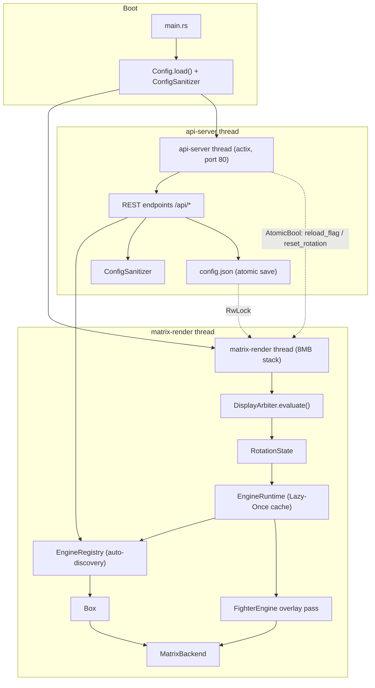

Les deux threads **ne partagent jamais d'état mutable directement**. Ils communiquent uniquement via :

- un `Config` partagé protégé par `RwLock<ConfigSettings>` (pour le snapshot des réglages), et
- des atomiques sans verrou (`AtomicBool` / `AtomicU32`) utilisés comme signaux one-shot.

---

## 3. Le contrat des moteurs (modèle de classes)

Chaque fonctionnalité visuelle (horloge, météo, lecteur GIF, ticker crypto…) implémente l'unique trait `Engine`. Le Core ne manipule jamais qu'un `Box<dyn Engine>` — il n'a **aucune connaissance à la compilation** des types concrets.

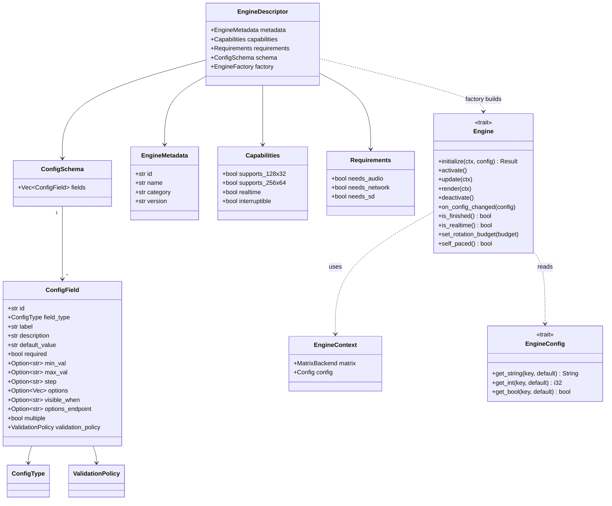

### Responsabilités des méthodes

| Méthode | Appelée | Rôle |
| :-- | :-- | :-- |
| `initialize` | une fois, au premier affichage | Allocation lourde : charger bitmaps/polices, réserver les buffers. |
| `activate` | à chaque passage à l'écran | Réinitialisation légère de l'état transitoire (sans allocation). |
| `update` | boucle chaude | Logique métier. **Aucune allocation inutile.** |
| `render` | boucle chaude | Dessin dans `context.matrix`. **Aucune allocation inutile.** |
| `deactivate` | en quittant l'écran | Arrêter les tâches/écouteurs de fond. |
| `on_config_changed` | à l'édition live | Relire les valeurs **sur place**, sans recréation. |
| `is_finished` | chaque frame | Signaler au runtime d'avancer plus tôt (ex. le crypto a fini sa liste de jetons). |
| `is_realtime` | chaque frame | Indice de cadence live (≈25 FPS) évalué par frame, contrairement au `Capabilities.realtime` statique. |
| `set_rotation_budget` | à l'activation | Pour les moteurs basés sur un compteur (GIF), reçoit la valeur numérique de l'entrée de rotation comme budget de lecture. |
| `self_paced` | chaque frame | Si `true`, le minuteur de durée ne doit **pas** forcer l'avance ; le moteur pilote l'avance via `is_finished`. |

---

## 4. Auto-découverte : Registry, Descriptor et Factory

### Pourquoi le Core n'a aucune liste de types concrets

Dans les versions d'avant refonte, `app.rs` incluait chaque fichier moteur et construisait un énorme `match` avec `Box::new(ClockEngine)`. Ajouter un moteur imposait de modifier le Core — une violation du principe ouvert/fermé (SOLID).

Désormais chaque moteur **s'enregistre à la compilation** via le `#[distributed_slice]` de la crate `linkme`. Le linker collecte chaque fonction d'enregistrement dans une slice statique unique `ENGINES` ; le Core l'itère simplement.

```rust
// core/registry.rs
#[distributed_slice]
pub static ENGINES: [fn() -> EngineDescriptor];
```

```rust
// n'importe quel fichier moteur
#[distributed_slice(crate::core::registry::ENGINES)]
fn register_clock() -> EngineDescriptor { /* metadata + schema + factory */ }
```

### Pourquoi le Registry stocke des descripteurs, pas des instances

Instancier chaque moteur au boot (`Box::new(...)`) gaspillerait de la RAM et ralentirait le démarrage. Un **descripteur** est léger : il porte les métadonnées, capacités, prérequis, le schéma de configuration, et une **factory** — un pointeur de fonction `fn() -> Box<dyn Engine>` qui construit l'instance uniquement au besoin.

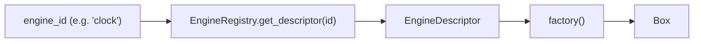

`EngineRegistry` expose deux appels :

- `get_all_descriptors()` — utilisé par `GET /api/engines` et le sanitizer.
- `get_descriptor(id)` — utilisé par le runtime pour construire une instance.

---

## 5. Le cycle de vie « Lazy-Once »

L'`EngineRuntime` possède deux maps : les instances vivantes en cache et un snapshot de la config avec laquelle chacune a été configurée en dernier.

```rust
pub struct EngineRuntime {
    instances: HashMap<String, Box<dyn Engine>>,     // instance_id -> moteur vivant
    configs:   HashMap<String, HashMap<String,String>>, // instance_id -> dernière config appliquée
}
```

`get_instance()` est le cœur du Lazy-Once et du hot-reload :

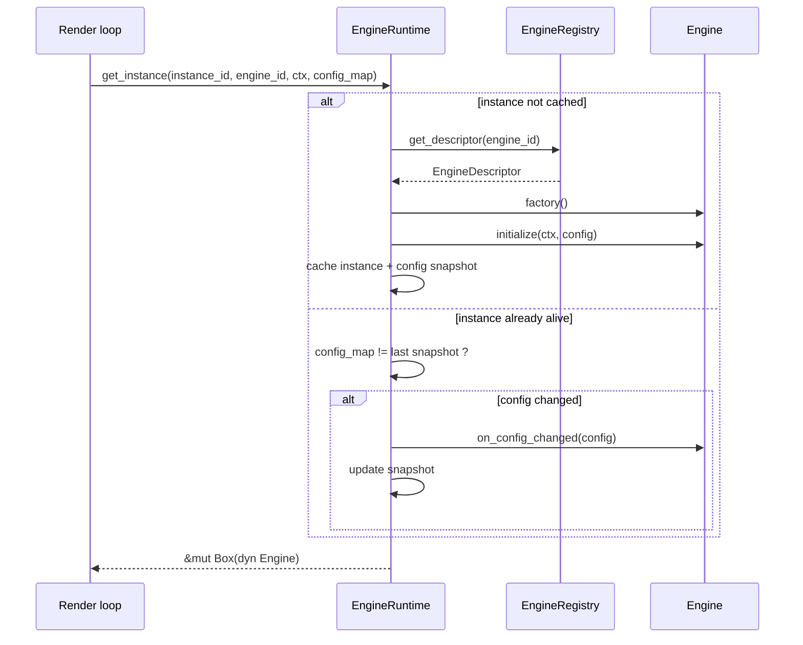

Le cycle de vie sous forme de machine à états :

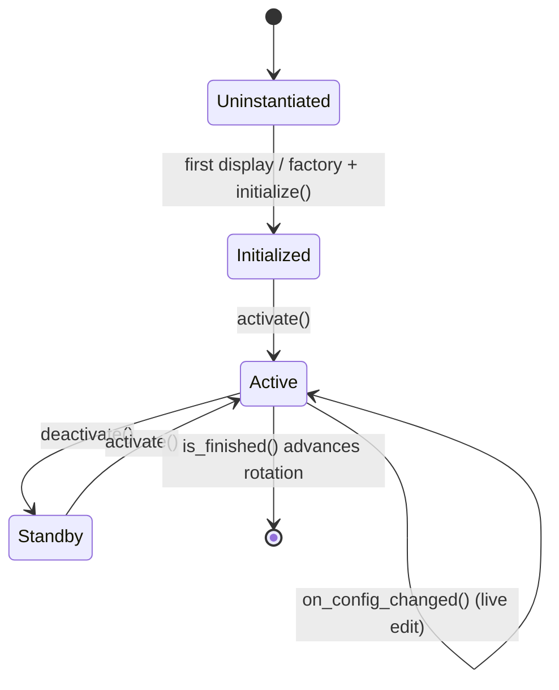

**Propriété clé :** une édition de configuration ne détruit ni ne reconstruit jamais une instance. L'instance garde ses buffers et relit simplement les valeurs dans `on_config_changed()`.

---

## 6. Modèle de configuration : `config.json` → instances

L'unique fichier racine `config.json` décrit tout l'appareil. Sa structure :

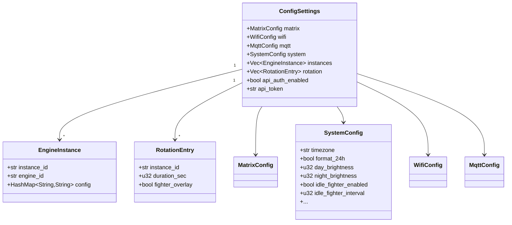

### Trois concepts distincts

- **Moteur (Engine)** — un *type* (ex. `clock`), déclaré une fois par le Registry.
- **Instance** — une *occurrence nommée et configurée* d'un moteur (ex. `clock_main`, `clock_arcade`), stockée dans `instances`.
- **Configuration** — le `HashMap<String,String>` d'une instance, validé contre le `ConfigSchema` du moteur.

C'est pourquoi vous pouvez faire tourner plusieurs horloges avec des polices/thèmes différents à partir du même `ClockEngine`.

### Pourquoi `config.json` et `EngineConfig` sont séparés

Les moteurs ne doivent pas voir les identifiants WiFi ni les réglages des autres moteurs. Le runtime enveloppe le `HashMap` de chaque instance dans un `HashConfig` et ne remet au moteur que le trait `EngineConfig` (`get_string/get_int/get_bool`) — un proxy restreint exposant exactement les clés déclarées par le moteur dans son schéma.

### Les signaux runtime vivent sur `Config`

`Config` porte aussi l'état runtime inter-threads, distinct du `ConfigSettings` persistant :

```rust
pub struct Config {
    pub reload_flag: AtomicBool,      // changement matériel/réseau -> redémarrage propre
    pub reset_rotation: AtomicBool,   // édition instance/rotation -> relecture à la frame suivante
    pub matrix_power: AtomicBool,     // on/off live
    pub matrix_brightness: AtomicU32, // luminosité live (0..100)
    pub message_payload: Mutex<Option<Value>>,
    pub settings: RwLock<ConfigSettings>,
}
```

---

## 7. Auto-réparation : le ConfigSanitizer

`ConfigSanitizer::sanitize_instances()` s'exécute au boot et après chaque écriture. Pour chaque instance, il retrouve le schéma du moteur et répare la config stockée afin que le runtime voie toujours des données valides — c'est ce qui rend les mises à jour OTA robustes.

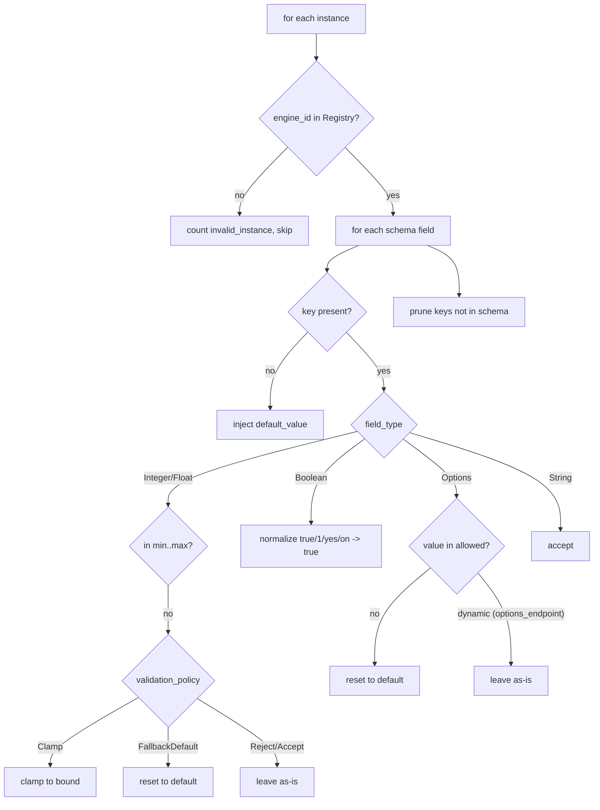

`SanitizeResult` indique combien de valeurs ont été `defaults_injected`, `values_clamped`, `values_fallback`, `keys_pruned` et `invalid_instances`, ainsi que si le fichier a été `modified` (déclenchant une ré-sauvegarde).

Deux subtilités importantes :

- **Les options dynamiques sont de confiance.** Un champ avec `options_endpoint` (ex. un nom de fichier de police) n'a pas de liste blanche statique à la compilation ; le sanitizer laisse donc sa valeur intacte.
- **Le multi-sélection est un CSV.** Quand `multiple = true`, la valeur est une liste séparée par des virgules ; chaque jeton doit appartenir à l'ensemble autorisé.

Exemple OTA concret — le firmware v2 ajoute `font_size` et retire `legacy_mode` :

```jsonc
// stocké (v1)                 // après boot en v2
{ "font": "foo" }        -->   { "font": "foo", "font_size": "16" }
{ "legacy_mode": "x" }   -->   {}   // élagué : plus dans le schéma
```

---

## 8. Propagation de config et hot reload

Comme les instances sont en cache, une édition doit être **poussée activement** vers le moteur vivant plutôt que de le recréer. La chaîne est câblée de bout en bout :

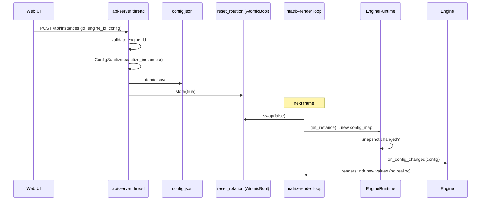

Deux classes de propagation :

- **Éditions d'instance / rotation** → `reset_rotation` → appliquées **en live** via `on_config_changed()` ; sans redémarrage ni réallocation.
- **Changements matériel / réseau** (géométrie matrice, `disable_internal`…) → `reload_flag` → la boucle de rendu redémarre proprement le processus pour réinitialiser le pilote. La luminosité/puissance live font exception : elles passent par les atomiques `matrix_brightness` / `matrix_power` sans redémarrage.

---

## 9. UI dynamique pilotée par schéma et listes personnalisées

L'UI web ne contient **aucun formulaire par moteur**. `GET /api/engines` renvoie chaque descripteur (métadonnées + schéma), et `dynamic_engines.js` interprète chaque `ConfigField` pour construire le bon widget. Ajouter un moteur ou un champ change l'UI sans aucune ligne de frontend.

### Résolution champ → widget

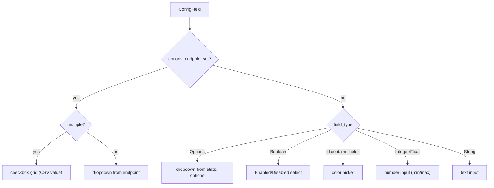

### Listes d'options personnalisées / dynamiques (les endpoints de « découverte de ressources »)

C'est le mécanisme que l'ancienne UI codée en dur perdait. Un champ déclare **d'où** viennent ses choix au lieu de les coder en dur ; le backend sert les ressources réelles et à jour :

| Endpoint | Source | Utilisé par (champ) |
| :-- | :-- | :-- |
| `GET /api/fonts` | fichiers dans `fonts/` (`.ttf`, `.bdf`) | `font` de l'horloge, tout moteur de texte |
| `GET /api/playlists` | sous-dossiers de `gifs/` | `playlist` du GIF (**multiple**) |
| `GET /api/themes` | `core::theme::all_themes()` (source unique de vérité) | `theme` de l'horloge |

Chacun renvoie un tableau JSON de `{ "value": ..., "label": ... }`. Comme la liste est récupérée **en live**, déposer une nouvelle police dans `fonts/` ou un nouveau dossier GIF dans `gifs/` apparaît immédiatement dans l'UI.

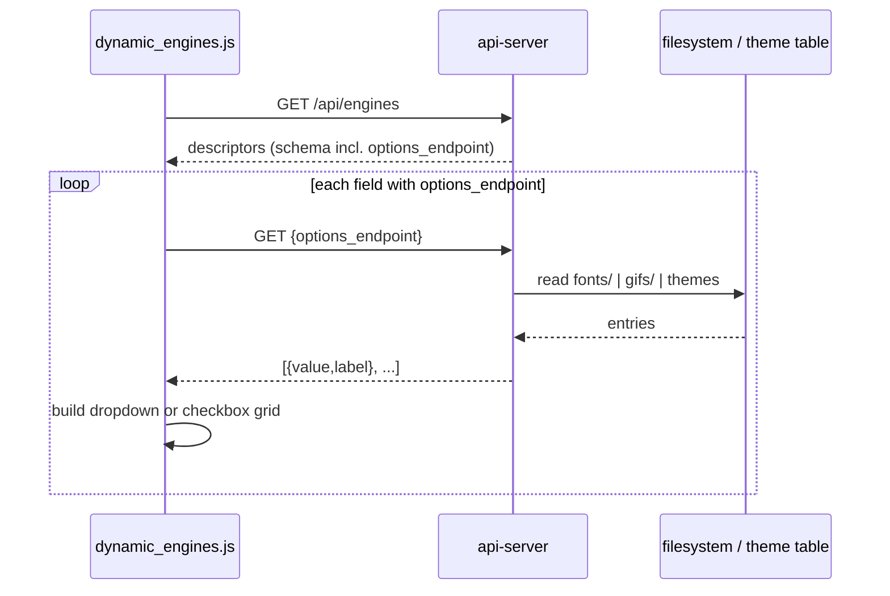

### Stockage du multi-sélection

Pour `multiple = true` (ex. la playlist GIF), l'UI affiche une grille de cases à cocher et stocke la sélection sous forme de **chaîne séparée par des virgules** dans la config d'instance (`"mario,zelda"`). Le moteur GIF et le sanitizer découpent tous deux sur `,`. C'est ainsi que l'utilisateur choisit *quels* dossiers GIF jouent — remplaçant l'ancien cas particulier « ignorer ceci, inclure cela » par un choix explicite et déclaratif.

### `visible_when`

Un champ peut porter `visible_when` référençant un autre champ, permettant au frontend de l'afficher/masquer conditionnellement (champs dépendants déclaratifs) sans JS spécifique au moteur.

---

## 10. Architecture d'Internationalisation (i18n) & Source de Vérité Unique

ArcadeMatrix sépare strictement la configuration de présentation globale de la logique interne des moteurs :

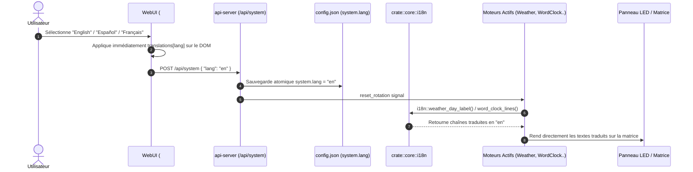

### Avantages de l'Architecture i18n Centralisée :
1. **Zéro Redondance de Schéma :** Aucun moteur individuel (`WeatherEngine`, `WordClock`, `DecibelEngine`, etc.) n'a de champ `lang` dans son schéma.
2. **Synchronisation Universelle :** Changer la langue dans l'en-tête de la WebUI reconfigure instantanément toute la machine (WebUI + Affichage Matrice).
3. **Extensibilité Trivialement Simple :** Pour ajouter une langue (ex: Allemand `de`), il suffit d'ajouter une entrée dans `SUPPORTED_LANGUAGES` (Front) et les dictionnaires du module `crate::core::i18n` (Back-end Rust et C++).

---

## 11. Pipeline d'Affichage Canonique : Arbiter & DisplayRuntime

La rotation n'est pas la seule source à pouvoir occuper la matrice. Les marquees (frontends d'arcade), alertes MQTT, messages one-shot et le lecteur GIF se disputent l'affichage. Le `DisplayArbiter` et le `DisplayRuntime` séparent strictement l'intention d'arbitrage du cycle de vie d'exécution :

```mermaid
flowchart TD
    PROD["Producteurs (Rotation, MQTT, Marquee, GIF)"] -->|DisplayRequest POD| ARB["DisplayArbiter [Option<DisplayRequest>; 8]"]
    ARB -->|DisplayDecision| DRT["DisplayRuntime (Cycle de vie, FSM)"]
    DRT -->|EngineHandle (4 octets)| ERT["EngineRuntime (HandleRegistry, O(1))"]
    ERT -->|Instance moteur| ENG["Engine.update() / Engine.render()"]
    ENG --> FB["Framebuffer de base"]
    FB --> OM["OverlayManager (Fighter)"]
    OM --> MX["MatrixBackend (hzeller)"]
```

### 11.1 DisplayArbiter (Évaluateur de Priorité Sans État)
- **Capacité Bornée** : Tableau fixe `[Option<DisplayRequest>; 8]` avec évaluation en $O(\text{MAX\_REQUESTS})$.
- **Zéro Allocation & Zéro Mutex** : S'exécute de façon lock-free et sans allocation sur le thread de rendu.
- **Identité d'Intention** : Strictement définie par `source_id + request_id + engine_handle`. Si une requête entrante correspond à l'intention active, `created_at` est préservé ; sinon, un nouvel horodatage est attribué.
- **Saturation Déterministe** : Si les 8 slots sont pleins, une requête entrante évince le slot de plus basse priorité si sa priorité est strictement supérieure, sinon elle est rejetée de manière déterministe.

### 11.2 DisplayRuntime & PreemptionStack
- **Propriétaire Exclusif du Cycle de Vie** : `DisplayRuntime` est le seul composant habilité à appeler `activate()`, `deactivate()`, `pause()` et `resume()`.
- **Pile de Préemption** : Structure à profondeur bornée `PreemptionStack<4>` stockant des enregistrements compacts `PreemptionEntry` (20 octets).
- **Transitions Transactionnelles** : La résolution du handle cible et la capacité de la pile sont vérifiées *avant* toute opération destructrice. Si une préemption échoue, la session active courante reste totalement intacte.
- **Reprise Exacte & Nettoyage des Orphelins** : À la fin d'une préemption, le runtime dépile, vérifie si l'intention submergée correspondant à `source_id + request_id + engine_handle` est toujours présente dans l'Arbiter, et nettoie proprement les sessions intermédiaires orphelines pour reprendre la baseline valide.

---

## 11. L'Architecture d'Overlay Transverse & OverlayManager

Le Fighter n'est **pas** un `Engine` dans l'`EngineRegistry` et n'est **pas** arbitré en tant que source d'affichage principale. C'est un *overlay transverse additif* : des sprites de combattants décoratifs incrustés **par-dessus** le framebuffer de l'écran actif.

L'architecture applique strictement une **hiérarchie de contrôle à 3 niveaux** :

$$\text{Overlay Actif} = \text{engine.allows\_overlay}() \land \text{config.system.idle\_fighter\_enabled} \land \text{rotation\_entry.overlays.fighter}$$

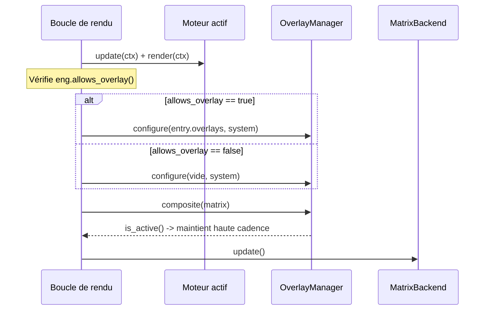

### Règles Clés & Invariants :
1. **Niveau 1 — Capacité Moteur (`allows_overlay`)** : Capacité fixe déclarée par le moteur. Si `false`, les overlays sont strictement interdits (ex. `MarqueeEngine` ou alertes textuelles d'urgence).
2. **Niveau 2 — Master Switch Global (`system.idle_fighter_enabled`)** : Préférence système permettant à l'utilisateur d'activer ou couper les overlays pour l'ensemble du périphérique.
3. **Niveau 3 — Interrupteur par Entrée de Rotation (`rotation[i].overlays.fighter`)** : Choix granulaire de l'utilisateur pour chaque carte de rotation dans la Web UI. Schéma JSON canonique : `"overlays": { "fighter": true }`.
4. **Persistance en Mémoire Vive** : L'`OverlayManager` crée l'instance `FighterEngine` une seule fois au démarrage et la conserve en mémoire vive lors des transitions de rotation, éliminant ainsi les allocations dynamiques et le scintillement.
5. **Formatage Lisible de `config.json`** : Lors de son enregistrement sur disque, `config.json` est systématiquement indenté et formaté pour permettre une lecture et édition directe par un humain sans contrainte.

---

## 12. Isolation runtime et modèle de threads

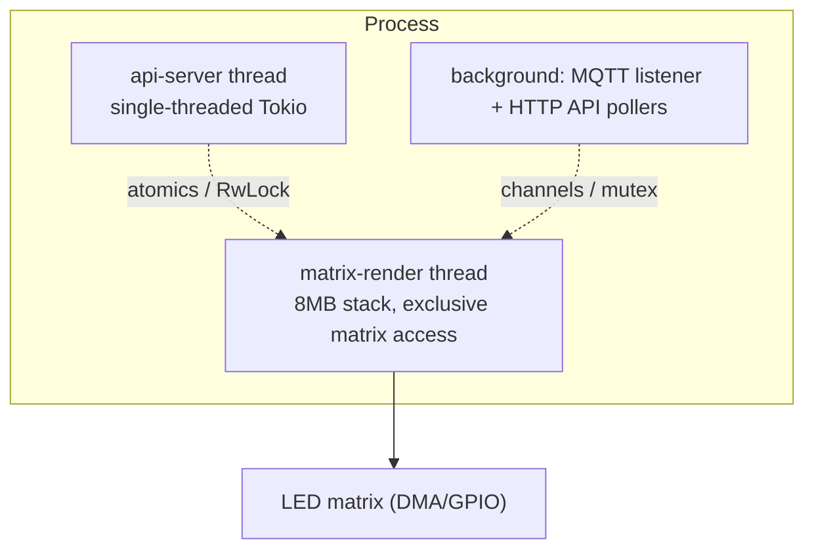

1. **Thread de rendu dédié (`matrix-render`)** — pile de 8 Mo, propriété exclusive de la matrice. S'il partageait le thread avec HTTP, chaque requête sauterait une frame (déchirure).
2. **Thread Web API isolé (`api-server`)** — un runtime Tokio mono-thread hébergeant actix sur le port 80. Il ne touche au thread de rendu que via des atomiques et de courtes lectures `RwLock`.
3. **Services de fond** — écouteur MQTT et pollers HTTP (crypto, météo, bourse) tournent hors du chemin de rendu, pour qu'un appel réseau lent ne bloque jamais `update()`.

---

## 13. Cadence de rendu

La pause par frame est dérivée de la capacité/état, **jamais** d'un nom de moteur codé en dur :

- `Capabilities.realtime == true` **ou** `engine.is_realtime() == true` en live → ~25 FPS (40 ms), pour le contenu animé (GIF, message défilant, Spotify, overlay Fighter actif).
- sinon → 1 Hz (1000 ms), pour le contenu statique (horloge, date, météo) — bien plus léger pour le CPU et le Wi-Fi.

`is_realtime()` est réévalué chaque frame, donc un moteur peut changer de cadence selon son état live (ex. une horloge qui n'anime que sur un thème précis).

---

## 14. Surface de l'API HTTP

Tous les endpoints sont des handlers actix dans `src/api/server.rs` ; les assets web statiques sont embarqués via `rust-embed`. Référence complète dans [../openapi.yaml](../openapi.yaml).

| Méthode | Chemin | Rôle |
| :-- | :-- | :-- |
| GET | `/api/system` | Snapshot complet des réglages |
| POST | `/api/system` | Patch des réglages top-level/système (sauvegarde partielle sûre) |
| GET | `/api/instances` | Lister les instances configurées |
| POST | `/api/instances` | Upsert d'une instance (assainie + sauvegardée) |
| DELETE | `/api/instances/{id}` | Supprimer une instance |
| GET | `/api/rotation` | Liste de rotation (ordre, durées, drapeaux overlay) |
| POST | `/api/rotation` | Remplacer la rotation, pose `reset_rotation` |
| GET | `/api/engines` | Tous les descripteurs (pilote l'UI dynamique) |
| GET | `/api/fonts` | Fichiers de polices de `fonts/` (options_endpoint) |
| GET | `/api/playlists` | Dossiers GIF de `gifs/` (options_endpoint) |
| GET | `/api/themes` | Thèmes de `core::theme` (options_endpoint) |
| GET | `/api/stats` | Stats runtime (uptime, mémoire, version) |
| POST | `/api/wifi` | Mettre à jour les identifiants Wi-Fi |
| POST | `/api/marquee` | Pousser une image de marquee |
| POST | `/api/mqtt/install` | Installer/activer le broker MQTT |
| POST | `/api/mqtt/logs` | Récupérer les logs MQTT |
| POST | `/api/system/restart` | Redémarrer le service |
| GET | `/api/action/reboot` · POST `/api/system/reboot` | Redémarrer le Pi |
| POST | `/api/system/shutdown` | Éteindre le Pi |
| POST | `/api/system/power` | Marche/arrêt live de la matrice |

Chaque handler mutateur passe derrière `check_auth` quand `api_auth_enabled` est actif.

---

## 15. Métadonnées de build

`core/build_info.rs` centralise les valeurs `env!` injectées par `build.rs` (`VERSION`, `ARCH`, `BUILD_TIMESTAMP`, `GIT_COMMIT`). Elles sont lues **une seule fois** ici car `env!` fige les valeurs à la compilation de chaque site d'appel ; les lire dans un module unique garde `/api/version`, la bannière de démarrage et la validation OTA cohérents entre builds incrémentaux.
