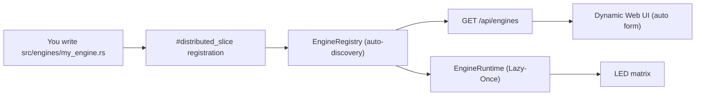
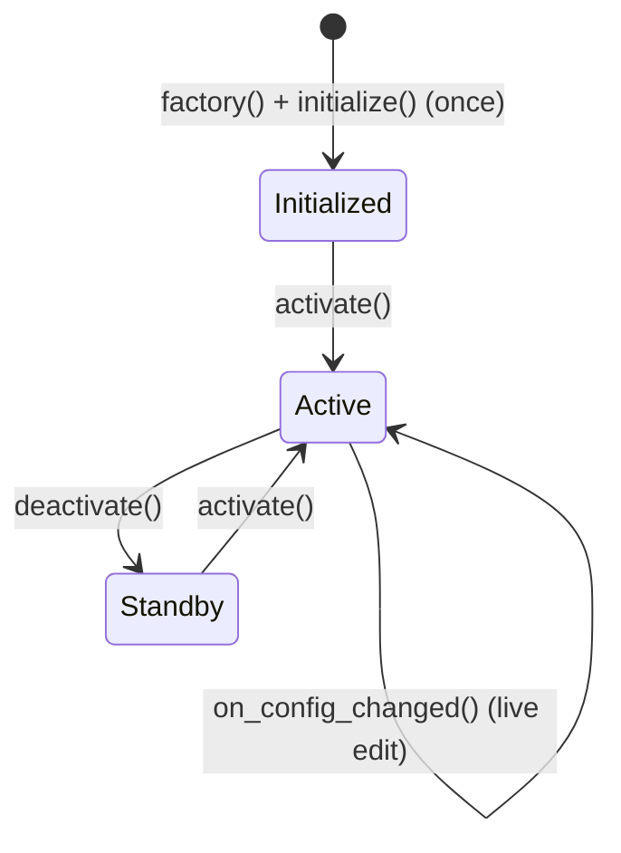
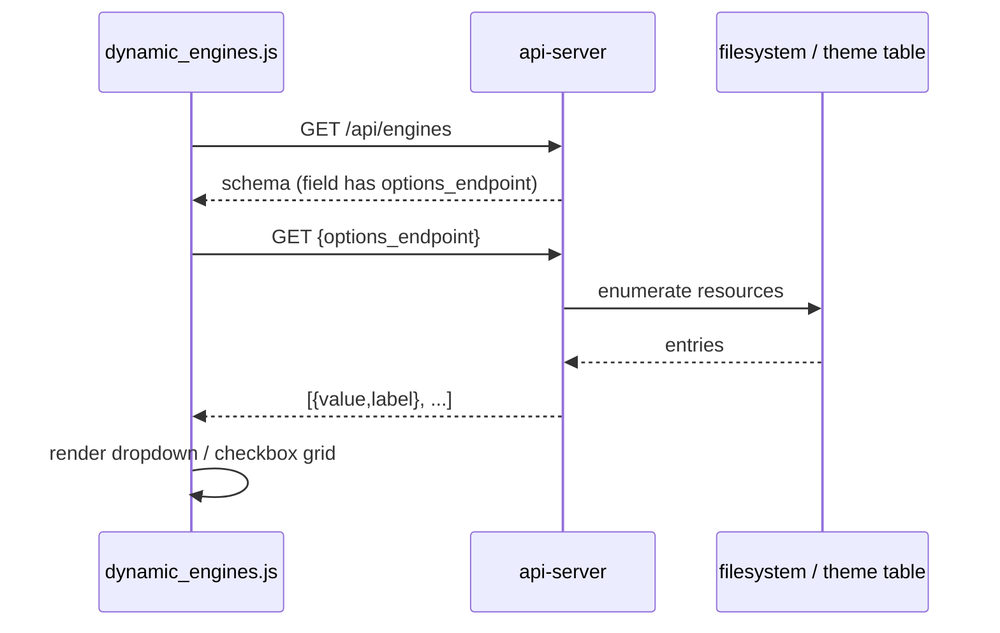
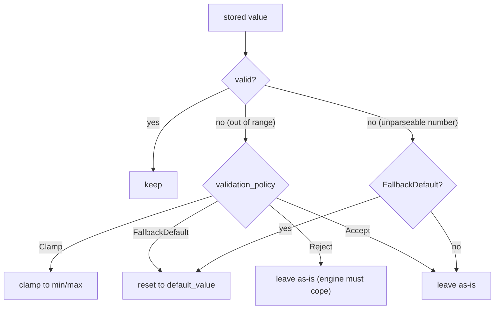
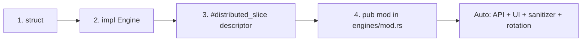

🇬🇧 English | 🇫🇷 [Français](DEVELOPER_FR.md) | 🇪🇸 [Español](DEVELOPER_ES.md)

# Developer Guide (Raspberry Pi - Rust)

This is the **complete** guide to extending ArcadeMatrix on Raspberry Pi. It explains the `Engine` contract in full, the entire `ConfigField` schema (including **dynamic/custom option lists**, multiselect, conditional fields and self-healing policies), and walks through building a new engine end-to-end.

> For the *why* behind the design (Registry, Lazy-Once, Arbiter, threading, overlay), read [ARCHITECTURE.md](ARCHITECTURE.md). This guide is the *how-to*.

---

## Table of Contents

1. [Mental Model](#1-mental-model)
2. [The Engine Trait in Full](#2-the-engine-trait-in-full)
3. [The Lifecycle & Golden Rules](#3-the-lifecycle--golden-rules)
4. [Capabilities & Requirements](#4-capabilities--requirements)
5. [The ConfigSchema & ConfigField Reference](#5-the-configschema--configfield-reference)
6. [Custom / Dynamic Option Lists](#6-custom--dynamic-option-lists)
7. [Multiselect Fields](#7-multiselect-fields)
8. [Conditional Fields (`visible_when`)](#8-conditional-fields-visible_when)
9. [Self-Healing Validation Policies](#9-self-healing-validation-policies)
10. [Tutorial: Create a New Engine](#10-tutorial-create-a-new-engine)
11. [Tutorial: Add a Custom-List Endpoint](#11-tutorial-add-a-custom-list-endpoint)
12. [Tutorial: Add a New Clock Face / Theme](#12-tutorial-add-a-new-clock-face--theme)
13. [Internationalization & Centralized i18n (Front & Back)](#13-internationalization--centralized-i18n-front--back)
14. [Reading Config in an Engine](#14-reading-config-in-an-engine)
15. [Rendering into the Matrix](#15-rendering-into-the-matrix)
16. [Testing & Local Run](#16-testing--local-run)
17. [Checklist](#17-checklist)

---

## 1. Mental Model

ArcadeMatrix has **no hardcoded list of features** in `app.rs`. Each engine is a self-registering plugin discovered at startup through a compile-time Registry (`linkme`).



Adding an engine touches **two files**: the engine itself and one `pub mod` line in `src/engines/mod.rs`. **`app.rs` is never edited.**

---

## 2. The Engine Trait in Full

Every engine implements `core::engine_contract::Engine`:

```rust
pub trait Engine: Send + Sync {
    // --- Mandatory lifecycle ---
    fn initialize(&mut self, ctx: &mut EngineContext, config: &dyn EngineConfig)
        -> Result<(), EngineError>;
    fn activate(&mut self);
    fn update(&mut self, ctx: &mut EngineContext);
    fn render(&mut self, ctx: &mut EngineContext);
    fn deactivate(&mut self);

    // --- Optional (have default impls) ---
    fn on_config_changed(&mut self, _config: &dyn EngineConfig) {}
    fn is_finished(&self) -> bool { false }
    fn is_realtime(&self) -> bool { false }
    fn set_rotation_budget(&mut self, _budget: u32) {}
    fn self_paced(&self) -> bool { false }
    fn allows_overlay(&self) -> bool { true }
    fn allow_rotation(&self) -> bool { true }
    fn pause(&mut self) { self.deactivate(); }
    fn resume(&mut self) { self.activate(); }
    fn on_display_geometry_changed(&mut self, _geometry: &DisplayGeometry) {}
}
```

| Method | Default | When to override |
| :-- | :-- | :-- |
| `initialize` | — | Always. Allocate buffers, load assets, read config once. |
| `activate` | — | Always. Cheap reset of transient state. |
| `update` | — | Always. Business logic each frame. |
| `render` | — | Always. Draw into `ctx.matrix`. |
| `deactivate` | — | Always. Stop timers/listeners. |
| `on_config_changed` | no-op | If your engine has editable settings (almost always). Re-read them **in place**. |
| `is_finished` | `false` | If the engine has an intrinsic end (e.g. finished a token list) and should advance the rotation early. |
| `is_realtime` | `false` | If the engine animates only under some live state and needs ~25 FPS then. |
| `set_rotation_budget` | no-op | If rotation advance is count-based (e.g. play N GIFs). Receives the entry's numeric value. |
| `self_paced` | `false` | If the engine drives its own advance via `is_finished` and must NOT be force-advanced by the duration timer. |
| `allows_overlay` | `true` | Override to `false` for full-screen emergency alerts or games where transverse overlays (Fighter) must not appear. |
| `allow_rotation` | `true` | Override to `false` for purely event-driven/preemptive engines (e.g. Marquee) that must not appear in the idle rotation picker. |
| `pause` | `deactivate()` | Hook called when temporarily preempted by a higher-priority alert on the `PreemptionStack`. |
| `resume` | `activate()` | Hook called when resuming after preemption ends. |
| `on_display_geometry_changed` | no-op | Hook called when the panel rotation (Tate mode / 90° / 180° / 270°) changes logical dimensions. |

---

## 3. The Lifecycle & Golden Rules



- **Golden rule #1 — allocate once.** Never create a fresh `String`/`Vec` in `update()`/`render()`. Pre-allocate in `initialize()` and mutate in place:
  ```rust
  self.buf.clear();
  write!(&mut self.buf, "{}:{}", h, m).ok();
  ```
- **Golden rule #2 — hot-reload in place.** In `on_config_changed()` re-read values into existing fields. The instance is **not** recreated (Lazy-Once), so keep your allocations.
- **Golden rule #3 — no blocking I/O in the hot loop.** Network/disk work belongs in a background thread; hand results to `update()` via a channel or shared state.

---

## 4. Capabilities & Requirements

Declared in the descriptor, these are static metadata the runtime and UI read.

```rust
Capabilities {
    supports_128x32: bool,  // panel geometry hints
    supports_256x64: bool,
    realtime: bool,         // true -> polled at ~25 FPS; false -> 1 Hz
    interruptible: bool,    // may be pre-empted by a higher-priority source
}

Requirements {
    needs_audio: bool,
    needs_network: bool,    // engine calls out to the internet
    needs_sd: bool,
}
```

- Set `realtime: true` **only** if you draw a new frame every tick (GIF, scrolling text, Spotify). Static content (clock/weather) must stay `false` to save CPU and Wi-Fi.
- For dynamic cadence (animate sometimes), keep `realtime: false` and override `is_realtime()` to return `true` while animating.

---

## 5. The ConfigSchema & ConfigField Reference

The schema is the **single source of truth** for the UI and the sanitizer. Every field:

```rust
pub struct ConfigField {
    pub id: &'static str,                 // config key (stored in config.json)
    pub field_type: ConfigType,           // Boolean | Integer | Float | String | Options
    pub label: &'static str,              // UI label
    pub description: &'static str,        // UI tooltip
    pub default_value: &'static str,      // injected when missing (self-healing)
    pub required: bool,
    pub min_val: Option<&'static str>,    // numeric bound (Integer/Float)
    pub max_val: Option<&'static str>,
    pub step: Option<&'static str>,       // UI stepper granularity
    pub options: Option<Vec<ConfigOption>>, // static choices for Options
    pub visible_when: Option<&'static str>, // conditional visibility
    pub options_endpoint: Option<&'static str>, // dynamic choices (custom list)
    pub multiple: bool,                   // multiselect (CSV storage)
    pub validation_policy: ValidationPolicy, // Clamp | FallbackDefault | Reject | Accept
}
```

`ConfigType` variants:

| Variant | Widget | Sanitizer behaviour |
| :-- | :-- | :-- |
| `Boolean` | Enabled/Disabled select | normalizes `true/1/yes/on` → `true`, else default |
| `Integer` | number input | parse + clamp/fallback to `min_val..max_val` |
| `Float` | number input | parse + clamp/fallback to `min_val..max_val` |
| `String` | text input | accepted as-is |
| `Options` | dropdown (or checkbox grid if `multiple`) | value must be in `options` (unless dynamic) |

> **Tip:** all values are stored as strings in `config.json`. Parse them with the `EngineConfig` helpers (`get_int`, `get_bool`, `get_string`).

---

## 6. Custom / Dynamic Option Lists

Sometimes the choices are **not known at compile time** — the installed fonts, the GIF folders on disk, the available themes. Instead of a static `options` list, point the field at an **options endpoint**. The frontend fetches it live and builds the widget.



Built-in endpoints (all return `[{ "value": ..., "label": ... }]`):

| `options_endpoint` | Serves | Backed by |
| :-- | :-- | :-- |
| `/api/fonts` | font filenames | files in `fonts/` (`.ttf`, `.bdf`) |
| `/api/playlists` | GIF folder names | sub-dirs of `gifs/` |
| `/api/themes` | theme id/name | `core::theme::all_themes()` |

Real example — the **clock** engine's theme and font fields:

```rust
ConfigField {
    id: "theme",
    field_type: ConfigType::Options,
    label: "Theme",
    description: "Color theme",
    default_value: "matrix",
    options: None,                          // no static list
    options_endpoint: Some("/api/themes"),  // fetched live
    ..Default::default()
},
ConfigField {
    id: "font",
    field_type: ConfigType::Options,
    label: "Font",
    description: "Bitmap or TTF font",
    default_value: "PressStart2P.ttf",
    options_endpoint: Some("/api/fonts"),
    ..Default::default()
},
```

Because the list is fetched at render time, **dropping a new font into `fonts/` or a new folder into `gifs/` appears in the UI immediately** — no rebuild, no schema change.

---

## 7. Multiselect Fields

Set `multiple: true` on an `Options` field (static or dynamic) to let the user pick **several** values. The UI renders a checkbox grid; the selection is stored as a **comma-separated string** in the instance config.

Real example — the **GIF** engine's playlist selection:

```rust
ConfigField {
    id: "playlists",
    field_type: ConfigType::Options,
    label: "GIF Playlists",
    description: "Which GIF folders to play",
    default_value: "",
    options_endpoint: Some("/api/playlists"),
    multiple: true,                 // -> checkbox grid, CSV storage
    ..Default::default()
}
```

Stored as e.g. `"mario,zelda,sonic"`. In your engine, split it:

```rust
let selected: Vec<String> = config
    .get_string("playlists", "")
    .split(',')
    .map(str::trim)
    .filter(|s| !s.is_empty())
    .map(String::from)
    .collect();
```

The sanitizer validates each token against the allowed set (for static options) and leaves dynamic-endpoint values untouched. This replaces the old "hardcode which GIFs to include/ignore" approach with an explicit, user-driven, declarative selection.

---

## 8. Conditional Fields (`visible_when`)

`visible_when` lets a field appear only when another field has a given state, so you can build dependent forms without engine-specific JavaScript. Set it to the id of the controlling field; the frontend shows the field conditionally.

```rust
ConfigField {
    id: "scroll_speed",
    field_type: ConfigType::Integer,
    label: "Scroll Speed",
    visible_when: Some("animated"), // only shown when the "animated" field is on
    ..Default::default()
}
```

---

## 9. Self-Healing Validation Policies

`validation_policy` decides what the `ConfigSanitizer` does with an out-of-range or unparseable value on boot / on save.



| Policy | Out-of-range number | Unparseable number | Bad option value |
| :-- | :-- | :-- | :-- |
| `Clamp` | clamp to bound | left as-is | — |
| `FallbackDefault` | reset to default | reset to default | reset to default |
| `Reject` | left as-is | left as-is | — |
| `Accept` | left as-is | left as-is | — |

Missing keys are always **injected** with `default_value`; keys not in the schema are **pruned**. This is what makes OTA upgrades seamless (new fields appear, removed fields disappear).

---

## 10. Tutorial: Create a New Engine

### Step 1 — the struct (`src/engines/my_engine.rs`)

```rust
use crate::core::engine_contract::{Engine, EngineConfig, EngineContext, EngineError};

pub struct MyEngine {
    my_setting: String, // pre-allocated buffer
    counter: u32,
}

impl MyEngine {
    pub fn new() -> Self {
        Self { my_setting: String::new(), counter: 0 }
    }
}
```

### Step 2 — implement the lifecycle

```rust
impl Engine for MyEngine {
    fn initialize(&mut self, _ctx: &mut EngineContext, config: &dyn EngineConfig)
        -> Result<(), EngineError> {
        self.my_setting = config.get_string("my_setting", "default"); // alloc OK here
        Ok(())
    }

    fn activate(&mut self) { self.counter = 0; }

    fn update(&mut self, _ctx: &mut EngineContext) {
        self.counter += 1; // no allocation
    }

    fn render(&mut self, ctx: &mut EngineContext) {
        ctx.matrix.clear();
        // draw self.my_setting using existing buffers
    }

    fn deactivate(&mut self) {}

    fn on_config_changed(&mut self, config: &dyn EngineConfig) {
        self.my_setting = config.get_string("my_setting", "default"); // in place
    }
}
```

### Step 3 — register with a descriptor (self-discovery)

```rust
use crate::core::engine_contract::{
    Capabilities, ConfigField, ConfigSchema, ConfigType, EngineDescriptor,
    EngineMetadata, Requirements, ValidationPolicy,
};
use linkme::distributed_slice;

#[distributed_slice(crate::core::registry::ENGINES)]
fn register_my_engine() -> EngineDescriptor {
    EngineDescriptor {
        metadata: EngineMetadata {
            id: "my_engine",
            name: "My Custom Engine",
            category: "misc",
            version: "1.0",
        },
        capabilities: Capabilities::default(), // set realtime:true if you animate
        requirements: Requirements::default(),
        schema: ConfigSchema {
            fields: vec![ConfigField {
                id: "my_setting",
                field_type: ConfigType::String,
                label: "My Setting",
                description: "Text to display",
                default_value: "default",
                validation_policy: ValidationPolicy::Accept,
                ..Default::default() // use struct-update syntax for the rest
            }],
        },
        factory: || Box::new(MyEngine::new()),
    }
}
```

> Using `..Default::default()` keeps registrations short — you only spell out the fields that matter.

### Step 4 — expose the module (`src/engines/mod.rs`)

```rust
pub mod my_engine;
```

Done. The engine now appears in `GET /api/engines`, gets an auto-generated form in the Web UI, and its config is sanitized and hot-reloaded automatically. **No `app.rs` change.**



---

## 11. Tutorial: Add a Custom-List Endpoint

If your field needs choices from a resource the user manages (files, playlists, presets), add an options endpoint and point a field at it.

### Step 1 — the handler (`src/api/server.rs`)

```rust
#[get("/api/presets")]
async fn get_presets(req: HttpRequest, data: web::Data<AppState>) -> impl Responder {
    if let Err(e) = check_auth(&req, &data.config) { return e; }
    let mut out = Vec::new();
    if let Ok(entries) = std::fs::read_dir("presets") {
        for entry in entries.flatten() {
            if let Some(name) = entry.file_name().to_str() {
                out.push(json!({ "value": name, "label": name }));
            }
        }
    }
    HttpResponse::Ok().json(out)
}
```

Register it with the other services in the actix `App` builder.

### Step 2 — point a field at it

```rust
ConfigField {
    id: "preset",
    field_type: ConfigType::Options,
    label: "Preset",
    options_endpoint: Some("/api/presets"),
    // multiple: true, // uncomment for a checkbox grid
    ..Default::default()
}
```

The frontend needs **no** changes — `dynamic_engines.js` already fetches any `options_endpoint` and renders a dropdown (or checkbox grid when `multiple`).

---

## 12. Tutorial: Add a New Clock Face / Theme

Clocks in ArcadeMatrix are organized into modular renderers managed by `ClockEngine` (`src/engines/clock.rs`). To add a new visual theme or clock animation (e.g. *SpaceInvadersClock*):

### Step 1 — Create `src/engines/clocks/space_invaders_clock.rs`

```rust
use chrono::Timelike;
use crate::engines::renderers::BaseRenderer;

pub struct SpaceInvadersClock {
    base: BaseRenderer,
    invader_frame: u32,
    last_anim_ms: u128,
}

impl SpaceInvadersClock {
    pub fn new() -> Self {
        Self {
            base: BaseRenderer::new(),
            invader_frame: 0,
            last_anim_ms: 0,
        }
    }

    pub fn draw(
        &mut self,
        matrix: &mut dyn crate::matrix::MatrixBackend,
        now: chrono::DateTime<chrono::Local>,
        font: &str,
        size: u32,
        color: (u8, u8, u8),
    ) {
        let time_str = now.format("%H:%M:%S").to_string();
        self.base.draw_text_centered(matrix, &time_str, font, size, color);
    }
}
```

### Step 2 — Expose in `src/engines/clocks/mod.rs`

```rust
pub mod space_invaders_clock;
pub use space_invaders_clock::SpaceInvadersClock;
```

### Step 3 — Wire into `ClockEngine` (`src/engines/clock.rs`)

1. Add the struct to `ClockEngine`:
```rust
pub struct ClockEngine {
    // ...
    space_invaders: SpaceInvadersClock,
}
```

2. Initialize in `ClockEngine::new`:
```rust
space_invaders: SpaceInvadersClock::new(),
```

3. Route rendering in `render()`:
```rust
25 => self.space_invaders.draw(ctx.matrix, now, &self.time_font, self.time_size, c1),
```

### Step 4 — Declare option in `ClockEngine::descriptor()`

Add `{ label: "Space Invaders Clock", value: "25" }` to the `theme` field options:

```rust
ConfigOption { label: "Space Invaders Clock", value: "25" },
```

The WebUI dynamically renders the option in the theme selector, and changes take effect instantly upon save via hot-reload.

---

## 13. Internationalization & Centralized i18n (Front & Back)

ArcadeMatrix on Raspberry Pi uses the centralized [`crate::core::i18n`](../src/core/i18n.rs) module.

> [!IMPORTANT]
> **Golden Rule: Never add a `lang` field to your engine's `ConfigSchema`.**
> The system language (`system.lang`) is the single source of truth. When the user changes language in the WebUI header (`#lang-selector`), the UI sends `POST /api/system` `{ "lang": code }`, persisting the setting and propagating it immediately to all active engines.

### A. Usage in a Rust Engine (`crate::core::i18n`)

```rust
use crate::core::i18n::{self, Lang};

// 1. Read system language from context
let sys_lang = ctx.config.settings.read().system.lang.clone();
let lang = Lang::from_str_code(&sys_lang);

// 2. Weather day names (e.g. "TODAY", "TMRW", "MON"..)
let day_label = i18n::weather_day_label(lang, day_of_week, is_today, is_tomorrow);

// 3. Translated weather condition strings
let condition = i18n::weather_condition(lang, "Thunderstorm with heavy rain");

// 4. WordClock full text lines
let lines = i18n::word_clock_lines(lang, hours, minutes);

// 5. Noise / Decibel level statuses
let noise = i18n::noise_level(lang, level_index);
```

### B. Tutorial: Adding a New Language (e.g. German `de`) in 3 Steps

1. **Front-end WebUI (`api/www/js/i18n.js` or `index.html`):**
   Add the language to `SUPPORTED_LANGUAGES` and complete translations:
   ```javascript
   export const SUPPORTED_LANGUAGES = [
     { code: 'fr', label: 'Français' },
     { code: 'en', label: 'English' },
     { code: 'es', label: 'Español' },
     { code: 'de', label: 'Deutsch' },
   ];
   ```
2. **Raspberry Pi Back-end (`src/core/i18n.rs`):**
   - Add variant `De` to enum `Lang`.
   - Provide translation lookups for weather, word clock, and noise status.
3. **ESP32 Back-end (`src/core/I18n.h` & `src/core/I18n.cpp`):**
   - Add `DE` to enum `Lang` and implement the static translation methods.

---

## 14. Reading Config in an Engine

The engine receives a restricted `&dyn EngineConfig` proxy (never the whole `config.json`):

```rust
let interval = config.get_int("interval", 10);      // parsed i32
let enabled  = config.get_bool("enabled", true);    // true/1
let label    = config.get_string("label", "Hello"); // owned String
```

These map onto the instance's `HashMap<String,String>`. Keys correspond to your schema `id`s.

---

## 15. Rendering into the Matrix

`ctx.matrix` is a `&mut dyn MatrixBackend`. Typical pattern:

```rust
fn render(&mut self, ctx: &mut EngineContext) {
    ctx.matrix.clear();
    // draw pixels / text / bitmaps into ctx.matrix
    // do NOT call ctx.matrix.update() — the render loop flushes the frame
}
```

The **render loop** owns `update()` (the flush to the panel) and, after your `render()` returns, may run the additive **Fighter overlay** pass on top of your frame (see [ARCHITECTURE.md §11](ARCHITECTURE.md#11-the-fighter-overlay-compositor)).

---

## 16. Testing & Local Run

```bash
rtk cargo fmt
rtk cargo test          # unit + integration tests
rtk cargo build --release
```

- Unit-test pure logic (parsers, formatting) directly in the engine module (`#[cfg(test)]`).
- The mock matrix (`tests/test_matrix.rs`) lets you assert pixels without hardware.
- The registry test (`tests/test_registry.rs`) checks discovery, descriptors, and the runtime lifecycle — a good template for engine tests.

The pre-commit hook runs the release validator, doc/config-key validator, `cargo fmt --check`, and the full test suite.

---

## 17. Checklist

- [ ] Struct pre-allocates buffers; no allocation in `update`/`render`.
- [ ] `on_config_changed` re-reads every editable field **in place**.
- [ ] `Capabilities.realtime` reflects whether you animate every frame (or override `is_realtime`).
- [ ] Every schema field has a sensible `default_value` and `validation_policy`.
- [ ] Dynamic choices use `options_endpoint`; multi-value uses `multiple: true` (CSV).
- [ ] Localized strings use the centralized `crate::core::i18n` module (no redundant `lang` field in schema).
- [ ] Registered via `#[distributed_slice]`; module added to `engines/mod.rs`.
- [ ] `app.rs` untouched.
- [ ] `cargo fmt`, `cargo test`, `cargo build --release` all pass.
