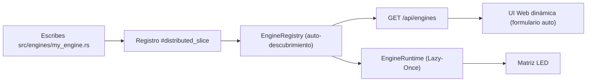
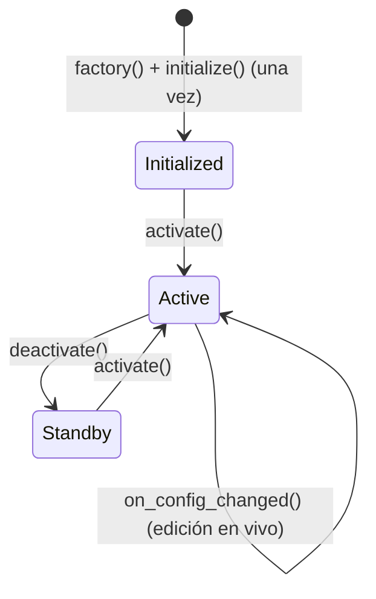
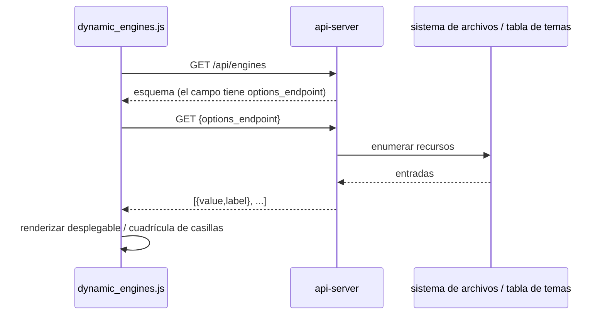
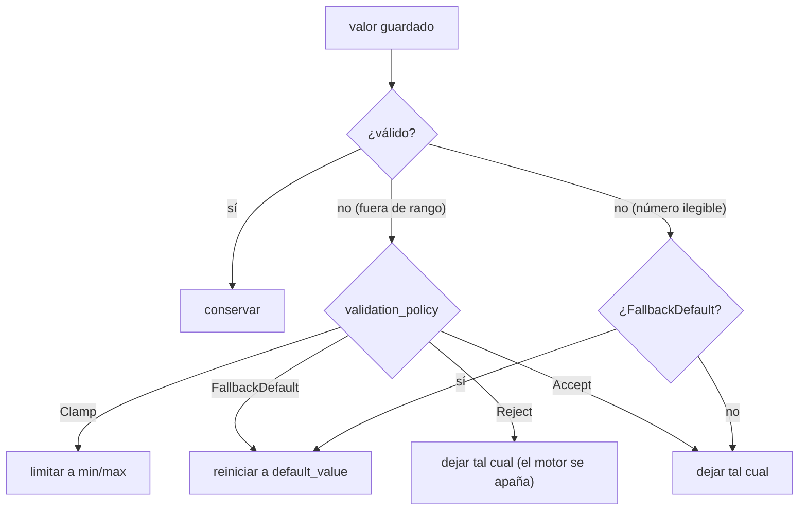
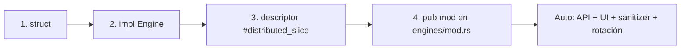

🇪🇸 Español | 🇬🇧 [English](DEVELOPER.md) | 🇫🇷 [Français](DEVELOPER_FR.md)

# Guía del desarrollador (Raspberry Pi - Rust)

Esta es la guía **completa** para extender ArcadeMatrix en Raspberry Pi. Detalla íntegramente el contrato `Engine`, todo el esquema `ConfigField` (incluidas las **listas de opciones dinámicas / personalizadas**, la multiselección, los campos condicionales y las políticas de auto-reparación), y recorre la creación de un nuevo motor de principio a fin.

> Para el *porqué* del diseño (Registry, Lazy-Once, Árbitro, hilos, overlay), lee [ARCHITECTURE_ES.md](ARCHITECTURE_ES.md). Esta guía es el *cómo hacerlo*.

---

## Tabla de contenidos

1. [Modelo mental](#1-modelo-mental)
2. [El trait Engine en detalle](#2-el-trait-engine-en-detalle)
3. [El ciclo de vida y las reglas de oro](#3-el-ciclo-de-vida-y-las-reglas-de-oro)
4. [Capabilities y Requirements](#4-capabilities-y-requirements)
5. [Referencia del ConfigSchema y del ConfigField](#5-referencia-del-configschema-y-del-configfield)
6. [Listas de opciones personalizadas / dinámicas](#6-listas-de-opciones-personalizadas--dinámicas)
7. [Campos de multiselección](#7-campos-de-multiselección)
8. [Campos condicionales (`visible_when`)](#8-campos-condicionales-visible_when)
9. [Políticas de validación auto-reparadoras](#9-políticas-de-validación-auto-reparadoras)
10. [Tutorial: crear un nuevo motor](#10-tutorial-crear-un-nuevo-motor)
11. [Tutorial: añadir un endpoint de lista personalizada](#11-tutorial-añadir-un-endpoint-de-lista-personalizada)
12. [Tutorial: añadir un nuevo tema de reloj](#12-tutorial-añadir-un-nuevo-tema-de-reloj)
13. [Internacionalización y Centralización i18n (Front y Back)](#13-internacionalización-y-centralización-i18n-front-y-back)
14. [Leer la config en un motor](#14-leer-la-config-en-un-motor)
15. [Dibujar en la matriz](#15-dibujar-en-la-matriz)
16. [Pruebas y ejecución local](#16-pruebas-y-ejecución-local)
17. [Checklist](#17-checklist)

---

## 1. Modelo mental

ArcadeMatrix no tiene **ninguna lista de funciones codificada** en `app.rs`. Cada motor es un plugin auto-registrado, descubierto en el arranque mediante un Registry resuelto en compilación (`linkme`).



Añadir un motor toca **dos archivos**: el motor en sí y una línea `pub mod` en `src/engines/mod.rs`. **`app.rs` nunca se edita.**

---

## 2. El trait Engine en detalle

Cada motor implementa `core::engine_contract::Engine`:

```rust
pub trait Engine: Send + Sync {
    // --- Ciclo de vida obligatorio ---
    fn initialize(&mut self, ctx: &mut EngineContext, config: &dyn EngineConfig)
        -> Result<(), EngineError>;
    fn activate(&mut self);
    fn update(&mut self, ctx: &mut EngineContext);
    fn render(&mut self, ctx: &mut EngineContext);
    fn deactivate(&mut self);

    // --- Opcional (con implementaciones por defecto) ---
    fn on_config_changed(&mut self, _config: &dyn EngineConfig) {}
    fn is_finished(&self) -> bool { false }
    fn is_realtime(&self) -> bool { false }
    fn set_rotation_budget(&mut self, _budget: u32) {}
    fn self_paced(&self) -> bool { false }
}
```

| Método | Por defecto | Cuándo sobrescribir |
| :-- | :-- | :-- |
| `initialize` | — | Siempre. Reservar búferes, cargar assets, leer config una vez. |
| `activate` | — | Siempre. Reinicio barato del estado transitorio. |
| `update` | — | Siempre. Lógica de negocio por frame. |
| `render` | — | Siempre. Dibujar en `ctx.matrix`. |
| `deactivate` | — | Siempre. Detener temporizadores/escuchas. |
| `on_config_changed` | no-op | Si tu motor tiene ajustes editables (casi siempre). Releer **in situ**. |
| `is_finished` | `false` | Si el motor tiene un fin intrínseco (p. ej. lista de tokens terminada) y debe avanzar la rotación antes. |
| `is_realtime` | `false` | Si el motor anima solo en cierto estado en vivo y entonces necesita ~25 FPS. |
| `set_rotation_budget` | no-op | Si el avance de rotación es por contador (p. ej. reproducir N GIFs). Recibe el valor numérico de la entrada. |
| `self_paced` | `false` | Si el motor dirige su propio avance vía `is_finished` y NO debe ser forzado por el temporizador de duración. |

---

## 3. El ciclo de vida y las reglas de oro



- **Regla de oro n.º 1 — asignar una vez.** Nunca crear un nuevo `String`/`Vec` en `update()`/`render()`. Pre-reservar en `initialize()` y mutar in situ:
  ```rust
  self.buf.clear();
  write!(&mut self.buf, "{}:{}", h, m).ok();
  ```
- **Regla de oro n.º 2 — hot-reload in situ.** En `on_config_changed()` releer los valores en los campos existentes. La instancia **no** se recrea (Lazy-Once), así que conserva tus asignaciones.
- **Regla de oro n.º 3 — sin E/S bloqueante en el bucle caliente.** El trabajo de red/disco pertenece a un hilo de fondo; entrega los resultados a `update()` vía un canal o estado compartido.

---

## 4. Capabilities y Requirements

Declaradas en el descriptor, son metadatos estáticos que leen el runtime y la UI.

```rust
Capabilities {
    supports_128x32: bool,  // pistas de geometría del panel
    supports_256x64: bool,
    realtime: bool,         // true -> sondeado a ~25 FPS; false -> 1 Hz
    interruptible: bool,    // puede ser expulsado por una fuente de mayor prioridad
}

Requirements {
    needs_audio: bool,
    needs_network: bool,    // el motor llama a Internet
    needs_sd: bool,
}
```

- Pon `realtime: true` **solo** si dibujas una nueva frame en cada tick (GIF, texto desplazante, Spotify). El contenido estático (reloj/clima) debe quedar `false` para ahorrar CPU y Wi-Fi.
- Para cadencia dinámica (animar a veces), mantén `realtime: false` y sobrescribe `is_realtime()` para devolver `true` mientras animas.

---

## 5. Referencia del ConfigSchema y del ConfigField

El esquema es la **única fuente de verdad** para la UI y el sanitizer. Cada campo:

```rust
pub struct ConfigField {
    pub id: &'static str,                 // clave de config (guardada en config.json)
    pub field_type: ConfigType,           // Boolean | Integer | Float | String | Options
    pub label: &'static str,              // etiqueta UI
    pub description: &'static str,        // tooltip UI
    pub default_value: &'static str,      // inyectado si falta (auto-reparación)
    pub required: bool,
    pub min_val: Option<&'static str>,    // límite numérico (Integer/Float)
    pub max_val: Option<&'static str>,
    pub step: Option<&'static str>,       // granularidad del stepper UI
    pub options: Option<Vec<ConfigOption>>, // opciones estáticas para Options
    pub visible_when: Option<&'static str>, // visibilidad condicional
    pub options_endpoint: Option<&'static str>, // opciones dinámicas (lista personalizada)
    pub multiple: bool,                   // multiselección (almacenamiento CSV)
    pub validation_policy: ValidationPolicy, // Clamp | FallbackDefault | Reject | Accept
}
```

Variantes de `ConfigType`:

| Variante | Widget | Comportamiento del sanitizer |
| :-- | :-- | :-- |
| `Boolean` | select Activado/Desactivado | normaliza `true/1/yes/on` → `true`, si no el defecto |
| `Integer` | campo numérico | parse + clamp/fallback a `min_val..max_val` |
| `Float` | campo numérico | parse + clamp/fallback a `min_val..max_val` |
| `String` | campo de texto | aceptado tal cual |
| `Options` | desplegable (o cuadrícula de casillas si `multiple`) | el valor debe estar en `options` (salvo dinámico) |

> **Consejo:** todos los valores se guardan como cadenas en `config.json`. Parséalos con los helpers `EngineConfig` (`get_int`, `get_bool`, `get_string`).

---

## 6. Listas de opciones personalizadas / dinámicas

A veces las opciones **no se conocen en compilación** — las fuentes instaladas, las carpetas GIF en disco, los temas disponibles. En vez de una lista `options` estática, apunta el campo a un **endpoint de opciones**. El frontend lo consulta en vivo y construye el widget.



Endpoints integrados (todos devuelven `[{ "value": ..., "label": ... }]`):

| `options_endpoint` | Sirve | Respaldado por |
| :-- | :-- | :-- |
| `/api/fonts` | nombres de archivo de fuente | archivos en `fonts/` (`.ttf`, `.bdf`) |
| `/api/playlists` | nombres de carpetas GIF | subdirectorios de `gifs/` |
| `/api/themes` | id/nombre de tema | `core::theme::all_themes()` |

Ejemplo real — los campos tema y fuente del motor **reloj**:

```rust
ConfigField {
    id: "theme",
    field_type: ConfigType::Options,
    label: "Theme",
    description: "Color theme",
    default_value: "matrix",
    options: None,                          // sin lista estática
    options_endpoint: Some("/api/themes"),  // consultado en vivo
    ..Default::default()
},
ConfigField {
    id: "font",
    field_type: ConfigType::Options,
    label: "Font",
    description: "Bitmap or TTF font",
    default_value: "PressStart2P.ttf",
    options_endpoint: Some("/api/fonts"),
    ..Default::default()
},
```

Como la lista se consulta en el momento del render, **soltar una nueva fuente en `fonts/` o una nueva carpeta en `gifs/` aparece de inmediato en la UI** — sin recompilar, sin cambio de esquema.

---

## 7. Campos de multiselección

Pon `multiple: true` en un campo `Options` (estático o dinámico) para que el usuario elija **varios** valores. La UI renderiza una cuadrícula de casillas; la selección se guarda como una **cadena separada por comas** en la config de la instancia.

Ejemplo real — la selección de playlists del motor **GIF**:

```rust
ConfigField {
    id: "playlists",
    field_type: ConfigType::Options,
    label: "GIF Playlists",
    description: "Which GIF folders to play",
    default_value: "",
    options_endpoint: Some("/api/playlists"),
    multiple: true,                 // -> cuadrícula de casillas, almacenamiento CSV
    ..Default::default()
}
```

Guardado por ej. `"mario,zelda,sonic"`. En tu motor, divídelo:

```rust
let selected: Vec<String> = config
    .get_string("playlists", "")
    .split(',')
    .map(str::trim)
    .filter(|s| !s.is_empty())
    .map(String::from)
    .collect();
```

El sanitizer valida cada token contra el conjunto permitido (para opciones estáticas) y deja intactos los valores de endpoint dinámico. Esto reemplaza el antiguo enfoque de «codificar qué GIFs incluir/ignorar» por una selección explícita, dirigida por el usuario y declarativa.

---

## 8. Campos condicionales (`visible_when`)

`visible_when` permite que un campo aparezca solo cuando otro campo tiene un estado dado, para construir formularios dependientes sin JavaScript específico del motor. Ponle el id del campo controlador; el frontend muestra el campo condicionalmente.

```rust
ConfigField {
    id: "scroll_speed",
    field_type: ConfigType::Integer,
    label: "Scroll Speed",
    visible_when: Some("animated"), // mostrado solo cuando el campo "animated" está activo
    ..Default::default()
}
```

---

## 9. Políticas de validación auto-reparadoras

`validation_policy` decide qué hace el `ConfigSanitizer` con un valor fuera de rango o ilegible en el arranque / al guardar.



| Política | Número fuera de rango | Número ilegible | Valor de opción inválido |
| :-- | :-- | :-- | :-- |
| `Clamp` | limitar | dejado tal cual | — |
| `FallbackDefault` | reiniciar al defecto | reiniciar al defecto | reiniciar al defecto |
| `Reject` | dejado tal cual | dejado tal cual | — |
| `Accept` | dejado tal cual | dejado tal cual | — |

Las claves faltantes siempre se **inyectan** con `default_value`; las claves ausentes del esquema se **podan**. Esto es lo que hace las actualizaciones OTA transparentes (los campos nuevos aparecen, los eliminados desaparecen).

---

## 10. Tutorial: crear un nuevo motor

### Paso 1 — la struct (`src/engines/my_engine.rs`)

```rust
use crate::core::engine_contract::{Engine, EngineConfig, EngineContext, EngineError};

pub struct MyEngine {
    my_setting: String, // búfer pre-reservado
    counter: u32,
}

impl MyEngine {
    pub fn new() -> Self {
        Self { my_setting: String::new(), counter: 0 }
    }
}
```

### Paso 2 — implementar el ciclo de vida

```rust
impl Engine for MyEngine {
    fn initialize(&mut self, _ctx: &mut EngineContext, config: &dyn EngineConfig)
        -> Result<(), EngineError> {
        self.my_setting = config.get_string("my_setting", "default"); // alloc OK aquí
        Ok(())
    }

    fn activate(&mut self) { self.counter = 0; }

    fn update(&mut self, _ctx: &mut EngineContext) {
        self.counter += 1; // sin asignación
    }

    fn render(&mut self, ctx: &mut EngineContext) {
        ctx.matrix.clear();
        // dibujar self.my_setting con los búferes existentes
    }

    fn deactivate(&mut self) {}

    fn on_config_changed(&mut self, config: &dyn EngineConfig) {
        self.my_setting = config.get_string("my_setting", "default"); // in situ
    }
}
```

### Paso 3 — registrar con un descriptor (auto-descubrimiento)

```rust
use crate::core::engine_contract::{
    Capabilities, ConfigField, ConfigSchema, ConfigType, EngineDescriptor,
    EngineMetadata, Requirements, ValidationPolicy,
};
use linkme::distributed_slice;

#[distributed_slice(crate::core::registry::ENGINES)]
fn register_my_engine() -> EngineDescriptor {
    EngineDescriptor {
        metadata: EngineMetadata {
            id: "my_engine",
            name: "My Custom Engine",
            category: "misc",
            version: "1.0",
        },
        capabilities: Capabilities::default(), // pon realtime:true si animas
        requirements: Requirements::default(),
        schema: ConfigSchema {
            fields: vec![ConfigField {
                id: "my_setting",
                field_type: ConfigType::String,
                label: "My Setting",
                description: "Text to display",
                default_value: "default",
                validation_policy: ValidationPolicy::Accept,
                ..Default::default() // sintaxis struct-update para el resto
            }],
        },
        factory: || Box::new(MyEngine::new()),
    }
}
```

> Usar `..Default::default()` mantiene los registros cortos — solo detallas los campos que importan.

### Paso 4 — exponer el módulo (`src/engines/mod.rs`)

```rust
pub mod my_engine;
```

Listo. El motor aparece ahora en `GET /api/engines`, obtiene un formulario auto-generado en la UI Web, y su config se sanea y recarga en caliente automáticamente. **Sin cambios en `app.rs`.**



---

## 11. Tutorial: añadir un endpoint de lista personalizada

Si tu campo necesita opciones de un recurso que gestiona el usuario (archivos, playlists, presets), añade un endpoint de opciones y apunta un campo a él.

### Paso 1 — el handler (`src/api/server.rs`)

```rust
#[get("/api/presets")]
async fn get_presets(req: HttpRequest, data: web::Data<AppState>) -> impl Responder {
    if let Err(e) = check_auth(&req, &data.config) { return e; }
    let mut out = Vec::new();
    if let Ok(entries) = std::fs::read_dir("presets") {
        for entry in entries.flatten() {
            if let Some(name) = entry.file_name().to_str() {
                out.push(json!({ "value": name, "label": name }));
            }
        }
    }
    HttpResponse::Ok().json(out)
}
```

Regístralo con los demás servicios en el builder `App` de actix.

### Paso 2 — apuntar un campo a él

```rust
ConfigField {
    id: "preset",
    field_type: ConfigType::Options,
    label: "Preset",
    options_endpoint: Some("/api/presets"),
    // multiple: true, // descomenta para una cuadrícula de casillas
    ..Default::default()
}
```

---

## 12. Tutorial: añadir un nuevo tema de reloj

Los relojes en ArcadeMatrix están organizados en módulos de renderizado bajo `ClockEngine` (`src/engines/clock.rs`). Para añadir un nuevo tema visual o animación de reloj (ej: *SpaceInvadersClock*):

### Paso 1 — Crear `src/engines/clocks/space_invaders_clock.rs`

```rust
use chrono::Timelike;
use crate::engines::renderers::BaseRenderer;

pub struct SpaceInvadersClock {
    base: BaseRenderer,
    invader_frame: u32,
    last_anim_ms: u128,
}

impl SpaceInvadersClock {
    pub fn new() -> Self {
        Self {
            base: BaseRenderer::new(),
            invader_frame: 0,
            last_anim_ms: 0,
        }
    }

    pub fn draw(
        &mut self,
        matrix: &mut dyn crate::matrix::MatrixBackend,
        now: chrono::DateTime<chrono::Local>,
        font: &str,
        size: u32,
        color: (u8, u8, u8),
    ) {
        let time_str = now.format("%H:%M:%S").to_string();
        self.base.draw_text_centered(matrix, &time_str, font, size, color);
    }
}
```

### Paso 2 — Exponer en `src/engines/clocks/mod.rs`

```rust
pub mod space_invaders_clock;
pub use space_invaders_clock::SpaceInvadersClock;
```

### Paso 3 — Conectar en `ClockEngine` (`src/engines/clock.rs`)

1. Añadir la estructura en `ClockEngine`:
```rust
pub struct ClockEngine {
    // ...
    space_invaders: SpaceInvadersClock,
}
```

2. Inicializar en `ClockEngine::new`:
```rust
space_invaders: SpaceInvadersClock::new(),
```

3. Enrutar el renderizado en `render()`:
```rust
25 => self.space_invaders.draw(ctx.matrix, now, &self.time_font, self.time_size, c1),
```

### Paso 4 — Declarar la opción en `ClockEngine::descriptor()`

Añade `{ label: "Space Invaders Clock", value: "25" }` a las opciones del campo `theme`.

---

## 13. Internacionalización y Centralización i18n (Front y Back)

ArcadeMatrix en Raspberry Pi utiliza el módulo centralizado [`crate::core::i18n`](../src/core/i18n.rs).

> [!IMPORTANT]
> **Regla de oro: Nunca añada un campo `lang` en el esquema de sus motores (`ConfigSchema`).**
> El idioma del sistema (`system.lang`) es la fuente única de verdad. Cuando el usuario cambia de idioma en la cabecera de la WebUI (`#lang-selector`), la interfaz envía `POST /api/system` `{ "lang": code }`, guardando el ajuste y propagándolo inmediatamente a todos los motores activos.

### A. Uso en un motor Rust (`crate::core::i18n`)

```rust
use crate::core::i18n::{self, Lang};

// 1. Leer el idioma del sistema desde el contexto
let sys_lang = ctx.config.settings.read().system.lang.clone();
let lang = Lang::from_str_code(&sys_lang);

// 2. Nombres de días meteorológicos (ej: "HOY", "MAÑA", "DOM"..)
let day_label = i18n::weather_day_label(lang, day_of_week, is_today, is_tomorrow);

// 3. Traducción de condiciones climáticas
let condition = i18n::weather_condition(lang, "Thunderstorm with heavy rain");

// 4. Líneas completas del reloj de texto (WordClock)
let lines = i18n::word_clock_lines(lang, hours, minutes);

// 5. Niveles de ruido / decibelios
let noise = i18n::noise_level(lang, level_index);
```

### B. Tutorial: Añadir un nuevo idioma (ej: Alemán `de`) en 3 pasos

1. **Front-end WebUI (`api/www/js/i18n.js` o `index.html`):**
   Añada el idioma a `SUPPORTED_LANGUAGES` y complete las traducciones:
   ```javascript
   export const SUPPORTED_LANGUAGES = [
     { code: 'fr', label: 'Français' },
     { code: 'en', label: 'English' },
     { code: 'es', label: 'Español' },
     { code: 'de', label: 'Deutsch' },
   ];
   ```
2. **Back-end Raspberry Pi (`src/core/i18n.rs`):**
   - Añada la variante `De` al enum `Lang`.
   - Implemente las tablas de correspondencia para clima, reloj de texto y ruido.
3. **Back-end ESP32 (`src/core/I18n.h` & `src/core/I18n.cpp`):**
   - Añada `DE` al enum `Lang` y complete los métodos estáticos en `I18n.cpp`.

---

## 14. Leer la config en un motor

El motor recibe un proxy restringido `&dyn EngineConfig` (nunca todo el `config.json`):

```rust
let interval = config.get_int("interval", 10);      // i32 parseado
let enabled  = config.get_bool("enabled", true);    // true/1
let label    = config.get_string("label", "Hello"); // String propia
```

Estos mapean sobre el `HashMap<String,String>` de la instancia. Las claves corresponden a los `id` de tu esquema.

---

## 15. Dibujar en la matriz

`ctx.matrix` es un `&mut dyn MatrixBackend`. Patrón típico:

```rust
fn render(&mut self, ctx: &mut EngineContext) {
    ctx.matrix.clear();
    // dibujar píxeles / texto / bitmaps en ctx.matrix
    // NO llames a ctx.matrix.update() — el bucle de render envía la frame
}
```

El **bucle de render** posee `update()` (el envío al panel) y, tras el retorno de tu `render()`, puede ejecutar la pasada aditiva del **overlay Fighter** encima de tu frame (ver [ARCHITECTURE_ES.md §11](ARCHITECTURE_ES.md#11-el-compositor-de-overlay-fighter)).

---

## 16. Pruebas y ejecución local

```bash
rtk cargo fmt
rtk cargo test          # pruebas unitarias + integración
rtk cargo build --release
```

- Prueba unitariamente la lógica pura (parsers, formateo) directamente en el módulo del motor (`#[cfg(test)]`).
- La matriz simulada (`tests/test_matrix.rs`) permite afirmar píxeles sin hardware.
- La prueba del registry (`tests/test_registry.rs`) verifica el descubrimiento, los descriptores y el ciclo de vida del runtime — una buena plantilla para pruebas de motor.

El hook de pre-commit ejecuta el validador de release, el validador de doc/claves de config, `cargo fmt --check` y la suite de pruebas completa.

---

## 17. Checklist

- [ ] La struct pre-reserva búferes; sin asignación en `update`/`render`.
- [ ] `on_config_changed` relee cada campo editable **in situ**.
- [ ] `Capabilities.realtime` refleja si animas cada frame (o sobrescribe `is_realtime`).
- [ ] Cada campo del esquema tiene un `default_value` y una `validation_policy` sensatos.
- [ ] Las opciones dinámicas usan `options_endpoint`; el multi-valor usa `multiple: true` (CSV).
- [ ] Los textos localizados utilizan el módulo centralizado `crate::core::i18n` (ningún campo `lang` redundante en el esquema).
- [ ] Registrado vía `#[distributed_slice]`; módulo añadido a `engines/mod.rs`.
- [ ] `app.rs` intacto.
- [ ] `cargo fmt`, `cargo test`, `cargo build --release` pasan todos.
