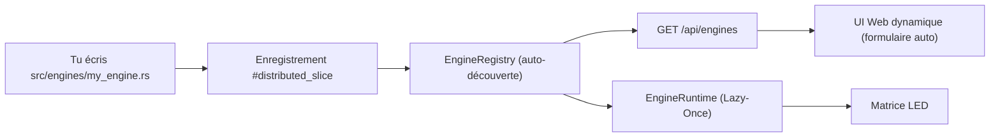
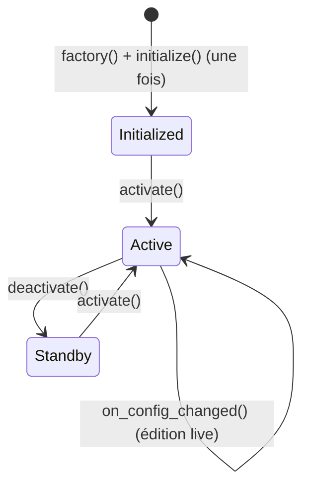
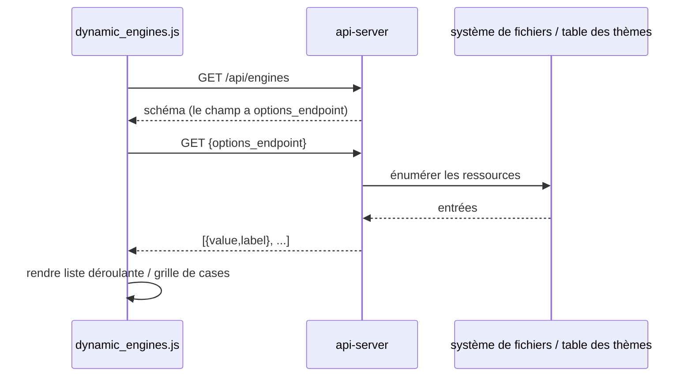
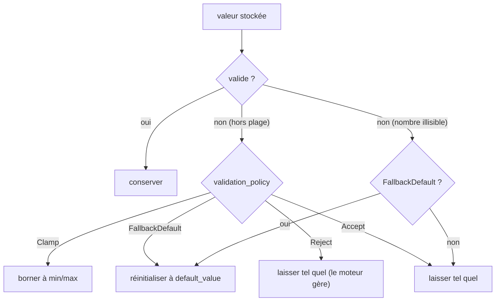
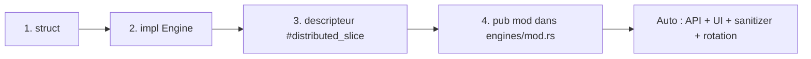

🇫🇷 Français | 🇬🇧 [English](DEVELOPER.md) | 🇪🇸 [Español](DEVELOPER_ES.md)

# Guide développeur (Raspberry Pi - Rust)

Ceci est le guide **complet** pour étendre ArcadeMatrix sur Raspberry Pi. Il détaille intégralement le contrat `Engine`, l'ensemble du schéma `ConfigField` (y compris les **listes d'options dynamiques / personnalisées**, la multi-sélection, les champs conditionnels et les politiques d'auto-réparation), et déroule la création d'un nouveau moteur de bout en bout.

> Pour le *pourquoi* des choix de conception (Registry, Lazy-Once, Arbitre, threads, overlay), lis [ARCHITECTURE_FR.md](ARCHITECTURE_FR.md). Ce guide est le *comment faire*.

---

## Table des matières

1. [Modèle mental](#1-modèle-mental)
2. [Le trait Engine en détail](#2-le-trait-engine-en-détail)
3. [Le cycle de vie et les règles d'or](#3-le-cycle-de-vie-et-les-règles-dor)
4. [Capabilities et Requirements](#4-capabilities-et-requirements)
5. [Référence du ConfigSchema et du ConfigField](#5-référence-du-configschema-et-du-configfield)
6. [Listes d'options personnalisées / dynamiques](#6-listes-doptions-personnalisées--dynamiques)
7. [Champs multi-sélection](#7-champs-multi-sélection)
8. [Champs conditionnels (`visible_when`)](#8-champs-conditionnels-visible_when)
9. [Politiques de validation auto-réparatrices](#9-politiques-de-validation-auto-réparatrices)
10. [Tutoriel : créer un nouveau moteur](#10-tutoriel--créer-un-nouveau-moteur)
11. [Tutoriel : ajouter un endpoint de liste personnalisée](#11-tutoriel--ajouter-un-endpoint-de-liste-personnalisée)
12. [Tutoriel : ajouter un nouveau thème d'horloge](#12-tutoriel--ajouter-un-nouveau-thème-dhorloge)
13. [Internationalisation & Centralisation i18n (Front & Back)](#13-internationalisation--centralisation-i18n-front--back)
14. [Lire la config dans un moteur](#14-lire-la-config-dans-un-moteur)
15. [Dessiner dans la matrice](#15-dessiner-dans-la-matrice)
16. [Tests et exécution locale](#16-tests-et-exécution-locale)
17. [Checklist](#17-checklist)

---

## 1. Modèle mental

ArcadeMatrix n'a **aucune liste de fonctionnalités codée en dur** dans `app.rs`. Chaque moteur est un plugin auto-enregistré, découvert au démarrage via un Registry résolu à la compilation (`linkme`).



Ajouter un moteur touche **deux fichiers** : le moteur lui-même et une ligne `pub mod` dans `src/engines/mod.rs`. **`app.rs` n'est jamais modifié.**

---

## 2. Le trait Engine en détail

Chaque moteur implémente `core::engine_contract::Engine` :

```rust
pub trait Engine: Send + Sync {
    // --- Cycle de vie obligatoire ---
    fn initialize(&mut self, ctx: &mut EngineContext, config: &dyn EngineConfig)
        -> Result<(), EngineError>;
    fn activate(&mut self);
    fn update(&mut self, ctx: &mut EngineContext);
    fn render(&mut self, ctx: &mut EngineContext);
    fn deactivate(&mut self);

    // --- Optionnel (implémentations par défaut) ---
    fn on_config_changed(&mut self, _config: &dyn EngineConfig) {}
    fn is_finished(&self) -> bool { false }
    fn is_realtime(&self) -> bool { false }
    fn set_rotation_budget(&mut self, _budget: u32) {}
    fn self_paced(&self) -> bool { false }
}
```

| Méthode | Défaut | Quand la surcharger |
| :-- | :-- | :-- |
| `initialize` | — | Toujours. Allouer les buffers, charger les assets, lire la config une fois. |
| `activate` | — | Toujours. Réinitialisation légère de l'état transitoire. |
| `update` | — | Toujours. Logique métier à chaque frame. |
| `render` | — | Toujours. Dessiner dans `ctx.matrix`. |
| `deactivate` | — | Toujours. Arrêter timers/écouteurs. |
| `on_config_changed` | no-op | Si ton moteur a des réglages éditables (presque toujours). Relire **sur place**. |
| `is_finished` | `false` | Si le moteur a une fin intrinsèque (ex. liste de tokens finie) et doit faire avancer la rotation plus tôt. |
| `is_realtime` | `false` | Si le moteur anime seulement dans un certain état vivant et a alors besoin de ~25 FPS. |
| `set_rotation_budget` | no-op | Si l'avance de rotation est basée sur un compteur (ex. jouer N GIFs). Reçoit la valeur numérique de l'entrée. |
| `self_paced` | `false` | Si le moteur pilote sa propre avance via `is_finished` et ne doit PAS être forcé par le timer de durée. |

---

## 3. Le cycle de vie et les règles d'or



- **Règle d'or n°1 — allouer une fois.** Ne jamais créer un nouveau `String`/`Vec` dans `update()`/`render()`. Pré-allouer dans `initialize()` et muter sur place :
  ```rust
  self.buf.clear();
  write!(&mut self.buf, "{}:{}", h, m).ok();
  ```
- **Règle d'or n°2 — hot-reload sur place.** Dans `on_config_changed()`, relire les valeurs dans les champs existants. L'instance n'est **pas** recréée (Lazy-Once), conserve donc tes allocations.
- **Règle d'or n°3 — pas d'E/S bloquantes dans la boucle chaude.** Le travail réseau/disque appartient à un thread de fond ; transmets les résultats à `update()` via un canal ou un état partagé.

---

## 4. Capabilities et Requirements

Déclarées dans le descripteur, ce sont des métadonnées statiques lues par le runtime et l'UI.

```rust
Capabilities {
    supports_128x32: bool,  // indices de géométrie de panneau
    supports_256x64: bool,
    realtime: bool,         // true -> sondé à ~25 FPS ; false -> 1 Hz
    interruptible: bool,    // peut être préempté par une source plus prioritaire
}

Requirements {
    needs_audio: bool,
    needs_network: bool,    // le moteur appelle Internet
    needs_sd: bool,
}
```

- Mets `realtime: true` **uniquement** si tu dessines une nouvelle frame à chaque tick (GIF, texte défilant, Spotify). Le contenu statique (horloge/météo) doit rester `false` pour économiser CPU et Wi-Fi.
- Pour une cadence dynamique (animer parfois), garde `realtime: false` et surcharge `is_realtime()` pour renvoyer `true` pendant l'animation.

---

## 5. Référence du ConfigSchema et du ConfigField

Le schéma est la **source unique de vérité** pour l'UI et le sanitizer. Chaque champ :

```rust
pub struct ConfigField {
    pub id: &'static str,                 // clé de config (stockée dans config.json)
    pub field_type: ConfigType,           // Boolean | Integer | Float | String | Options
    pub label: &'static str,              // libellé UI
    pub description: &'static str,        // infobulle UI
    pub default_value: &'static str,      // injecté si absent (auto-réparation)
    pub required: bool,
    pub min_val: Option<&'static str>,    // borne numérique (Integer/Float)
    pub max_val: Option<&'static str>,
    pub step: Option<&'static str>,       // granularité du sélecteur UI
    pub options: Option<Vec<ConfigOption>>, // choix statiques pour Options
    pub visible_when: Option<&'static str>, // visibilité conditionnelle
    pub options_endpoint: Option<&'static str>, // choix dynamiques (liste personnalisée)
    pub multiple: bool,                   // multi-sélection (stockage CSV)
    pub validation_policy: ValidationPolicy, // Clamp | FallbackDefault | Reject | Accept
}
```

Variantes de `ConfigType` :

| Variante | Widget | Comportement du sanitizer |
| :-- | :-- | :-- |
| `Boolean` | select Activé/Désactivé | normalise `true/1/yes/on` → `true`, sinon défaut |
| `Integer` | champ numérique | parse + clamp/fallback dans `min_val..max_val` |
| `Float` | champ numérique | parse + clamp/fallback dans `min_val..max_val` |
| `String` | champ texte | accepté tel quel |
| `Options` | liste déroulante (ou grille de cases si `multiple`) | la valeur doit être dans `options` (sauf dynamique) |

> **Astuce :** toutes les valeurs sont stockées en chaînes dans `config.json`. Parse-les avec les helpers `EngineConfig` (`get_int`, `get_bool`, `get_string`).

---

## 6. Listes d'options personnalisées / dynamiques

Parfois les choix ne sont **pas connus à la compilation** — les polices installées, les dossiers GIF sur le disque, les thèmes disponibles. Au lieu d'une liste `options` statique, pointe le champ vers un **endpoint d'options**. Le frontend l'interroge en direct et construit le widget.



Endpoints intégrés (tous renvoient `[{ "value": ..., "label": ... }]`) :

| `options_endpoint` | Sert | Alimenté par |
| :-- | :-- | :-- |
| `/api/fonts` | noms de fichiers de police | fichiers dans `fonts/` (`.ttf`, `.bdf`) |
| `/api/playlists` | noms de dossiers GIF | sous-dossiers de `gifs/` |
| `/api/themes` | id/nom de thème | `core::theme::all_themes()` |

Exemple réel — les champs thème et police du moteur **horloge** :

```rust
ConfigField {
    id: "theme",
    field_type: ConfigType::Options,
    label: "Theme",
    description: "Color theme",
    default_value: "matrix",
    options: None,                          // pas de liste statique
    options_endpoint: Some("/api/themes"),  // interrogé en direct
    ..Default::default()
},
ConfigField {
    id: "font",
    field_type: ConfigType::Options,
    label: "Font",
    description: "Bitmap or TTF font",
    default_value: "PressStart2P.ttf",
    options_endpoint: Some("/api/fonts"),
    ..Default::default()
},
```

Comme la liste est interrogée au moment du rendu, **déposer une nouvelle police dans `fonts/` ou un nouveau dossier dans `gifs/` apparaît immédiatement dans l'UI** — sans recompilation, sans changement de schéma.

---

## 7. Champs multi-sélection

Mets `multiple: true` sur un champ `Options` (statique ou dynamique) pour laisser l'utilisateur choisir **plusieurs** valeurs. L'UI affiche une grille de cases ; la sélection est stockée en **chaîne séparée par des virgules** dans la config d'instance.

Exemple réel — la sélection de playlists du moteur **GIF** :

```rust
ConfigField {
    id: "playlists",
    field_type: ConfigType::Options,
    label: "GIF Playlists",
    description: "Which GIF folders to play",
    default_value: "",
    options_endpoint: Some("/api/playlists"),
    multiple: true,                 // -> grille de cases, stockage CSV
    ..Default::default()
}
```

Stocké par ex. `"mario,zelda,sonic"`. Dans ton moteur, découpe-le :

```rust
let selected: Vec<String> = config
    .get_string("playlists", "")
    .split(',')
    .map(str::trim)
    .filter(|s| !s.is_empty())
    .map(String::from)
    .collect();
```

Le sanitizer valide chaque token contre l'ensemble autorisé (pour les options statiques) et laisse intactes les valeurs d'endpoint dynamique. Cela remplace l'ancienne approche « coder en dur quels GIFs inclure/ignorer » par une sélection explicite, pilotée par l'utilisateur et déclarative.

---

## 8. Champs conditionnels (`visible_when`)

`visible_when` permet à un champ de n'apparaître que lorsqu'un autre champ a un état donné, ce qui permet de construire des formulaires dépendants sans JavaScript spécifique au moteur. Mets-y l'id du champ contrôleur ; le frontend affiche le champ conditionnellement.

```rust
ConfigField {
    id: "scroll_speed",
    field_type: ConfigType::Integer,
    label: "Scroll Speed",
    visible_when: Some("animated"), // affiché seulement quand le champ "animated" est activé
    ..Default::default()
}
```

---

## 9. Politiques de validation auto-réparatrices

`validation_policy` décide ce que le `ConfigSanitizer` fait d'une valeur hors plage ou illisible au démarrage / à la sauvegarde.



| Politique | Nombre hors plage | Nombre illisible | Mauvaise valeur d'option |
| :-- | :-- | :-- | :-- |
| `Clamp` | borner | laissé tel quel | — |
| `FallbackDefault` | réinit. au défaut | réinit. au défaut | réinit. au défaut |
| `Reject` | laissé tel quel | laissé tel quel | — |
| `Accept` | laissé tel quel | laissé tel quel | — |

Les clés manquantes sont toujours **injectées** avec `default_value` ; les clés absentes du schéma sont **élaguées**. C'est ce qui rend les mises à jour OTA transparentes (les nouveaux champs apparaissent, les champs supprimés disparaissent).

---

## 10. Tutoriel : créer un nouveau moteur

### Étape 1 — la struct (`src/engines/my_engine.rs`)

```rust
use crate::core::engine_contract::{Engine, EngineConfig, EngineContext, EngineError};

pub struct MyEngine {
    my_setting: String, // buffer pré-alloué
    counter: u32,
}

impl MyEngine {
    pub fn new() -> Self {
        Self { my_setting: String::new(), counter: 0 }
    }
}
```

### Étape 2 — implémenter le cycle de vie

```rust
impl Engine for MyEngine {
    fn initialize(&mut self, _ctx: &mut EngineContext, config: &dyn EngineConfig)
        -> Result<(), EngineError> {
        self.my_setting = config.get_string("my_setting", "default"); // alloc OK ici
        Ok(())
    }

    fn activate(&mut self) { self.counter = 0; }

    fn update(&mut self, _ctx: &mut EngineContext) {
        self.counter += 1; // pas d'allocation
    }

    fn render(&mut self, ctx: &mut EngineContext) {
        ctx.matrix.clear();
        // dessiner self.my_setting avec les buffers existants
    }

    fn deactivate(&mut self) {}

    fn on_config_changed(&mut self, config: &dyn EngineConfig) {
        self.my_setting = config.get_string("my_setting", "default"); // sur place
    }
}
```

### Étape 3 — enregistrer avec un descripteur (auto-découverte)

```rust
use crate::core::engine_contract::{
    Capabilities, ConfigField, ConfigSchema, ConfigType, EngineDescriptor,
    EngineMetadata, Requirements, ValidationPolicy,
};
use linkme::distributed_slice;

#[distributed_slice(crate::core::registry::ENGINES)]
fn register_my_engine() -> EngineDescriptor {
    EngineDescriptor {
        metadata: EngineMetadata {
            id: "my_engine",
            name: "My Custom Engine",
            category: "misc",
            version: "1.0",
        },
        capabilities: Capabilities::default(), // mets realtime:true si tu animes
        requirements: Requirements::default(),
        schema: ConfigSchema {
            fields: vec![ConfigField {
                id: "my_setting",
                field_type: ConfigType::String,
                label: "My Setting",
                description: "Text to display",
                default_value: "default",
                validation_policy: ValidationPolicy::Accept,
                ..Default::default() // syntaxe struct-update pour le reste
            }],
        },
        factory: || Box::new(MyEngine::new()),
    }
}
```

> Utiliser `..Default::default()` garde les enregistrements courts — tu ne détailles que les champs qui comptent.

### Étape 4 — exposer le module (`src/engines/mod.rs`)

```rust
pub mod my_engine;
```

Terminé. Le moteur apparaît maintenant dans `GET /api/engines`, obtient un formulaire auto-généré dans l'UI Web, et sa config est nettoyée et rechargée à chaud automatiquement. **Aucune modif de `app.rs`.**



---

## 11. Tutoriel : ajouter un endpoint de liste personnalisée

Si ton champ a besoin de choix issus d'une ressource gérée par l'utilisateur (fichiers, playlists, presets), ajoute un endpoint d'options et pointe un champ dessus.

### Étape 1 — le handler (`src/api/server.rs`)

```rust
#[get("/api/presets")]
async fn get_presets(req: HttpRequest, data: web::Data<AppState>) -> impl Responder {
    if let Err(e) = check_auth(&req, &data.config) { return e; }
    let mut out = Vec::new();
    if let Ok(entries) = std::fs::read_dir("presets") {
        for entry in entries.flatten() {
            if let Some(name) = entry.file_name().to_str() {
                out.push(json!({ "value": name, "label": name }));
            }
        }
    }
    HttpResponse::Ok().json(out)
}
```

Enregistre-le avec les autres services dans le builder `App` d'actix.

### Étape 2 — pointer un champ dessus

```rust
ConfigField {
    id: "preset",
    field_type: ConfigType::Options,
    label: "Preset",
    options_endpoint: Some("/api/presets"),
    // multiple: true, // décommenter pour une grille de cases
    ..Default::default()
}
```

Le frontend n'a besoin d'**aucune** modification — `dynamic_engines.js` interroge déjà tout `options_endpoint` et rend une liste déroulante (ou une grille de cases si `multiple`).

---

## 12. Tutoriel : ajouter un nouveau thème d'horloge

Les horloges dans ArcadeMatrix sont organisées en modules de rendu sous `ClockEngine` (`src/engines/clock.rs`). Pour ajouter un nouveau thème visuel ou une animation d'horloge (ex : *SpaceInvadersClock*) :

### Étape 1 — Créer `src/engines/clocks/space_invaders_clock.rs`

```rust
use chrono::Timelike;
use crate::engines::renderers::BaseRenderer;

pub struct SpaceInvadersClock {
    base: BaseRenderer,
    invader_frame: u32,
    last_anim_ms: u128,
}

impl SpaceInvadersClock {
    pub fn new() -> Self {
        Self {
            base: BaseRenderer::new(),
            invader_frame: 0,
            last_anim_ms: 0,
        }
    }

    pub fn draw(
        &mut self,
        matrix: &mut dyn crate::matrix::MatrixBackend,
        now: chrono::DateTime<chrono::Local>,
        font: &str,
        size: u32,
        color: (u8, u8, u8),
    ) {
        let time_str = now.format("%H:%M:%S").to_string();
        self.base.draw_text_centered(matrix, &time_str, font, size, color);
    }
}
```

### Étape 2 — Exposer dans `src/engines/clocks/mod.rs`

```rust
pub mod space_invaders_clock;
pub use space_invaders_clock::SpaceInvadersClock;
```

### Étape 3 — Câbler dans `ClockEngine` (`src/engines/clock.rs`)

1. Ajouter la struct dans `ClockEngine` :
```rust
pub struct ClockEngine {
    // ...
    space_invaders: SpaceInvadersClock,
}
```

2. L'initialiser dans `ClockEngine::new` :
```rust
space_invaders: SpaceInvadersClock::new(),
```

3. Router le rendu dans `render()` :
```rust
25 => self.space_invaders.draw(ctx.matrix, now, &self.time_font, self.time_size, c1),
```

### Étape 4 — Déclarer l'option dans `ClockEngine::descriptor()`

Ajoute `{ label: "Space Invaders Clock", value: "25" }` aux options du champ `theme` :

```rust
ConfigOption { label: "Space Invaders Clock", value: "25" },
```

L'interface Web rend dynamiquement la nouvelle option dans le sélecteur de thèmes et applique le changement à chaud dès la sauvegarde.

---

## 13. Internationalisation & Centralisation i18n (Front & Back)

ArcadeMatrix sur Raspberry Pi utilise le module centralisé [`crate::core::i18n`](../src/core/i18n.rs).

> [!IMPORTANT]
> **Règle d'or : Ne jamais ajouter de champ `lang` dans les schémas de vos moteurs (`ConfigSchema`).**
> La langue globale du système (`system.lang`) est la source unique de vérité. Dès que l'utilisateur modifie la langue dans le sélecteur du bandeau (`#lang-selector`), l'interface envoie `POST /api/system` `{ "lang": code }`, persistant la langue et la propageant en direct à tous les moteurs actifs.

### A. Utilisation dans un moteur Rust (`crate::core::i18n`)

```rust
use crate::core::i18n::{self, Lang};

// 1. Lire la langue système depuis le contexte
let sys_lang = ctx.config.settings.read().system.lang.clone();
let lang = Lang::from_str_code(&sys_lang);

// 2. Libellés des jours météo (ex: "AUJ.", "DEMN", "LUN"..)
let day_label = i18n::weather_day_label(lang, day_of_week, is_today, is_tomorrow);

// 3. Traduction des conditions météo
let condition = i18n::weather_condition(lang, "Thunderstorm with heavy rain");

// 4. Lignes complètes de l'horloge en mots (WordClock)
let lines = i18n::word_clock_lines(lang, hours, minutes);

// 5. Niveaux sonores / décibels
let noise = i18n::noise_level(lang, level_index);
```

### B. Tutoriel : Ajouter une nouvelle langue (ex : Allemand `de`) en 3 étapes

1. **Front-end WebUI (`api/www/js/i18n.js` ou `index.html`) :**
   Ajoutez la langue dans `SUPPORTED_LANGUAGES` et complétez les traductions :
   ```javascript
   export const SUPPORTED_LANGUAGES = [
     { code: 'fr', label: 'Français' },
     { code: 'en', label: 'English' },
     { code: 'es', label: 'Español' },
     { code: 'de', label: 'Deutsch' },
   ];
   ```
2. **Back-end Raspberry Pi (`src/core/i18n.rs`) :**
   - Ajoutez la variante `De` à l'enum `Lang`.
   - Renseignez les dictionnaires et tables de correspondance dans `i18n.rs`.
3. **Back-end ESP32 (`src/core/I18n.h` & `src/core/I18n.cpp`) :**
   - Ajoutez `DE` à l'enum `Lang` et implémentez les méthodes statiques dans `I18n.cpp`.

---

## 14. Lire la config dans un moteur

Le moteur reçoit un proxy restreint `&dyn EngineConfig` (jamais tout le `config.json`) :

```rust
let interval = config.get_int("interval", 10);      // i32 parsé
let enabled  = config.get_bool("enabled", true);    // true/1
let label    = config.get_string("label", "Hello"); // String possédée
```

Ceux-ci mappent sur le `HashMap<String,String>` de l'instance. Les clés correspondent aux `id` de ton schéma.

---

## 15. Dessiner dans la matrice

`ctx.matrix` est un `&mut dyn MatrixBackend`. Motif typique :

```rust
fn render(&mut self, ctx: &mut EngineContext) {
    ctx.matrix.clear();
    // dessiner pixels / texte / bitmaps dans ctx.matrix
    // NE PAS appeler ctx.matrix.update() — la boucle de rendu envoie la frame
}
```

La **boucle de rendu** possède `update()` (l'envoi au panneau) et, après le retour de ton `render()`, peut exécuter la passe additive de **l'overlay Fighter** par-dessus ta frame (voir [ARCHITECTURE_FR.md §11](ARCHITECTURE_FR.md#11-le-compositeur-doverlay-fighter)).

---

## 16. Tests et exécution locale

```bash
rtk cargo fmt
rtk cargo test          # tests unitaires + intégration
rtk cargo build --release
```

- Teste unitairement la logique pure (parseurs, formatage) directement dans le module du moteur (`#[cfg(test)]`).
- La matrice simulée (`tests/test_matrix.rs`) permet d'affirmer les pixels sans matériel.
- Le test du registry (`tests/test_registry.rs`) vérifie la découverte, les descripteurs et le cycle de vie du runtime — un bon modèle pour les tests de moteur.

Le hook de pré-commit exécute le validateur de release, le validateur de doc/clés de config, `cargo fmt --check` et la suite de tests complète.

---

## 17. Checklist

- [ ] La struct pré-alloue les buffers ; aucune allocation dans `update`/`render`.
- [ ] `on_config_changed` relit chaque champ éditable **sur place**.
- [ ] `Capabilities.realtime` reflète si tu animes chaque frame (ou surcharge `is_realtime`).
- [ ] Chaque champ de schéma a un `default_value` et une `validation_policy` sensés.
- [ ] Les choix dynamiques utilisent `options_endpoint` ; le multi-valeur utilise `multiple: true` (CSV).
- [ ] Les textes localisés utilisent le module centralisé `crate::core::i18n` (aucun champ `lang` redondant dans le schéma).
- [ ] Enregistré via `#[distributed_slice]` ; module ajouté à `engines/mod.rs`.
- [ ] `app.rs` intouché.
- [ ] `cargo fmt`, `cargo test`, `cargo build --release` passent tous.
